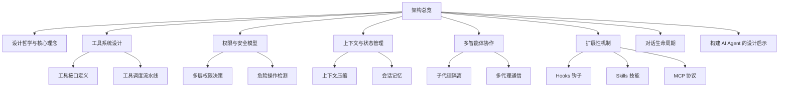

	
# Claude Code 架构总览

> [!abstract] 这是什么
> 这是一份基于 Claude Code 源码分析的知识库，目的不是"学会用 Claude Code"，而是**拆解它的设计思想**，为构建 AI Agent 类产品提供启发。

## 导航地图

## 核心笔记

| 笔记 | 核心问题 |
|------|---------|
| [[01 - 设计哲学与核心理念]] | Claude Code 为什么这样设计？整体架构风格是什么？ |
| [[02 - 工具系统设计]] | AI 如何安全地调用外部工具？工具的定义、验证、执行流程是怎样的？ |
| [[03 - 权限与安全模型]] | 如何让 AI 强大但不失控？多层安全防线如何协作？ |
| [[04 - 上下文与状态管理]] | 对话越来越长怎么办？如何在有限窗口里保持"记忆"？ |
| [[05 - 多智能体协作]] | 一个 AI 不够用时，怎么协调多个 AI 并行工作？ |
| [[06 - 扩展性机制]] | 如何让产品功能无限扩展？Hooks、Skills、MCP 各自解决什么问题？ |
| [[07 - 对话生命周期]] | 从用户输入到 AI 回复，中间经历了哪些阶段？ |
| [[08 - 构建 AI Agent 的设计启示]] | 从 Claude Code 中能学到什么？构建 Agent 产品的关键设计决策有哪些？ |

## 技术栈速览

| 维度 | 选择 |
|------|------|
| 语言 | TypeScript + TSX |
| 终端 UI | 自建 Ink 框架（基于 React 的终端渲染） |
| 包管理 | Bun |
| 运行时 | Node.js 18+ |
| 构建产物 | 单文件 `cli.js`（13 MB）+ Source Map |
| 状态管理 | 类 Redux 不可变更新 + React Context |
| AI 协议 | MCP（Model Context Protocol） |

## 源码规模

> [!info] 基于 v2.1.88
> - 总文件数：**1,902** 个源码文件
> - 工具类：184 个文件
> - UI 组件：389 个文件
> - 命令：207 个文件
> - 工具函数：564 个文件
> - 服务层：130 个文件

## 一句话总结

==Claude Code 的本质是一个"以 AI 为核心的操作系统"==——它把 LLM 放在中心，围绕它构建了工具调用、权限管理、上下文记忆、多代理协作和扩展生态，形成一个完整的==智能体运行时（Agent Runtime）==。
