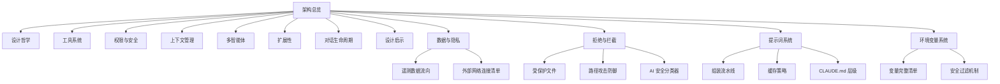

	
# Claude Code 架构总览

> [!abstract] 这是什么
> 这是一份基于 Claude Code 源码分析的知识库，目的不是"学会用 Claude Code"，而是**拆解它的设计思想**，为构建 AI Agent 类产品提供启发。

## 导航地图

## 核心笔记

### 架构与设计

| 笔记 | 核心问题 |
|------|---------|
| [[01 - 设计哲学与核心理念]] | Claude Code 为什么这样设计？整体架构风格是什么？ |
| [[02 - 工具系统设计]] | AI 如何安全地调用外部工具？工具的定义、验证、执行流程是怎样的？ |
| [[07 - 对话生命周期]] | 从用户输入到 AI 回复，中间经历了哪些阶段？ |
| [[04 - 上下文与状态管理]] | 对话越来越长怎么办？如何在有限窗口里保持"记忆"？ |

### 安全与权限

| 笔记 | 核心问题 |
|------|---------|
| [[03 - 权限与安全模型]] | 权限架构概览：多层防线、权限模式、规则系统如何协作？ |
| [[10 - 行为拒绝与操作拦截机制]] | 哪些操作会被拒绝？5 层决策流水线、命令分级、熔断机制 |
| &emsp; [[10a - 受保护的文件与目录]] | AI 永远不能自动修改的 10 个文件和 4 个目录，以及为什么 |
| &emsp; [[10b - 路径攻击与防御]] | 8 种用"花招路径"绕过安全检查的方式，以及防御策略 |
| &emsp; [[10c - 自动模式的 AI 分类器]] | 用 AI 审查 AI：双阶段分类器、防操控设计、熔断降级 |
| [[09 - 数据收集与隐私保护设计]] | 用户输入会被记录吗？类型系统如何做隐私护栏？ |
| &emsp; [[09a - 遥测数据流向与上报清单]] | 三条遥测管道各收什么数据？怎么关？本地存了什么？ |
| &emsp; [[09b - 外部网络连接完整清单]] | 12 类外部 URL 端点清单，隐私级别与网络连接对照表 |

### 协作与扩展

| 笔记 | 核心问题 |
|------|---------|
| [[05 - 多智能体协作]] | 一个 AI 不够用时，怎么协调多个 AI 并行工作？ |
| [[06 - 扩展性机制]] | Hooks、Skills、MCP 各自解决什么层面的扩展需求？ |

### 提示词系统

| 笔记 | 核心问题 |
|------|---------|
| [[11 - 提示词系统架构]] | 系统提示词怎么组装？静态/动态怎么分？缓存怎么做？ |
| &emsp; [[11a - 系统提示词的组装流水线]] | 十几个段落如何按顺序拼装？优先级链如何工作？ |
| &emsp; [[11b - 提示词缓存策略]] | 全局缓存分界线、MCP 降级、两阶段失效检测 |
| &emsp; [[11c - CLAUDE.md 配置层级]] | 六层配置文件的发现、加载、条件规则、@include 机制 |

### 运行时配置

| 笔记 | 核心问题 |
|------|---------|
| [[12 - 环境变量系统]] | 100+ 环境变量的分类、安全分级、环境自动探测 |
| &emsp; [[12a - 环境变量完整清单]] | 所有变量的速查表：变量名、用途、安全等级 |
| &emsp; [[12b - 环境变量的安全过滤机制]] | 信任来源层级、三层过滤器链、子进程密钥清洗 |

### 总结

| 笔记 | 核心问题 |
|------|---------|
| [[08 - 构建 AI Agent 的设计启示]] | 从 Claude Code 中提炼的 9 条产品设计经验 |

## 技术栈速览

| 维度 | 选择 |
|------|------|
| 语言 | TypeScript + TSX |
| 终端 UI | 自建 Ink 框架（基于 React 的终端渲染） |
| 包管理 | Bun |
| 运行时 | Node.js 18+ |
| 构建产物 | 单文件 `cli.js`（13 MB）+ Source Map |
| 状态管理 | 类 Redux 不可变更新 + React Context |
| AI 协议 | MCP（Model Context Protocol） |

## 源码规模

> [!info] 基于 v2.1.88
> - 总文件数：**1,902** 个源码文件
> - 工具类：184 个文件
> - UI 组件：389 个文件
> - 命令：207 个文件
> - 工具函数：564 个文件
> - 服务层：130 个文件

## 一句话总结

==Claude Code 的本质是一个"以 AI 为核心的操作系统"==——它把 LLM 放在中心，围绕它构建了工具调用、权限管理、上下文记忆、多代理协作和扩展生态，形成一个完整的==智能体运行时（Agent Runtime）==。
