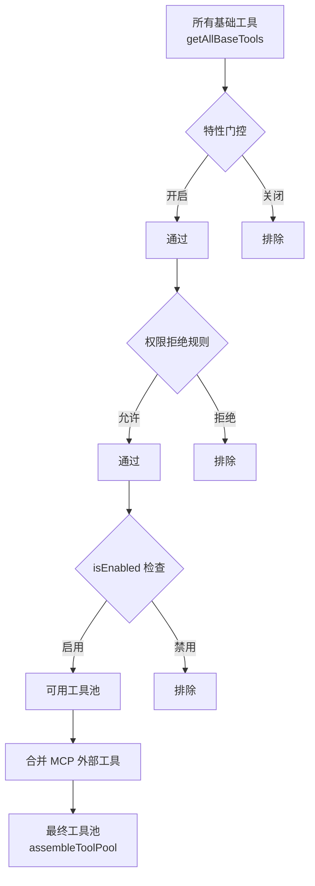

# 工具系统设计

> [!abstract] 核心问题
> AI 模型只会"说话"，不会"动手"。工具系统就是 AI 的"手"——它定义了 AI ==能做什么、怎么做、做完了怎么汇报==。

## 一、工具的"身份证"：统一接口

每个工具都必须遵守同一套"规范"（接口），就像每个员工都有统一格式的工牌：

```
一个工具必须声明：
├── 名字（name）          → 我叫什么
├── 输入规范（inputSchema）→ 我需要什么信息才能干活
├── 权限检查（checkPermissions）→ 这件事我能不能做
├── 执行逻辑（call）      → 我怎么做这件事
├── 结果格式化（mapToolResult）→ 做完了怎么汇报
├── 界面渲染（render*）    → 在界面上怎么展示过程和结果
└── 行为标记              → 我是只读的？并发安全的？破坏性的？
```

> [!tip] 设计启示
> 统一接口是工具系统的基石。它让系统可以==用同样的方式处理所有工具==——无论是读文件、运行命令还是搜索网页。新增工具只需要"填表"，不需要改系统核心。

### 关键行为标记

| 标记 | 含义 | 用途 |
|------|------|------|
| `isReadOnly` | 这个操作不修改任何东西 | 只读操作可以更宽松地授权 |
| `isConcurrencySafe` | 可以和其他工具同时运行 | 决定是否并行执行 |
| `isDestructive` | 可能造成不可逆的破坏 | 需要额外确认 |
| `shouldDefer` | 不急着告诉 AI | 节省提示词空间，需要时再加载 |

## 二、工具的"招聘流程"：注册与筛选

不是所有工具在所有场景都可用。工具的加载经过==三层筛选==：



> [!important] 排序稳定性
> 工具列表有固定排序，且内建工具永远排在 MCP 工具前面。这不是为了美观——而是为了==提示词缓存（Prompt Cache）==。如果工具列表每次都变，AI 就无法复用之前的缓存，白白浪费钱。

### 特性门控示例

| 工具 | 条件 |
|------|------|
| REPL 工具 | 仅 Anthropic 内部用户 |
| 定时任务工具 | 需要开启 `AGENT_TRIGGERS` 特性 |
| Web 浏览器 | 需要开启 `WEB_BROWSER_TOOL` 特性 |
| 任务管理工具 | 需要开启 `TodoV2` 特性 |

## 三、工具调度：一次执行的完整旅程

当 AI 决定使用某个工具时，系统会执行一套==严格的流水线==：

```
用户提问 → AI 思考 → AI 选择工具 → 以下流水线开始 ↓

1. 🔍 查找阶段
   在工具池中找到对应工具（支持别名兼容）

2. ✅ 输入验证阶段
   用 Zod 模式（一种数据验证库）检查输入格式是否正确
   → 失败则返回"输入错误"

3. 🔗 预处理钩子（PreToolUse Hooks）
   运行用户自定义的前置检查脚本
   → 钩子可以修改输入、直接批准/拒绝、或添加额外信息

4. 🔒 权限检查阶段
   根据规则判断：直接允许？直接拒绝？还是要问用户？
   → 详见 [[03 - 权限与安全模型]]

5. ⚡ 执行阶段
   调用工具的 call() 方法，期间可以产出进度事件
   → 用户实时看到工具在做什么

6. 📦 结果映射阶段
   把工具的原始结果转换成 AI 能理解的格式
   → 大结果会存到磁盘，只给 AI 看摘要

7. 🔗 后处理钩子（PostToolUse Hooks）
   运行用户自定义的后处理脚本
   → 可以修改输出或添加上下文

8. 📤 结果返回
   组装成 API 消息格式，续接对话
```

> [!example] 现实类比
> 像公司审批流程：提交申请（输入）→ 合规检查（验证）→ 上级审批（权限）→ 执行（call）→ 写报告（结果映射）→ 存档（持久化）

## 四、工具结果的"体积管理"

AI 的上下文窗口是有限的（像一个固定大小的工作台），不能让一个工具的输出占满整个桌面。

### 大结果持久化机制

```
如果工具输出 > maxResultSizeChars（每个工具自定义的阈值）：
  1. 把完整结果存到磁盘  ~/.claude/tool-results/{uuid}/
  2. 只给 AI 看摘要 + 文件路径
  3. AI 需要时可以再读取完整内容
```

> [!tip] 设计启示
> 这是 Agent 系统中非常重要的设计——AI 不需要一次看到所有信息，只需要知道"信息在哪"。类似人类的"我知道那份报告在哪个文件夹里"，需要时再翻开看。

## 五、工具的进度反馈

工具执行过程中可以持续汇报进度，让用户看到实时状态：

```
Bash 命令 → 实时显示命令输出（stdout/stderr）
文件搜索 → 显示已扫描文件数
网页抓取 → 显示下载进度
子代理   → 显示代理当前活动描述
```

进度信息只给用户看，==不会发送给 AI==（通过 `filterToolProgressMessages` 过滤掉）。这节省了宝贵的上下文空间。

## 六、MCP 工具的特殊处理

MCP（Model Context Protocol，模型上下文协议）工具来自外部服务器，需要额外处理：

| 差异 | 内建工具 | MCP 工具 |
|------|---------|---------|
| 命名 | `Read`、`Bash` | `mcp__服务器名__工具名` |
| 验证 | Zod 模式 | JSON Schema |
| 结果处理 | 立即映射 | 延迟到 PostHook 之后（Hook 可修改 MCP 输出） |
| 优先级 | 高（同名时内建优先） | 低 |

## 七、延迟加载工具

```
标记了 shouldDefer 的工具：
  → 不立即出现在系统提示词里
  → AI 不知道它的存在
  → 当 AI 搜索工具（ToolSearch）时才动态加载
  → 加载后和普通工具一样使用
```

> [!tip] 设计启示
> 这解决了"工具太多，提示词爆炸"的问题。核心常用工具直接可见，长尾工具按需加载。类似手机上的"所有应用"vs"常用应用"。

## 设计模式总结

| 模式 | 解决什么问题 |
|------|-------------|
| 统一接口 | 新工具零成本接入 |
| 三层筛选 | 不同场景用不同工具集 |
| 执行流水线 | 每个环节都可以拦截和修改 |
| 大结果持久化 | 不让单个工具撑爆上下文 |
| 进度流式反馈 | 用户不用干等 |
| 延迟加载 | 工具多了也不拖慢系统 |
| 排序稳定 | 最大化利用缓存节省成本 |

---

**相关笔记**：[[00 - Claude Code 架构总览]] | [[03 - 权限与安全模型]] | [[06 - 扩展性机制]] | [[07 - 对话生命周期]]
