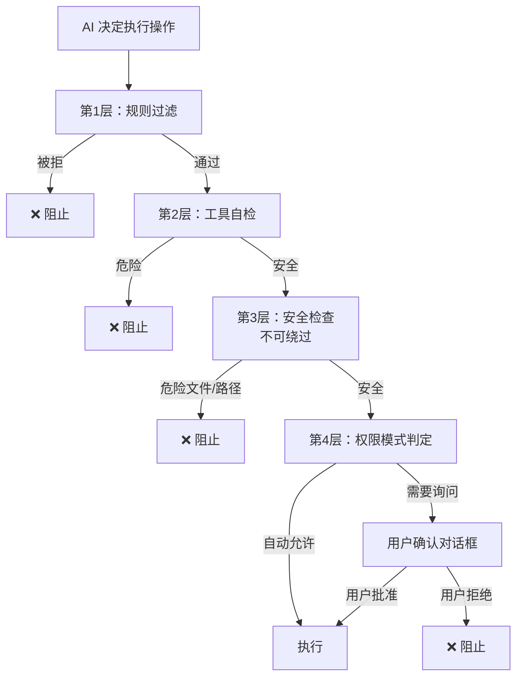

# 权限与安全模型

> [!abstract] 核心问题
> AI 能读写文件、运行命令、访问网络——如果不加限制，它可能删掉你的代码、泄露密码、或者搞乱系统配置。权限系统就是那道==安全围栏==。

## 一、设计哲学：纵深防御

Claude Code 不依赖单一的安全措施，而是构建了==多层防线==，即使某一层被突破，后面还有拦截：



> [!danger] 关键设计：不可绕过的安全层
> 第 3 层"安全检查"是==硬编码==的，即使用户开启了"全权模式"（bypass permissions），对以下内容的操作仍然会被拦截。这防止了用户因为图省事而"自残"。

## 二、权限模式

系统提供不同的"信任级别"，用户可以选择：

| 模式 | 中文名 | 行为 | 适用场景 |
|------|--------|------|---------|
| `default` | 默认模式 | 每次操作都问 | 初次使用、敏感项目 |
| `acceptEdits` | 允许编辑 | 自动允许工作目录内的文件编辑 | 日常开发 |
| `plan` | 规划模式 | 只规划不执行，每步需批准 | 学习、审查 |
| `auto` | 自动模式 | AI 分类器判断是否安全 | 高级用户（实验性） |
| `bypassPermissions` | 全权模式 | 几乎全部自动允许 | 信任环境（可被组织禁用） |

> [!warning] 自动模式的"熔断机制"
> 自动模式使用 AI 分类器判断操作是否安全。但如果分类器本身出错了怎么办？系统有==熔断器==：
> - 连续 3 次拒绝 → 降级为手动确认
> - 累计 20 次拒绝 → 降级为手动确认
> - 分类器服务不可用 → 立即降级为手动确认
>
> 这叫"失败关闭"（fail-closed）——不确定时选择更安全的路径。

## 三、规则系统：谁说了算？

权限规则来自==多个来源==，按优先级从高到低排列：

```
1. 特性标志（flagSettings）   → 平台级别的强制规则
2. 组织策略（policySettings）  → 公司级别的安全策略
3. 用户设置（userSettings）    → 个人全局偏好
4. 项目设置（projectSettings） → 项目级别的规则
5. 本地设置（localSettings）   → 工作区级别
6. 命令行参数（cliArg）       → 启动时指定
7. 会话规则（session）        → 运行中动态添加
```

### 规则格式

```
规则 = 工具名(内容匹配模式)

例子：
  Bash(npm test:*)      → 允许所有以 "npm test" 开头的命令
  FileEdit(/src/**)     → 允许编辑 src 目录下所有文件
  WebFetch              → 对所有网页抓取操作生效
  Bash(rm:*)            → 拒绝所有 rm 命令
```

> [!tip] 设计启示
> 多来源规则 + 优先级合并是企业级 Agent 产品的刚需。一个好的权限系统要能同时满足：组织管理员设安全底线、开发者定项目规则、用户调自己的习惯。

## 四、危险操作检测

### 受保护的文件

以下文件被硬编码保护，AI 不能修改它们（因为修改可能导致代码被植入后门）：

| 文件 | 为什么危险 |
|------|-----------|
| `.gitconfig` | Git 配置，可被用来运行任意命令 |
| `.bashrc` / `.zshrc` | Shell 启动脚本，每次打开终端都会执行 |
| `.git/hooks/*` | Git 钩子，在 commit/push 等操作时自动执行 |
| `.vscode/settings.json` | VS Code 设置，可触发代码执行 |
| `.claude/settings.json` | Claude Code 自身配置 |

### 受保护的目录

| 目录 | 为什么危险 |
|------|-----------|
| `.git` | Git 内部数据，修改可能破坏仓库 |
| `.vscode` | IDE 配置，可能注入恶意设置 |
| `.claude` | Claude Code 配置（但 worktrees 子目录例外） |

### 路径攻击防御

Claude Code 不只检查路径"看起来"是否安全，还会防范各种绕过手段：

| 攻击方式 | 说明 | 防御 |
|---------|------|------|
| 符号链接 | 创建一个看起来安全的文件名，实际指向危险文件 | 解析所有符号链接后再检查 |
| NTFS 替代数据流 | Windows 特有，`file.txt::$DATA` 绕过文件名检查 | 检测并拒绝 |
| 8.3 短文件名 | Windows 上 `.git` 可能显示为 `GIT~1` | 检测并拒绝 |
| 大小写绕过 | macOS/Windows 不区分大小写，`.GIT` 等于 `.git` | 不区分大小写比较 |
| 环境变量注入 | `$HOME/.bashrc` 在 shell 中会被展开 | 拒绝包含 `$` 的路径 |
| UNC 路径 | `\\server\share` 可能泄露 Windows 凭据 | 检测并拒绝 |

> [!danger] 真实案例启示
> 源码注释提到了历史漏洞：SessionEnd 钩子在用户拒绝信任对话时仍被执行，SubagentStop 钩子在子代理完成但信任对话还没通过时就执行了。这说明==安全检查必须覆盖所有代码路径==，而不只是"正常流程"。

### Bash 命令分类

不是所有命令都一样危险。Claude Code 把命令分成了不同风险等级：

```
⚠️ 高危命令（自动模式下被剥离）：
  - 代码执行器：python, node, ruby, perl, php
  - 包运行器：npx, npm run, bunx
  - Shell：bash, sh, zsh
  - 特殊命令：eval, exec, sudo, curl, wget

✅ 普通命令（可以按规则放行）：
  - 文件操作：ls, cat, head, tail
  - Git 命令：git status, git log
  - 构建命令：npm test, make
```

## 五、权限决策流程（完整版）

```
步骤 1：规则前置检查
  1a. 整个工具被拒绝规则匹配？ → 拒绝
  1b. 整个工具被标记为"需要询问"？ → 转到询问流程
  1c. 工具自身的权限检查 → 委托给工具实现
  1d. 危险文件/目录检查 → 即使全权模式也会拦截

步骤 2：模式判定
  2a. 全权模式？ → 允许
  2b. 整个工具被白名单匹配？ → 允许

步骤 3：默认处理
  → 默认模式：弹出确认对话框
  → 自动模式：交给 AI 分类器判断
  → 不询问模式：直接拒绝
  → 无头模式（SDK 集成）：除非 Hook 批准，否则拒绝
```

## 六、权限与 Hook 的协作

用户可以通过 [[06 - 扩展性机制|Hook 钩子]] 介入权限决策：

```
PreToolUse Hook 可以返回：
  - "allow" → 直接批准，跳过后续检查
  - "deny"  → 直接拒绝，附带原因
  - "passthrough" → 不干预，继续正常流程
  - 修改后的输入 → 改变工具的行为
```

> [!example] 应用场景
> 企业可以部署一个 Hook：所有对生产数据库的操作必须经过内部审批 API。这比简单的"允许/拒绝"灵活得多。

## 设计模式总结

| 模式 | 解决什么问题 |
|------|-------------|
| 纵深防御 | 单点失效不致命 |
| 失败关闭 | 不确定时选择安全 |
| 多来源规则 + 优先级 | 不同角色有不同控制权 |
| 不可绕过的硬检查 | 防止用户"好心办坏事" |
| 路径规范化 | 防止各种绕过技巧 |
| 权限与 Hook 协作 | 支持企业级自定义审批流程 |

---

**相关笔记**：[[00 - Claude Code 架构总览]] | [[01 - 设计哲学与核心理念]] | [[02 - 工具系统设计]] | [[06 - 扩展性机制]]
