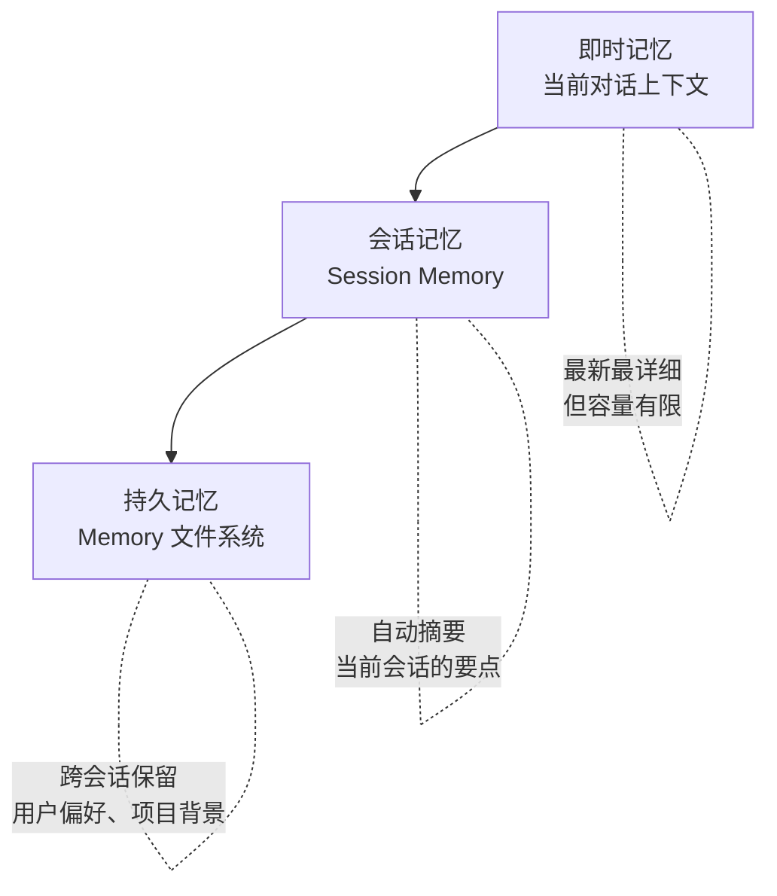
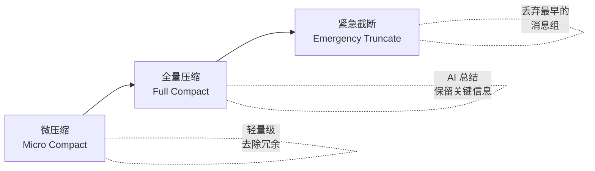
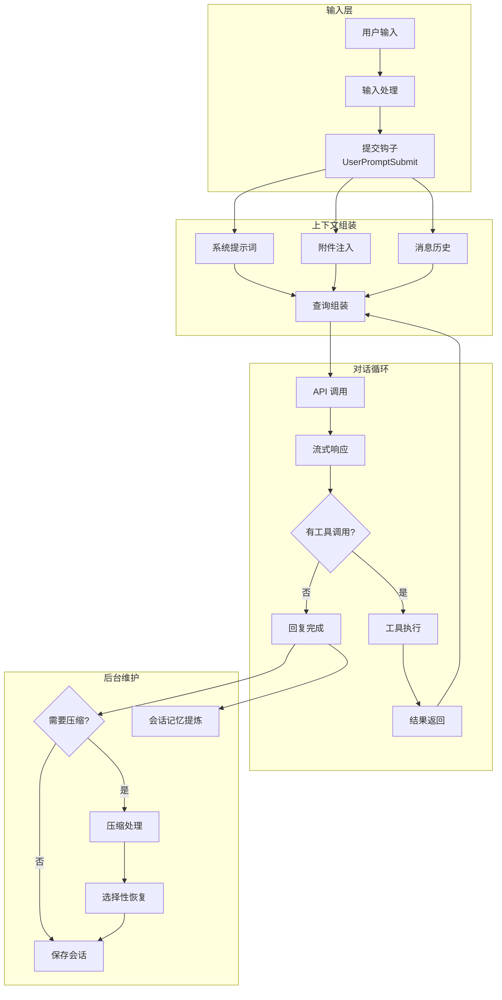

# 上下文与状态管理

> [!abstract] 核心问题
> AI 的"工作记忆"有上限（上下文窗口），就像一张办公桌——桌面大小有限，但你可能需要处理一摞文件。如何在有限空间里保持 AI 的"记忆"？这是 Agent 产品最核心的挑战之一。

## 一、三层记忆模型

Claude Code 把"记忆"分成三个层次，就像人的记忆系统：



| 层级 | 容量 | 生命周期 | 内容 |
|------|------|---------|------|
| 即时记忆 | 上下文窗口大小 | 当前对话 | 完整的消息历史、工具调用、结果 |
| 会话记忆 | 约 40K tokens | 当前会话 | AI 自动提炼的关键事实、决策、进展 |
| 持久记忆 | 无上限 | 跨会话 | 用户偏好、项目上下文、反馈规则 |

> [!tip] 设计启示
> 这就像做笔记的三个习惯：白板上写当前讨论（即时）、会议纪要（会话）、知识库（持久）。一个好的 Agent 产品必须有类似的分层记忆机制。

## 二、系统提示词：AI 的"工作手册"

每次 AI 开始思考前，系统会组装一份"工作手册"（系统提示词），告诉 AI 它是谁、能做什么、该怎么做。

### 提示词的分段缓存策略

```
┌─────────────────────────────────────┐
│         静态段落（可缓存）            │
│  ├── 角色描述："你是 Claude Code..."  │
│  ├── 工具使用规则                    │
│  ├── 编码规范                       │
│  ├── 安全准则                       │
│  └── 输出风格                       │
├─────── 缓存分界线 ─────────────────── │
│         动态段落（每次更新）           │
│  ├── 环境信息（当前目录、Git 状态）   │
│  ├── 可用 Skills 列表               │
│  ├── 记忆内容（从持久记忆加载）       │
│  ├── MCP 工具说明                   │
│  └── 当前日期、语言偏好              │
└─────────────────────────────────────┘
```

> [!important] 为什么要分"静态"和"动态"？
> AI API 有一种优化叫==提示词缓存（Prompt Cache）==——如果提示词的前半段没变，API 可以复用之前的计算结果，==省钱又快==。所以 Claude Code 故意把不常变的内容放前面（可缓存），常变的放后面。

### 上下文来源

系统会从多个地方收集信息注入提示词：

| 来源 | 内容 | 缓存策略 |
|------|------|---------|
| 硬编码段落 | 角色定义、行为规则 | 全局缓存 |
| Git 状态 | 当前分支、最近提交 | 会话内缓存（只查一次） |
| CLAUDE.md 文件 | 项目级指令（类似项目 README） | 会话内缓存 |
| 持久记忆文件 | 用户偏好、反馈规则 | 每次重新加载 |
| MCP 服务 | 外部工具说明 | 连接时加载 |

## 三、上下文压缩：桌面太满怎么办

随着对话进行，上下文会越来越大。Claude Code 有一套==自动压缩系统==：

### 压缩触发时机

```
监控器持续跟踪上下文大小：
  → 达到窗口容量的 70% → 发出警告
  → 接近上限 → 自动触发压缩
  → 压缩请求本身也太长 → 启动"紧急截断"模式
```

### 三级压缩策略



| 级别 | 做什么 | 什么时候用 |
|------|--------|-----------|
| 微压缩 | 去掉重复内容、压缩工具执行模式 | 两次全量压缩之间 |
| 全量压缩 | AI 把整段历史总结成精华摘要 | 上下文接近上限时 |
| 紧急截断 | 直接丢掉最早的消息（最后手段） | 连压缩请求都太长时 |

### 压缩后的"急救包"

全量压缩后，系统不是只留下摘要就完了——它会==有选择地恢复==一些关键信息：

```
压缩后自动恢复：
  ├── 最多 5 个关键文件的内容（每个最多 5000 tokens）
  ├── Skills 指令（最多 25,000 tokens 的预算）
  ├── 工具可用性说明
  └── 插入一个"压缩边界标记"（告诉 AI "这之前的历史已经被总结了"）
```

> [!tip] 设计启示
> "有限记忆 + 智能压缩 + 选择性恢复"这套组合拳是 Agent 产品的关键能力。你的 Agent 不需要记住所有细节，但必须知道==哪些信息值得保留、哪些可以忘记、忘了的去哪里找回来==。

## 四、会话记忆：AI 的"会议纪要"

会话记忆是一个在后台静默运行的系统，它让 AI 自动把重要信息记到一个 Markdown 文件中。

### 触发条件

```
什么时候提炼记忆？
  ├── 对话深度达到一定阈值（首次触发）
  ├── 距上次提炼已有足够多的 token 消耗
  ├── 距上次提炼已有足够多的工具调用
  └── 最近一次 AI 回复没有工具调用（说明是"安静时刻"）
```

### 运行方式

```
提炼过程：
  1. 派生一个子代理（不打扰主对话）
  2. 子代理阅读最新的对话历史
  3. 提炼关键事实到 ~/.local/share/Claude/session_memory.md
  4. 主代理在下次对话中自动读取这个文件
```

> [!example] 输出示例
> ```markdown
> ## 当前任务
> - 正在重构用户认证模块，从 JWT 迁移到 OAuth 2.0
> 
> ## 关键决策
> - 选择了 Passport.js 库
> - 需要保持向后兼容
> 
> ## 已完成
> - 创建了新的 auth 中间件
> - 更新了 3 个 API 路由
> ```

## 五、应用状态管理

整个应用的全局状态存在一个==单一的状态仓库（Store）==里：

```
AppState 包含：
  ├── 对话消息列表
  ├── 当前权限模式和规则
  ├── 模型选择和参数
  ├── MCP 服务器连接
  ├── 正在运行的任务
  ├── 代理注册表
  ├── UI 状态（视口大小、选中项）
  └── 推测执行状态
```

### 读取优化

```typescript
// ❌ 坏的方式：任何状态变化都会触发重渲染
const entireState = useAppState(s => s)

// ✅ 好的方式：只关心 verbose 字段变化才重渲染
const verbose = useAppState(s => s.verbose)
```

> [!info] 设计模式：选择器（Selector）
> 就像订报纸——你不需要每天收到整份报纸的所有版面，只需要你关心的那几页。"选择器"让每个组件只监听自己需要的状态片段。

## 六、会话持久化与恢复

对话不会因为关闭终端就丢失：

```
保存：
  每次对话更新 → 自动保存到 ~/.local/share/Claude/transcripts/{sessionId}.json

恢复：
  claude --resume    → 列出最近会话，选择恢复
  claude --continue  → 直接继续最后一次会话
```

> [!tip] 设计启示
> 对于 Agent 产品，"可恢复"是核心体验。用户不应该因为一次断开就丢失整个工作上下文。

## 七、附件系统：动态注入上下文

每次 AI 开始新一轮思考时，系统会注入一些"附件"（额外的上下文）：

```
附件注入流程：
  1. 记忆附件：从持久记忆文件加载
  2. 计划附件：当前的工作计划
  3. 工具发现附件：延迟加载的工具说明
  4. Skills 附件：已激活的 Skill 指令
  → 自动去重（同样的附件不会重复注入）
```

## 状态流全景图



## 设计模式总结

| 模式 | 解决什么问题 |
|------|-------------|
| 三层记忆模型 | 不同时间跨度的信息有不同的存储策略 |
| 提示词分段缓存 | 省钱省时间，静态内容不重复计算 |
| 渐进式压缩 | 对话再长也能继续，不会"失忆" |
| 压缩后选择性恢复 | 压缩不等于遗忘，关键信息要复原 |
| 会话记忆自动提炼 | 后台静默工作，不打扰用户 |
| 单一状态仓库 + 选择器 | 全局状态可控，UI 性能高效 |
| 会话持久化与恢复 | 关闭窗口不丢工作 |

---

**相关笔记**：[[00 - Claude Code 架构总览]] | [[01 - 设计哲学与核心理念]] | [[07 - 对话生命周期]] | [[05 - 多智能体协作]]
