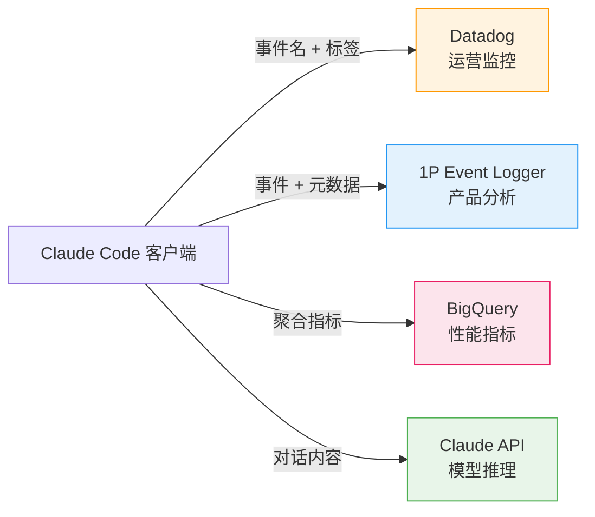
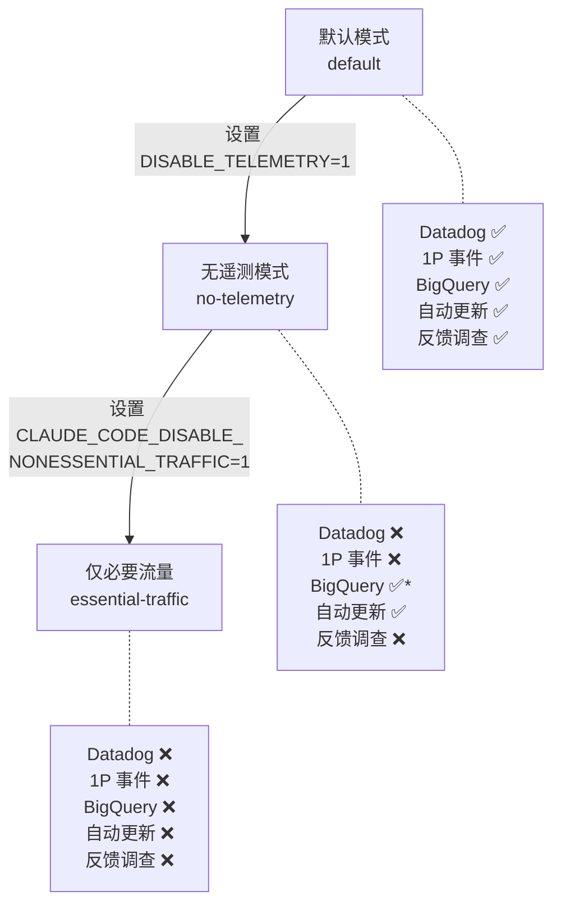

> [!abstract] 核心问题
> Claude Code 的遥测数据到底发往哪里？三个目的地各收什么？用户怎么关？
> 答案：**数据流向三个独立管道——Datadog（运营监控）、1P 事件日志（产品分析）、BigQuery（性能指标）——每个管道有不同的数据范围和关闭方式。**

## 三条遥测管道总览

Claude Code 并不是把所有数据塞进一个接口，而是设计了三条独立的上报管道，各司其职：



> [!important] 关键区分
> 对话内容（你输入的文字、代码、文件内容）只发给 **Claude API 用于模型推理**，不会进入遥测管道。遥测管道只收集"发生了什么事"（事件），不收集"用户说了什么"（内容）。

## 管道一：Datadog — 运营监控

**源码**：`src/services/analytics/datadog.ts`
**目的地**：`https://http-intake.logs.us5.datadoghq.com/api/v2/logs`
**用途**：实时监控产品健康度，快速发现生产问题

### 严格的白名单机制

Datadog 只接受 **64 个预定义事件**，硬编码在 `DATADOG_ALLOWED_EVENTS` 集合中。任何不在名单里的事件直接丢弃：

```typescript
const DATADOG_ALLOWED_EVENTS = new Set([
  'tengu_init',              // 启动
  'tengu_exit',              // 退出
  'tengu_api_error',         // API 错误
  'tengu_api_success',       // API 成功
  'tengu_tool_use_success',  // 工具调用成功
  'tengu_tool_use_error',    // 工具调用失败
  'tengu_uncaught_exception', // 未捕获异常
  'tengu_voice_recording_started', // 语音录制
  // ... 共 64 个事件
])
```

### 每个事件携带的标签

```typescript
const TAG_FIELDS = [
  'arch',              // CPU 架构（arm64/x64）
  'platform',          // 操作系统
  'model',             // 模型名称（会被规范化）
  'provider',          // API 提供方
  'version',           // 客户端版本
  'toolName',          // 工具名称（MCP 会脱敏为 "mcp"）
  'subscriptionType',  // 订阅类型
  'userBucket',        // 用户桶号（0-29）
  // ...
]
```

### 用户身份如何被隐藏

Datadog 不记录用户 ID，而是用**桶化（bucketing）**来近似统计用户数：

```typescript
const NUM_USER_BUCKETS = 30

const getUserBucket = memoize((): number => {
  const userId = getOrCreateUserID()
  const hash = createHash('sha256').update(userId).digest('hex')
  return parseInt(hash.slice(0, 8), 16) % NUM_USER_BUCKETS
})
```

把用户 ID 哈希后取模 30，得到一个 0-29 的桶号。这样可以估算"有多少不同用户受影响"，但无法反推出具体是谁。

> [!tip] 设计启示
> **桶化是隐私与监控的折中**。你不需要知道"具体是 user_abc123 遇到了问题"，你只需要知道"大约有 5 个不同的桶受影响（约 5 个用户）"。这个思路在任何需要"统计但不识别"的场景都适用。

### 额外的限制

- **仅生产环境**：`NODE_ENV !== 'production'` 直接跳过
- **仅第一方**：Bedrock、Vertex 等第三方 provider 不上报
- **模型名规范化**：非 Anthropic 内部用户的模型名会被映射到已知列表，不在列表中的统一为 `'other'`
- **版本号截断**：开发版本号 `2.0.53-dev.20251124.t173302.sha526cc6a` 截断为 `2.0.53-dev.20251124`

## 管道二：1P 事件日志 — 产品分析

**源码**：`src/services/analytics/firstPartyEventLogger.ts`
**目的地**：`/api/event_logging/batch`（Anthropic 自己的 API 服务器）
**用途**：产品使用分析、A/B 实验追踪、功能采用率

### 与 Datadog 的关键区别

| 维度 | Datadog | 1P 事件日志 |
|------|---------|------------|
| 服务方 | 第三方 SaaS | Anthropic 自有 |
| 事件范围 | 64 个白名单事件 | 任何事件名 |
| 元数据丰富度 | 标签（键值对） | 完整的结构化元数据 |
| 用户身份 | 桶号（0-29） | user_id + account_uuid + org_uuid |
| 失败处理 | 丢弃 | 持久化到磁盘重试 |

### 上报的元数据结构

每个 1P 事件携带三层元数据（来自 `metadata.ts` 的 `to1PEventFormat`）：

**环境层（env）**——描述"在哪台机器上"：
- 操作系统、CPU 架构、Node.js 版本
- 终端类型、包管理器、运行时
- 是否 CI 环境、是否 WSL、是否远程
- 客户端版本、构建时间

**核心层（core）**——描述"是谁在做什么"：
- session_id、model、user_type
- is_interactive（是否交互模式）
- client_type（CLI / IDE 扩展 / 桌面端）
- agent 相关信息（子代理 ID、父会话、团队名）

**附加层（additional）**——描述"这个事件的具体细节"：
- 每个事件类型不同的特定字段
- 例如工具调用事件会有 toolName、duration 等

### 类型系统的隐私护栏

1P 事件的 metadata 参数类型也是 `Record<string, number | boolean | undefined>`——**禁止字符串**。这与 Datadog 管道使用的是同一套类型约束，从编译时就阻止了文本数据泄露。

### 采样机制

事件可以通过 GrowthBook 远程配置进行采样：

```typescript
export type EventSamplingConfig = {
  [eventName: string]: {
    sample_rate: number  // 0-1，0 = 全部丢弃，1 = 全部保留
  }
}
```

没有配置的事件默认 100% 上报。这允许 Anthropic 在高流量事件上动态降采样，避免日志洪水。

### 失败事件持久化

1P 事件发送失败后不会丢弃，而是写入磁盘：

```
~/.claude/telemetry/1p_failed_events.[sessionId].[batchUUID].json
```

下次启动时会自动重试这些事件。这意味着**即使网络断开，事件也不会丢失**。

> [!warning] 注意
> 本地磁盘上会留下失败事件的 JSONL 文件。虽然不包含用户输入内容，但包含事件名、元数据等信息。对安全敏感环境来说，定期清理 `~/.claude/telemetry/` 目录是有意义的。

## 管道三：BigQuery — 性能指标

**源码**：`src/utils/telemetry/bigqueryExporter.ts`
**目的地**：`https://api.anthropic.com/api/claude_code/metrics`
**用途**：性能监控、资源使用追踪、产品指标大盘

### 上报内容

BigQuery 收集的是 **OpenTelemetry 标准指标**，不是事件。区别在于：

- **事件**：离散的"发生了一件事"（如"工具调用成功了"）
- **指标**：连续的"某个度量的值"（如"token 使用量 = 1523"，"缓存命中率 = 0.85"）

资源属性（随每次导出发送）：

```typescript
const resourceAttributes = {
  'service.name': 'claude-code',
  'service.version': '2.1.88',
  'os.type': 'darwin',
  'os.version': '25.3.0',
  'host.arch': 'arm64',
  'user.customer_type': 'claude_ai',  // 或 'api'
  'user.subscription_type': 'pro',     // 仅 claude_ai 用户
}
```

### 组织级别关闭

BigQuery 有一个独特的关闭机制——**组织级别的 opt-out**：

```typescript
// 检查组织是否禁用了指标
const metricsStatus = await checkMetricsEnabled()
// 调用 /api/claude_code/organizations/metrics_enabled
```

这个检查有双层缓存：
- 内存缓存：1 小时
- 磁盘缓存：24 小时

也就是说企业管理员可以在后台为整个组织关闭指标上报，无需每个用户单独设置。

## 主 API 调用 vs 遥测——关键区分

很多人容易混淆：**发给 Claude 模型的请求** 和 **遥测数据** 是完全不同的两条路。

| | 主 API 调用 | 遥测数据 |
|--|-----------|---------|
| **目的** | 让 AI 生成回答 | 产品监控和分析 |
| **包含对话内容** | ✅ 完整对话历史 | ❌ 用户输入被 REDACTED |
| **包含文件内容** | ✅ 工具结果中可能有 | ❌ 文件路径被 SHA256 哈希 |
| **用户能关闭** | ❌ 关了就不能用了 | ✅ 可以关 |
| **第三方能看到** | ❌ 仅 Anthropic | ⚠️ Datadog 看到部分事件 |

> [!tip] 设计启示
> **功能通道和遥测通道一定要物理隔离。** Claude Code 的做法是：功能用 `/v1/messages` API，遥测用三条独立管道。这样即使遥测系统出问题，核心功能不受影响；用户关闭遥测也不影响使用。

## 完整的上报 vs 不上报清单

### ✅ 会上报

| 数据 | 流向 | 脱敏方式 |
|------|------|---------|
| 事件名（如 tengu_tool_use_success） | Datadog + 1P | 原文 |
| 工具类型名（Bash、Read、Write…） | Datadog + 1P | 内置工具原文，MCP 替换为 `mcp_tool` |
| 模型名称 | 三条管道 | 外部用户会规范化为已知列表 |
| 操作系统、架构、Node 版本 | 三条管道 | 原文 |
| 客户端版本 | 三条管道 | 开发版本号截断 |
| session_id | 1P + BigQuery | 原始 UUID |
| user_id | 1P | 本地生成的匿名 UUID |
| account_uuid / org_uuid | 1P | OAuth 用户的账户标识 |
| 订阅类型（pro/max/enterprise） | 三条管道 | 原文 |
| CPU/内存/堆使用量 | 1P + BigQuery | 原始数值 |
| 用户桶号（0-29） | Datadog | 从 user_id 哈希取模 |
| 文件扩展名（来自 Bash 命令） | 1P | 仅扩展名，超 10 字符替换为 `other` |
| Git 仓库远程地址哈希 | 1P | SHA256 前 16 字符 |
| 是否 CI / GitHub Actions | 三条管道 | 布尔值 |
| GrowthBook 实验分配 | 1P | 实验 ID + 变体号 |

### ❌ 不会上报

| 数据 | 原因 |
|------|------|
| 用户输入的文字 | 默认 `<REDACTED>`，类型系统禁止字符串 |
| 代码内容、文件内容 | 类型系统禁止 + 文件路径哈希 |
| 完整文件路径 | SHA256 哈希，不可逆 |
| MCP 服务器名称（用户自定义） | 统一替换为 `mcp_tool` |
| 会话对话历史 | 仅存在于主 API 调用和本地 transcript |
| 系统提示词全文 | 仅发送 SHA256 哈希（tracing 场景） |

## 三级隐私开关

源码 `src/utils/privacyLevel.ts` 定义了三级递进的隐私控制：



> \* BigQuery 在 no-telemetry 模式下仍可能上报，需要组织级别单独关闭

此外还有一层独立的判断（`isAnalyticsDisabled()`）：
- 测试环境（`NODE_ENV=test`）自动关闭
- 使用 Bedrock / Vertex / Foundry 等第三方 provider 时自动关闭

> [!tip] 设计启示
> **隐私控制要分级，不要只有"全开"和"全关"。** Claude Code 的三级设计允许：企业用户在保留产品功能的同时关闭遥测（no-telemetry），或在高安全环境下彻底断网除了 API 调用（essential-traffic）。分级比二元开关灵活得多。

## 本地持久化的数据

除了网络上报，Claude Code 还在本地存储一些数据：

| 路径 | 内容 | 包含用户数据？ |
|------|------|---------------|
| `~/.claude/[sessionId]/transcript.jsonl` | 完整会话记录 | ✅ 完整对话 |
| `~/.claude/[sessionId]/tool-results/` | 大型工具输出 | ✅ 文件内容等 |
| `~/.claude/[sessionId]/memory.jsonl` | 会话记忆 | ✅ 上下文信息 |
| `~/.claude/telemetry/1p_failed_events.*.json` | 失败的遥测事件 | ⚠️ 事件名+元数据 |
| `~/.claude/` 下的缓存文件 | 指标 opt-out 状态等 | ❌ 仅配置 |

> [!important] 本地 transcript 是完整的
> 虽然遥测管道会脱敏，但本地的 `transcript.jsonl` 包含**完整的对话历史、工具输入输出、文件内容**。如果你在意本地数据安全，定期清理 `~/.claude/` 下的会话目录是必要的。

## "Help Improve Claude" 开关

除了环境变量，OAuth 用户还有一个 UI 级别的隐私控制——**Grove 设置**：

- 源码：`src/commands/privacy-settings/`
- 后端：`/api/oauth/account/settings`
- 首次运行时弹出对话框，询问是否同意"帮助改进 Claude"
- 用户选择会保存到 `account.settings.grove_enabled`

这是一个独立于遥测开关的同意机制，主要控制的是用户数据是否可以被用于模型训练改进。

---

相关笔记：
- [[09 - 数据收集与隐私保护设计]] — 隐私保护的设计理念：REDACTED、类型护栏、审查类型
- [[09b - 外部网络连接完整清单]] — 所有外部 URL 和端点，按用途分类，含隐私级别对照
- [[12 - 环境变量系统]] — 遥测相关的环境变量
- [[12b - 环境变量的安全过滤机制]] — 环境变量如何被过滤
- [[01 - 设计哲学与核心理念]] — "失败关闭"原则在隐私中的体现
