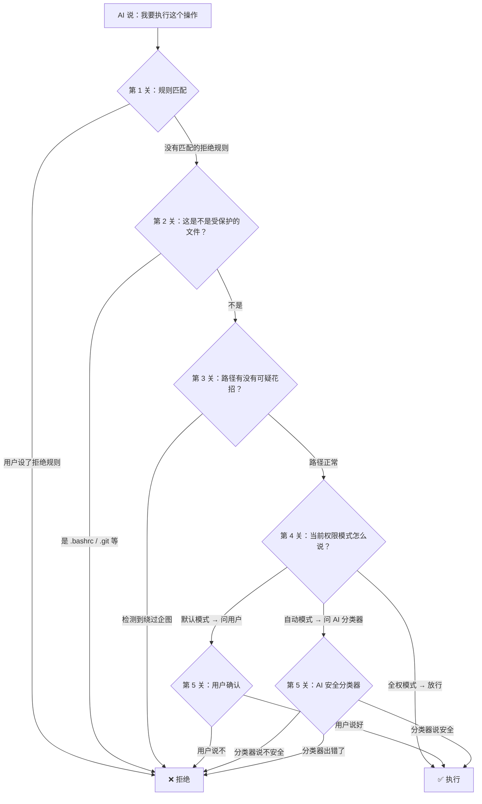

> [!abstract] 核心问题
> 你让 AI 帮你干活，但 AI 会不会干"出格"的事？比如删掉你的系统文件、偷偷改掉你的 Shell 配置、把代码传到外部服务器？Claude Code 用了一套多层"拒绝"机制来防止这些事发生。

## 先说结论

Claude Code **不是靠一个简单的黑名单来决定"做不做"**。它更像是一栋大楼的安保系统——从大门口的门禁卡，到楼层的闸机，到机房的指纹锁，每一层都独立运作，任何一层说"不行"，操作就被挡下来。

具体来说，一个操作从 AI 提出到真正执行，要经过 **5 道关卡**：

这 5 关的详细设计分别在以下子笔记中展开：

| 子笔记 | 讲什么 |
|--------|-------|
| [[10a - 受保护的文件与目录]] | 哪些文件 AI 永远不能自动修改？为什么是这些？ |
| [[10b - 路径攻击与防御]] | 攻击者怎么用"花招路径"骗过安全检查？Claude Code 怎么防？ |
| [[10c - 自动模式的 AI 分类器]] | 用 AI 来审查 AI 的操作——这个"安全分类器"是怎么工作的？ |

## 为什么要这么多层？

一个常见的问题是：为什么不能只用一层检查？比如做个黑名单，把危险操作列出来不就行了？

答案是：**单点防御一旦被绕过，就等于没有防御。**

> [!example] 类比：银行金库
> 银行不会只靠一把锁来保护金库。它有监控、保安、门禁、时间锁、报警系统……每一层都假设"其他层可能失效"。这就是安全领域的**纵深防御**（Defense in Depth）。

Claude Code 的每一层防御都假设前面的层可能被绕过：
- 规则匹配可能没覆盖到某个操作？——受保护文件列表兜底
- 受保护文件列表可能被路径花招绕过？——路径攻击检测兜底
- 路径检测可能漏掉新的攻击方式？——权限模式和用户确认兜底
- 用户可能点了"全部允许"？——受保护文件检查**即使在全权模式下也不可绕过**

最后这一点特别重要：有些检查是**硬编码**的，用户想关也关不掉。这不是限制用户的自由，而是防止用户因为图省事而"自伤"。

## 两个核心设计原则

### 原则一：失败关闭（Fail-Closed）

当系统遇到不确定的情况时，是选择"放行"还是"拒绝"？

Claude Code 的答案是：**永远选择拒绝**。

比如自动模式的 AI 分类器：
- 分类器服务挂了？→ 拒绝
- 分类器返回了看不懂的结果？→ 拒绝
- 网络超时了？→ 拒绝

这跟很多互联网产品的逻辑相反。大部分产品的默认是"让用户继续"（fail-open），因为中断体验很伤用户感受。但在安全领域，"不确定就放行"等于"不确定就信任"——这是危险的。

> [!tip] 设计启示
> 做 AI Agent 产品时，安全相关的决策链条要设计成 fail-closed。这意味着你要接受一些误报（偶尔拦住了不该拦的操作），来换取零漏报（永远不放过真正危险的操作）。

### 原则二：宁可误杀，不可放过

这在路径检查上体现得最明显。

比如用户输入了一个路径 `$HOME/.bashrc`，这个 `$HOME` 在安全检查时是一个字面量字符串，但在 Shell 执行时会被展开成实际的用户目录。这就产生了一个安全漏洞：**你检查的路径和实际操作的路径不是同一个东西**。

Claude Code 的做法是：路径里只要出现 `$`、`%`、`~user` 这些"可能被 Shell 解释"的字符，就直接拒绝自动执行，必须由用户手动确认。

这会不会误伤？会。有些完全安全的路径也会被拦下来。但在安全设计中，**误报的代价远小于漏报**。

## 危险命令的分级处理

Claude Code 把 Shell 命令分成了两类：

**高危命令**——这些可以执行任意代码，相当于"给了一把万能钥匙"：
- 编程语言解释器：`python`、`node`、`ruby`、`php` 等
- 包运行器：`npx`、`bunx`、`npm run` 等
- Shell 自身：`bash`、`sh`、`zsh`、`eval`、`exec`
- 提权命令：`sudo`
- 远程执行：`ssh`

**普通命令**——功能有限，不容易造成严重后果：
- 文件查看：`ls`、`cat`、`head`
- 版本控制：`git status`、`git log`
- 构建工具：`npm test`、`make`

高危命令在自动模式下会被剥离掉用户预设的"允许"规则——即使你之前说过"允许所有 python 命令"，自动模式也会忽略这条规则，强制让分类器来判断每次 `python` 调用是否安全。

> [!tip] 设计启示
> 命令分级的关键不是"这个命令本身危不危险"，而是"这个命令能被用来做多少不同的事"。`ls` 只能列文件，`python` 可以做任何事——后者需要更严格的控制，不管用户要求它做什么。

## 熔断机制：防止反复试探

还有一个小但重要的机制：如果自动模式的分类器**连续 3 次或累计 20 次**拒绝了操作，系统会自动降级为手动确认模式。

这解决了什么问题？想象一个场景：AI 被 prompt injection 攻击后，反复尝试执行同一个危险操作，每次稍微改变一下参数。分类器虽然每次都拒绝了，但随着上下文变化，可能第 N 次就判断失误了。熔断器确保了"多次尝试"这个行为本身就触发更严格的控制——从"AI 判断"升级为"人类判断"。

---

相关笔记：
- [[03 - 权限与安全模型]]
- [[09 - 数据收集与隐私保护设计]]
- [[02 - 工具系统设计]]
- [[08 - 构建 AI Agent 的设计启示]]
