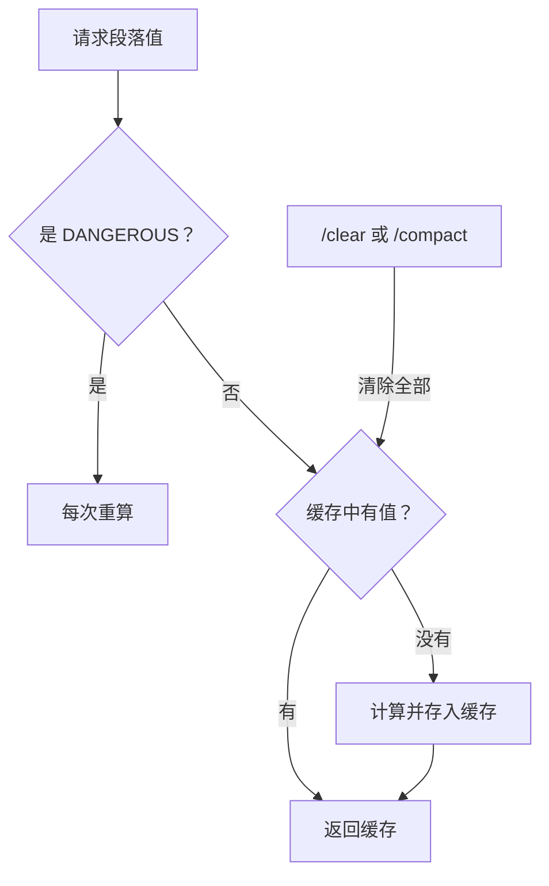

> [!abstract]
> Claude Code 的系统提示词不是一个写死的字符串，而是由十几个独立段落按固定顺序拼装而成。这篇分析整个组装流程：哪些段落、怎么排列、优先级如何工作、哪些内容是动态注入的。

## 一、组装入口：`getSystemPrompt()`

整个系统提示词的组装发生在 `src/constants/prompts.ts` 的 `getSystemPrompt()` 函数。它接收四个参数：

- **tools**：当前启用的工具列表
- **model**：当前使用的模型 ID
- **additionalWorkingDirectories**：额外工作目录（`--add-dir`）
- **mcpClients**：已连接的 MCP 服务器

返回的是一个 **字符串数组** `string[]`，每个元素是一个段落。最终由 API 层合并成文本块发送给模型。

> [!important] 为什么是数组而不是字符串？
> 因为缓存系统需要知道哪些段落是静态的、哪些是动态的。数组让后续处理可以按段落粒度操作——比如在特定位置插入缓存分界标记。

## 二、段落清单与排列顺序

### 静态段落（缓存分界线之前）

这些段落对所有用户、所有会话都一样，可以全局缓存：

| 顺序 | 段落 | 生成函数 | 内容概要 |
|------|------|---------|---------|
| 1 | 身份介绍 | `getSimpleIntroSection()` | "You are an interactive agent…"，包含网络安全风险指令 |
| 2 | 系统规则 | `getSimpleSystemSection()` | 权限模式、system-reminder 说明、hooks 说明、上下文压缩 |
| 3 | 任务执行 | `getSimpleDoingTasksSection()` | 代码风格、安全性、不要过度工程化等行为准则 |
| 4 | 操作安全 | `getActionsSection()` | 可逆性评估、危险操作确认、"measure twice, cut once" |
| 5 | 工具使用 | `getUsingYourToolsSection()` | 优先用专用工具、并行调用、任务管理 |
| 6 | 语气风格 | `getSimpleToneAndStyleSection()` | 不用 emoji、简洁、引用代码格式 |
| 7 | 输出效率 | `getOutputEfficiencySection()` | "Go straight to the point"，简洁输出准则 |

```
┌─────────────────────────────────────────┐
│         静态段落（全局可缓存）             │
│  intro → system → tasks → actions →     │
│  tools → tone → output_efficiency       │
├═════════════════════════════════════════┤
│    __SYSTEM_PROMPT_DYNAMIC_BOUNDARY__   │  ← 分界标记
├─────────────────────────────────────────┤
│         动态段落（会话级）                 │
│  session → memory → env → lang →        │
│  mcp → scratchpad → frc → ...           │
└─────────────────────────────────────────┘
```

### 动态段落（缓存分界线之后）

这些段落因用户、会话、环境不同而变化，通过**注册表**管理：

| 段落名 | 内容 | 变化原因 |
|--------|------|---------|
| `session_guidance` | 会话特定指南 | 取决于启用了哪些工具、技能、代理 |
| `memory` | 记忆系统提示词 | auto memory 的行为指令和 MEMORY.md 内容 |
| `ant_model_override` | 内部模型覆盖 | 仅 Anthropic 内部使用 |
| `env_info_simple` | 环境信息 | 工作目录、平台、shell、git 状态、模型名称 |
| `language` | 语言偏好 | 用户设置的 `settings.language` |
| `output_style` | 输出风格 | 自定义输出风格配置 |
| `mcp_instructions` | MCP 指令 | 已连接 MCP 服务器提供的使用说明 |
| `scratchpad` | 临时目录说明 | 是否启用了 scratchpad 功能 |
| `frc` | 函数结果清理 | cached microcompact 是否启用 |
| `summarize_tool_results` | 工具结果摘要 | 提醒模型记录重要信息 |
| `token_budget` | Token 预算 | TOKEN_BUDGET 功能是否开启 |

## 三、段落注册表：memoize 与刷新

动态段落不是每次调用都重算的，而是通过 `systemPromptSection()` 注册后由**注册表**管理缓存。

### 注册方式

```typescript
// 普通段落：计算一次，缓存到 /clear 或 /compact
systemPromptSection('memory', () => loadMemoryPrompt())

// 危险段落：每次都重算，会破坏缓存！
DANGEROUS_uncachedSystemPromptSection(
  'mcp_instructions',
  () => getMcpInstructionsSection(mcpClients),
  'MCP servers connect/disconnect between turns'  // 必须说明原因
)
```

### 缓存逻辑



> [!tip] 设计启示：用"危险"命名来约束缓存破坏
> 把"每次重算"的段落函数命名为 `DANGEROUS_uncachedSystemPromptSection`，并且**强制要求填写原因**。这个设计模式很巧妙——它不是禁止你打破缓存，而是通过命名和参数让你在写代码时三思。目前源码中只有 MCP 指令一个段落使用了这个"危险"标记。

## 四、优先级系统：谁的提示词说了算？

`buildEffectiveSystemPrompt()` 函数定义了一个清晰的优先级链：

```
Override（最高）→ Coordinator → Agent → Custom → Default（最低）
                                                    ↑
                                              Append（总是追加）
```

| 优先级 | 来源 | 场景 | 效果 |
|--------|------|------|------|
| 0（最高） | Override | loop 模式 | **替换**所有其他提示词 |
| 1 | Coordinator | 协调器模式 | **替换**默认提示词 |
| 2 | Agent | 主线程代理定义 | **替换**默认，或在 Proactive 模式下**追加** |
| 3 | Custom | `--system-prompt` 参数 | **替换**默认提示词 |
| 4（最低） | Default | 标准 Claude Code | 完整的 `getSystemPrompt()` 输出 |
| — | Append | `appendSystemPrompt` | **总是追加**到最终结果末尾 |

> [!warning] Agent 在 Proactive 模式下的特殊处理
> 普通模式下，Agent 提示词**替换**默认提示词。但在 Proactive（自主工作）模式下，Agent 提示词是**追加**到默认提示词后面的。这是因为 Proactive 模式需要保留自主工作的基础指令，Agent 只是在上面叠加领域知识——类似于"队友"模式。

## 五、环境信息段落的组成

`computeSimpleEnvInfo()` 生成的环境信息包含：

```markdown
# Environment
You have been invoked in the following environment:
 - Primary working directory: /Users/xxx/project
   - Is a git repository: true
 - Platform: darwin
 - Shell: zsh
 - OS Version: Darwin 25.3.0
 - You are powered by the model named Claude Opus 4.6. The exact model ID is claude-opus-4-6.
 - Assistant knowledge cutoff is May 2025.
 - The most recent Claude model family is Claude 4.5/4.6. Model IDs — ...
 - Claude Code is available as a CLI in the terminal, desktop app...
 - Fast mode for Claude Code uses the same Claude Opus 4.6 model...
```

这些信息让模型知道自己"在哪里"——操作系统、shell 类型、是否在 git 仓库中、自己是什么模型。

> [!tip] 设计启示：让 AI 知道自己的运行环境
> 这不只是"告诉 AI 信息"，更是**校准 AI 的行为**。比如知道 shell 是 zsh 还是 bash 会影响命令语法；知道是 Windows 会提示用 Unix 风格路径；知道自己是什么模型可以在推荐 API 时给出正确的模型 ID。

## 六、会话特定指南的条件组装

`getSessionSpecificGuidanceSection()` 根据当前会话的工具集动态组装指南：

- **有 AskUserQuestion 工具？** → 加入"被拒绝时可以询问"的指南
- **非非交互模式？** → 加入"用 `!` 前缀执行命令"的提示
- **有 Agent 工具？** → 加入代理使用指南（Fork 子代理 vs 常规子代理）
- **有 Explore/Plan 代理？** → 加入"简单搜索直接用 Glob/Grep，复杂搜索用 Explore 代理"的指南
- **有 Skill 工具？** → 加入"用 `/skill-name` 调用技能"的说明
- **有 Verification Agent？** → 加入独立验证要求（非琐碎实现必须经过验证代理）

这段的关键在于：**它被放在动态分界线之后**，就是因为这些条件每个用户不同，放在静态区域会让缓存分裂成 $2^N$ 个变体。

## 七、精简模式

当环境变量 `CLAUDE_CODE_SIMPLE=true` 时，整个系统提示词简化为一行：

```
You are Claude Code, Anthropic's official CLI for Claude.

CWD: /Users/xxx
Date: 2026-03-31
```

这是为调试或嵌入场景提供的极简模式。

## 八、子代理的提示词增强

子代理（subagent）不走 `getSystemPrompt()`，而是通过 `enhanceSystemPromptWithEnvDetails()` 在已有提示词基础上追加：

- Agent 行为注意事项（用绝对路径、简洁报告、不用 emoji）
- 技能发现指南（如果启用）
- 环境信息

子代理的提示词比主线程精简得多——它们是"执行者"，不需要完整的行为规范。

> [!tip] 设计启示：主代理和子代理需要不同粒度的提示词
> 主代理需要完整的行为规范（安全、风格、工具使用），子代理只需要知道"在哪里、怎么报告"。把提示词按角色分层，避免子代理的提示词膨胀浪费 token。

---

**相关笔记**：[[11 - 提示词系统架构]] | [[11b - 提示词缓存策略]] | [[11c - CLAUDE.md 配置层级]] | [[04 - 上下文与状态管理]]
