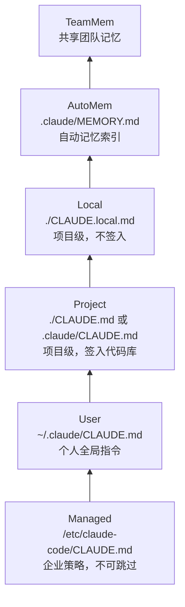
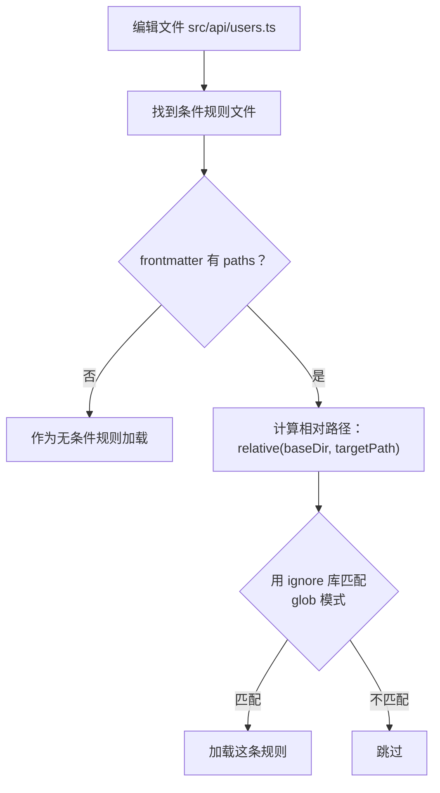
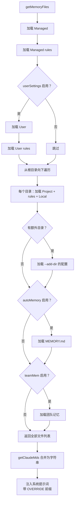

> [!abstract]
> CLAUDE.md 是 Claude Code 最重要的用户定制入口——通过这些文件，用户可以向 AI 注入项目规范、行为偏好、工作流指令。这篇分析 CLAUDE.md 的多层发现机制、加载顺序、条件规则、`@include` 指令，以及最终如何注入系统提示词。

## 一、六层配置，从全局到个人

Claude Code 定义了六种配置文件类型，按优先级从低到高排列：



| 类型 | 路径 | 谁写的 | 签入 Git？ | 特点 |
|------|------|--------|-----------|------|
| **Managed** | `/etc/claude-code/CLAUDE.md` | IT 管理员 | — | 全局策略，永远加载，不可排除 |
| **User** | `~/.claude/CLAUDE.md` | 用户自己 | 否 | 个人偏好，适用所有项目 |
| **Project** | `CLAUDE.md`、`.claude/CLAUDE.md` | 团队 | 是 | 项目规范，团队共享 |
| **Local** | `CLAUDE.local.md` | 用户自己 | 否 | 个人的项目特定指令 |
| **AutoMem** | `.claude/MEMORY.md` | Claude 自动 | 否 | 自动记忆系统索引 |
| **TeamMem** | 共享路径 | 团队 | — | 跨组织同步的团队记忆 |

> [!important] 优先级是"越后加载越高"
> 文件按上述顺序加载，越靠后的文件越"新"，模型会更关注最后加载的内容。这是 LLM 的"近因效应"——最后出现的指令权重最高。

## 二、目录遍历：从根目录到工作目录

Project 和 Local 类型的文件不只在工作目录找，而是**从根目录一路往下找到当前目录**：

```
/ ← 从这里开始
├── CLAUDE.md (如果有就加载)
├── .claude/CLAUDE.md
├── .claude/rules/*.md
│
├── home/
│   └── user/
│       └── projects/
│           ├── CLAUDE.md ← 加载
│           ├── .claude/CLAUDE.md ← 加载
│           ├── .claude/rules/*.md ← 加载
│           │
│           └── my-app/           ← 当前工作目录
│               ├── CLAUDE.md ← 最后加载（最高优先级）
│               ├── CLAUDE.local.md ← 最后加载
│               └── .claude/rules/*.md ← 加载
```

这意味着：**越靠近工作目录的文件优先级越高**。在 monorepo 中，根目录的 CLAUDE.md 放通用规范，子项目目录放特定规范，两者会叠加。

### Worktree 的去重处理

当使用 git worktree 时（比如 `claude -w`），worktree 嵌套在主仓库内。向上遍历会同时经过 worktree 根目录和主仓库根目录——两个目录里的 `CLAUDE.md` 内容相同。

系统的处理方式：**跳过 worktree 之上、主仓库之内的 Project 类型文件**，因为 worktree 已经有自己的 checkout。但 `CLAUDE.local.md` 不跳过，因为它不签入 Git，只在主仓库存在。

## 三、Rules 目录：灵活的规则系统

除了 `CLAUDE.md` 本身，每个层级还支持 `.claude/rules/` 目录：

```
.claude/rules/
├── typescript.md        ← 无条件规则，总是加载
├── testing.md           ← 无条件规则
├── frontend/
│   └── react.md         ← 支持子目录
└── api-routes.md        ← 可以有条件规则（通过 frontmatter）
```

### 无条件规则 vs 条件规则

**无条件规则**：没有 frontmatter `paths` 字段的 `.md` 文件，总是加载。

**条件规则**：frontmatter 中有 `paths` 字段的文件，只在操作目标文件匹配时加载：

```yaml
---
paths:
  - src/api/**
  - src/routes/**
---

API 路由必须使用 RESTful 命名规范...
```

当用户编辑 `src/api/users.ts` 时，这个规则文件才会被注入；编辑 `src/components/Button.tsx` 时就不会加载。

> [!tip] 设计启示：条件规则是"按需加载"的精细控制
> 大项目可能有几十条规则，全部塞进提示词会浪费 token。条件规则让你只在相关场景下加载相关指令——前端规则只在编辑前端代码时出现，后端规则只在编辑后端代码时出现。这是一个在 token 预算和指令覆盖之间的优雅平衡。

### 条件规则的匹配逻辑



**重要细节**：
- Project rules 的 glob 基准目录是 `.claude` 的父目录
- Managed/User rules 的 glob 基准目录是工作目录
- 使用 `ignore` 库（和 `.gitignore` 相同的语法）做匹配

## 四、`@include` 指令：文件引用

CLAUDE.md 中可以用 `@` 语法引用其他文件的内容：

```markdown
# 项目规范

参考以下文档：
@./docs/api-conventions.md
@~/shared-rules/security.md
@/etc/company/coding-standards.md
```

### 解析规则

| 语法 | 含义 |
|------|------|
| `@./path` | 相对于当前文件所在目录 |
| `@path` | 同上（没有前缀等同于 `@./path`） |
| `@~/path` | 相对于用户 home 目录 |
| `@/path` | 绝对路径 |

### 安全限制

- **最大递归深度**：5 层（防止循环引用）
- **循环检测**：已处理的路径不会重复处理
- **文件类型过滤**：只允许文本文件（`.md`、`.ts`、`.py` 等 100+ 种扩展名），拒绝二进制文件
- **外部文件审批**：如果 `@include` 引用了工作目录之外的文件，需要用户明确批准（`hasClaudeMdExternalIncludesApproved`）
- **HTML 注释剥离**：`<!-- -->` 注释会被自动移除，不会注入到提示词
- **代码块内忽略**：代码块和行内代码中的 `@path` 不会被当作引用

> [!warning] @include 的安全考量
> 外部 `@include` 是一个潜在的攻击向量——恶意的 CLAUDE.md 可以引用系统文件。因此系统要求用户显式批准外部引用，并且 User 类型的 CLAUDE.md 可以无限制引用外部文件（因为用户信任自己的全局配置）。

## 五、排除机制

用户可以通过 `claudeMdExcludes` 设置排除特定的 CLAUDE.md 文件：

```json
{
  "claudeMdExcludes": [
    "/tmp/project/CLAUDE.md",
    "**/test-fixtures/**/*.md"
  ]
}
```

### 排除规则

- 只对 User、Project、Local 三种类型生效
- **Managed 和 AutoMem/TeamMem 不可排除**（策略文件和记忆系统必须加载）
- 支持 glob 模式（picomatch）
- **Symlink 感知**：排除模式同时匹配原始路径和 realpath 解析后的路径（解决 macOS `/tmp` → `/private/tmp` 的问题）

## 六、注入系统提示词的方式

所有加载的 CLAUDE.md 文件最终通过 `getClaudeMds()` 函数合并成一个字符串，注入提示词：

```
Codebase and user instructions are shown below. Be sure to adhere 
to these instructions. IMPORTANT: These instructions OVERRIDE any 
default behavior and you MUST follow them exactly as written.

Contents of /project/CLAUDE.md (project instructions, checked into the codebase):

[文件内容]

Contents of /project/CLAUDE.local.md (user's private project instructions, not checked in):

[文件内容]

Contents of ~/.claude/projects/xxx/memory/MEMORY.md (user's auto-memory, persists across conversations):

[文件内容]
```

每个文件都带有**类型标注**，让模型知道这是项目规范、个人配置还是记忆系统。

### TeamMem 的特殊处理

团队记忆用 XML 标签包裹：

```xml
<team-memory-content source="shared">
[内容]
</team-memory-content>
```

这让模型能区分"团队共识"和"个人配置"。

## 七、MEMORY.md 的截断保护

AutoMem 和 TeamMem 的入口文件（MEMORY.md）有两重截断保护：

| 限制 | 阈值 | 原因 |
|------|------|------|
| 行数 | 200 行 | 索引应该是简短的指针列表 |
| 字节数 | 25KB | 防止长行绕过行数限制 |

超出限制时会追加警告：

```
> WARNING: MEMORY.md is 347 lines (limit: 200). Only part of it 
> was loaded. Keep index entries to one line under ~200 chars; 
> move detail into topic files.
```

> [!tip] 设计启示：配置文件需要"安全阀"
> 用户的 CLAUDE.md 和 MEMORY.md 可能无限增长。设置硬性上限（40000 字符的推荐上限、200 行的 MEMORY.md 限制）并给出友好的警告，比让系统悄悄地吃掉大量 token 要好得多。

## 八、InstructionsLoaded Hook

每个被加载的配置文件（User、Project、Local、Managed）都会触发 `InstructionsLoaded` hook，让用户可以审计哪些指令被注入了：

```typescript
void executeInstructionsLoadedHooks(
  file.path,      // 文件路径
  file.type,      // 类型：Project / User / Local / Managed
  loadReason,     // 原因：session_start / compact / include
  {
    globs: file.globs,          // 条件规则的 glob 模式
    parentFilePath: file.parent, // @include 的父文件
  }
)
```

> [!info] AutoMem 和 TeamMem 不触发这个 hook
> 因为它们是记忆系统，不是"指令"。Hook 的语义是"有指令被加载了"，不包含记忆内容。

## 九、整体加载流程



> [!tip] 设计启示：配置加载是一个"洋葱模型"
> 从最外层（全局策略）到最内层（个人记忆），每一层都可以独立开关、独立审计。这种设计适合任何需要多级配置的 AI 产品：
> - **企业层**：强制性策略（安全规范、合规要求）
> - **团队层**：项目规范（代码风格、架构约束）
> - **个人层**：偏好设置（语言、快捷键习惯）
> - **会话层**：临时覆盖（调试、实验）
>
> 关键是让每一层的**来源和优先级都透明**——用户应该能看到"这条指令是从哪个文件来的"。

---

**相关笔记**：[[11 - 提示词系统架构]] | [[11a - 系统提示词的组装流水线]] | [[06 - 扩展性机制]] | [[03 - 权限与安全模型]]
