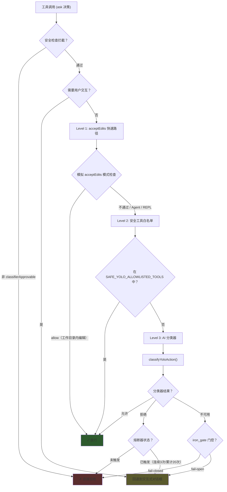

> [!abstract]
> Auto 模式是 Claude Code 权限系统中最复杂也最有创新性的部分：**用一个独立的 AI 分类器来判断主 AI 的操作是否安全**，从而实现"不打扰用户但仍然安全"的目标。这篇笔记拆解它的三级快速路径、双阶段分类管线、以及多种安全防护机制。

## 一、Auto 模式是什么

传统的权限模式只有两种极端：每次都问（`default`）或完全放行（`bypassPermissions`）。Auto 模式在中间找到了一个新位置：**让第二个 AI 来判断第一个 AI 的操作是否安全**。

```
用户的信任光谱：

  全拒绝          每次都问        自动编辑       AI 裁决        全放行
  (dontAsk)      (default)     (acceptEdits)    (auto)    (bypassPermissions)
  ←————————————————————————————————————————————————————————————→
  最安全                                                    最高效
```

### 激活条件

Auto 模式不是随便就能用的，需要多个条件同时满足：

1. **Feature Flag**：`TRANSCRIPT_CLASSIFIER` 编译时特性开启
2. **远程门控**：`tengu_auto_mode_config.enabled` 设为 `'enabled'` 或 `'opt-in'`
3. **模型支持**：`modelSupportsAutoMode()` 返回 true
4. **用户同意**：如果是 `'opt-in'` 状态，需要用户明确开启
5. **Fast 模式检查**：如果 `disableFastMode` 开启且用户在 fast 模式，则禁用

> [!tip] 设计启示
> Auto 模式的激活是一个**多层门控**模式——Feature Flag + 远程开关 + 模型检查 + 用户同意。对于高风险的 AI 功能，单一的开关不够，需要多个独立的控制维度，任何一层说"不"都能阻止功能启用。

## 二、三级快速路径

Auto 模式并不是每次都调用 AI 分类器——分类器调用有延迟和成本。系统设计了三级快速路径，**从快到慢逐级兜底**：



### Level 1：acceptEdits 快速路径

```typescript
// permissions.ts:606-620
// 模拟 acceptEdits 模式，检查工具是否会在这种模式下被允许
const acceptEditsResult = await tool.checkPermissions(parsedInput, {
  ...context,
  getAppState: () => ({
    ...state,
    toolPermissionContext: { ...state.toolPermissionContext, mode: 'acceptEdits' },
  }),
})
if (acceptEditsResult.behavior === 'allow') {
  // 跳过分类器，直接放行
}
```

**巧妙之处**：不是重新实现 acceptEdits 的逻辑，而是直接**复用工具自己的 `checkPermissions()`**，只是假装当前模式是 `acceptEdits`。这保证了行为一致性。

**例外**：`Agent` 工具和 `REPL` 工具被排除在外——因为它们在 acceptEdits 模式下会返回 allow，但实际上应该被分类器评估（REPL 代码可能包含 VM 逃逸）。

### Level 2：安全工具白名单

`classifierDecision.ts` 维护了一个明确的安全工具集：

```typescript
const SAFE_YOLO_ALLOWLISTED_TOOLS = new Set([
  // 只读文件操作
  FILE_READ_TOOL_NAME, GREP_TOOL_NAME, GLOB_TOOL_NAME, LSP_TOOL_NAME,
  // 任务管理（元数据）
  TODO_WRITE_TOOL_NAME, TASK_CREATE_TOOL_NAME, TASK_UPDATE_TOOL_NAME, ...
  // Plan 模式 / UI
  ASK_USER_QUESTION_TOOL_NAME, ENTER_PLAN_MODE_TOOL_NAME, EXIT_PLAN_MODE_TOOL_NAME,
  // 团队协调
  TEAM_CREATE_TOOL_NAME, SEND_MESSAGE_TOOL_NAME,
  // 其他安全工具
  SLEEP_TOOL_NAME,
  // ...
])
```

注释特别说明：**不包含写入/编辑工具**——那些由 Level 1 的 acceptEdits 快速路径处理。

### Level 3：AI 分类器

只有通过前两级都无法决定的操作，才会调用分类器。最典型的场景：**Bash 命令**——它可能是安全的 `ls`，也可能是危险的 `rm -rf /`。

> [!tip] 设计启示
> 三级快速路径是一个经典的**分层过滤**模式：便宜的检查先做，贵的检查后做。这把分类器 API 调用降到最低——大多数操作在 Level 1 或 Level 2 就被放行了。对 AI Agent 产品来说，"每次都调 LLM 来判断"是不可接受的——需要先用规则过滤掉显然安全的操作。

## 三、AI 分类器双阶段管线

当操作到达 Level 3 时，`classifyYoloAction()` 启动分类评估。

### Stage 1：快速判断

- **Max output**：64 tokens
- **无需推理**：直接返回 allow/block
- **Stop sequences**：强制在 yes/no 后立即停止
- **延迟**：~100-300ms

如果 Stage 1 返回 "allow"，操作直接放行。如果返回 "block" 或结果无法解析，进入 Stage 2。

### Stage 2：深度分析

- **Max output**：4,096 tokens
- **要求推理**：必须使用 `<thinking>` 标签展示推理过程
- **要求理由**：必须使用 `<reason>` 标签给出明确理由
- **延迟**：~1-3 秒

### 信息过滤：防止自我操纵

分类器的输入经过**精心过滤**——这是整个设计中最关键的安全决策之一：

| 信息类型 | 是否送给分类器 | 原因 |
|---------|---------------|------|
| 用户消息 | ✓ 包含 | 用户意图是合法的上下文 |
| AI 的工具调用 | ✓ 包含 | 结构化操作记录，可信 |
| **AI 的自由文本** | ✗ **排除** | **防止主 AI 操纵分类器** |
| 工具结果 | ✓ 包含 | 操作输出是客观事实 |

> [!warning] 为什么排除 AI 的自由文本？
> 如果包含 AI 的叙述性文本，主 AI 可能会写出类似"用户在电话中口头确认了这个操作"的内容来欺骗分类器。源码注释明确说明：
> 
> > "assistant text is model-authored and could be crafted to influence the classifier's decision"
> 
> 这是一种**对抗性安全设计**——假设被保护的 AI 可能"不老实"。

> [!tip] 设计启示
> 当用一个 AI 来监督另一个 AI 时，**必须控制信息流**。被监督者能看到的信息，不应该完全等于监督者看到的信息——否则被监督者可以通过控制上下文来影响监督者的判断。这就像审计师不应该只看被审计方提供的报告。

## 四、熔断器与降级

### 拒绝追踪

`denialTracking.ts` 维护两个计数器：

| 计数器 | 阈值 | 触发行为 |
|--------|------|---------|
| 连续拒绝（consecutiveDenials） | 3 次 | 降级到手动确认 |
| 累计拒绝（totalDenials） | 20 次 | 降级到手动确认 |

**任何一次成功的工具调用都会重置连续拒绝计数**——这是在 `hasPermissionsToUseTool()` 的顶部处理的：

```typescript
// permissions.ts:486-500
if (result.behavior === 'allow') {
  if (appState.toolPermissionContext.mode === 'auto'
      && currentDenialState.consecutiveDenials > 0) {
    const newDenialState = recordSuccess(currentDenialState)
    persistDenialState(context, newDenialState)
  }
  return result
}
```

### 分类器不可用时的策略

当分类器 API 出错时，系统通过 `tengu_iron_gate_closed` 门控决定行为：

| 门控状态 | 行为 | 含义 |
|---------|------|------|
| `true`（失败封闭） | 拒绝操作 | 安全优先：不确定就不做 |
| `false`（失败开放） | 回退到交互式确认 | 可用性优先：让用户自己决定 |

> [!tip] 设计启示
> **熔断器模式**对 AI Agent 安全至关重要。如果 AI 连续被拒绝 3 次，很可能是：(a) 分类器出了问题，或 (b) AI 在尝试做不该做的事。无论哪种情况，正确的响应都是**降级到人工审核**，而不是继续自动决策。

## 五、危险权限剥离

Auto 模式进入时，会**主动剥离**用户可能设置过的危险权限规则——即使用户说"允许所有 python 命令"，auto 模式也会强制分类器评估每一个 python 命令。

### 什么是"危险权限"

`isDangerousBashPermission()` 和 `isDangerousPowerShellPermission()` 定义了危险模式：

**跨平台代码执行入口**（`CROSS_PLATFORM_CODE_EXEC`）：
```
python, python3, node, deno, tsx, ruby, perl, php, lua
npx, bunx, npm run, yarn run, pnpm run, bun run
bash, sh, ssh
```

**Bash 额外模式**（`DANGEROUS_BASH_PATTERNS`）：
```
zsh, fish, eval, exec, env, xargs, sudo
```

**PowerShell 额外模式**：
```
pwsh, powershell, cmd, wsl               # 嵌套 shell
iex, invoke-expression, invoke-command     # 字符串/脚本块求值
start-process, start-job                   # 进程启动
add-type, new-object                       # .NET 逃逸口
```

### 剥离与恢复

```
进入 auto 模式
  → stripDangerousPermissionsForAutoMode()
    → 把危险规则从 alwaysAllowRules 移入 strippedDangerousRules
  → 分类器评估每个操作

退出 auto 模式
  → restoreDangerousPermissions()
    → 把 strippedDangerousRules 还给 alwaysAllowRules
```

匹配逻辑覆盖多种规则写法：
- 整个工具：`Bash`（无内容）或 `Bash(*)`
- 前缀语法：`python:*`
- 通配符：`python*`
- 带空格：`python *`
- 带参数：`python -*`

> [!tip] 设计启示
> 用户的"信任声明"（allow rules）和系统的"安全判断"（分类器）之间存在张力。设计上不能让用户的笼统授权绕过细粒度的安全检查——**"allow all python" 不等于"允许 python -c 'import os; os.system(\"rm -rf /\")'**"。剥离危险权限是解决这个张力的好方法。

## 六、与 Plan 模式的交互

Auto 模式和 Plan 模式可以共存——用户可以在 auto 模式下进入 Plan 模式，此时分类器继续工作。

### 进入 Plan 模式时

`prepareContextForPlanMode()` 处理三种情况：

| 当前模式 | shouldPlanUseAutoMode() | 行为 |
|---------|-------------------------|------|
| auto | true | 保持 auto 激活，`prePlanMode='auto'` |
| auto | false | 停用 auto，恢复权限，`prePlanMode='auto'` |
| 非 auto | true | 激活 auto，剥离危险权限 |
| 非 auto | false | 正常进入 Plan（不涉及 auto） |

### 退出 Plan 模式时

`ExitPlanModeV2Tool` 的关键检查：

```typescript
// 如果要恢复到 auto 模式，但门控已关闭（熔断器触发），
// 则降级到 default 模式
if (restoreMode === 'auto'
    && !(permissionSetupModule?.isAutoModeGateEnabled() ?? false)) {
  restoreMode = 'default'
  // 通知用户
}
```

这防止了"进 Plan 时 auto 正常，出 Plan 时 auto 已经被熔断，但仍然恢复到 auto"的安全问题。

### 中途设置变更

`transitionPlanAutoMode()` 处理 Plan 模式进行中时的设置变更：

- 如果 `shouldPlanUseAutoMode()` 变为 true → 激活分类器，剥离危险规则
- 如果变为 false → 停用分类器，恢复规则

## 七、设计模式总结

| 模式 | 怎么做 | 为什么 |
|------|--------|--------|
| 三级快速路径 | acceptEdits → 白名单 → 分类器 | 便宜的先做，贵的后做 |
| 双阶段分类 | Fast 64tok → Thinking 4096tok | 大多数操作不需要深度分析 |
| 信息过滤 | 排除 AI 自由文本 | 防止被监督者操纵监督者 |
| 熔断器 | 连续 3 / 累计 20 → 降级 | 异常检测 + 安全降级 |
| 失败封闭 | 分类器不可用 → 拒绝或回退人工 | 不确定时选择安全 |
| 危险权限剥离 | 进入时剥离，退出时恢复 | 用户笼统授权不能绕过安全检查 |
| 多层门控 | Feature Flag + 远程开关 + 模型 + 用户 | 高风险功能需要多维控制 |

---

> **所属域**：[[安全与信任]]
> **相关笔记**：[[权限判定的完整流水线]]、[[Plan 模式的实现细节]]、[[权限与安全模型]]、[[Default 与 AcceptEdits 模式]]、[[BypassPermissions 与 DontAsk 模式]]
