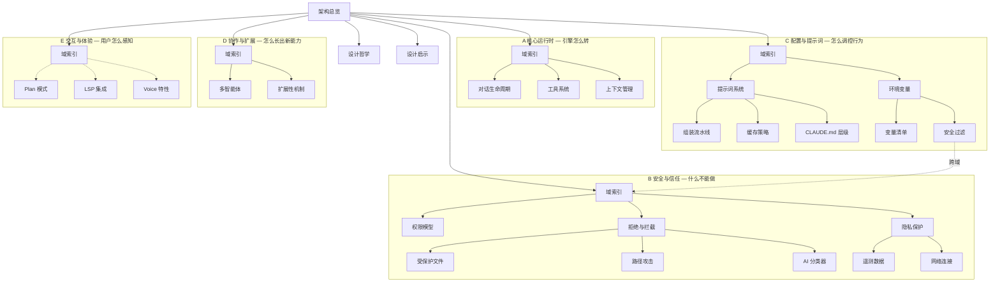

# Claude Code 架构总览

> [!abstract] 这是什么
> 这是一份基于 Claude Code 源码分析的知识库，目的不是"学会用 Claude Code"，而是**拆解它的设计思想**，为构建 AI Agent 类产品提供启发。

## 知识域导航

%%虚线 = 待探索%%

---

## 五个知识域

### A 核心运行时 — "引擎怎么转"

> AI Agent 的核心执行循环：对话流转、工具调用、上下文管理

**域索引**：[[核心运行时]]

| 笔记 | 核心问题 |
|------|---------|
| [[对话生命周期]] | 从用户输入到 AI 回复，中间经历了哪些阶段？ |
| [[工具系统设计]] | AI 如何安全地调用外部工具？ |
| [[上下文与状态管理]] | 对话越来越长怎么办？如何保持"记忆"？ |

### B 安全与信任 — "什么不能做"

> 权限控制、行为拦截、隐私保护 — 构建用户信任的基础设施

**域索引**：[[安全与信任]]

| 笔记 | 核心问题 |
|------|---------|
| [[权限与安全模型]] | 多层防线、权限模式、规则系统如何协作？ |
| [[行为拒绝与操作拦截机制]] | 5 层决策流水线、命令分级、熔断机制 |
| [[受保护的文件与目录]] | AI 绝对不能碰的文件和目录 |
| [[路径攻击与防御]] | 8 种路径花招及防御策略 |
| [[自动模式的 AI 分类器]] | 用 AI 审查 AI：双阶段分类器 |
| [[数据收集与隐私保护设计]] | 用户输入会被记录吗？ |
| [[遥测数据流向与上报清单]] | 三条遥测管道各收什么数据？ |
| [[外部网络连接完整清单]] | 12 类外部 URL 端点清单 |

### C 配置与提示词 — "怎么调控行为"

> 系统提示词组装、分层配置、环境变量 — 不改代码就能调整行为

**域索引**：[[配置与提示词]]

| 笔记 | 核心问题 |
|------|---------|
| [[提示词系统架构]] | 系统提示词怎么组装？ |
| [[系统提示词的组装流水线]] | 十几个段落如何拼装？ |
| [[提示词缓存策略]] | 全局缓存分界线、失效检测 |
| [[CLAUDE.md 配置层级]] | 六层配置文件的发现与加载 |
| [[环境变量系统]] | 100+ 环境变量的分类与安全分级 |
| [[环境变量完整清单]] | 速查表 |
| [[环境变量的安全过滤机制]] | 三层过滤器链 *(跨域 → B 域)* |

### D 协作与扩展 — "怎么长出新能力"

> 多代理协作、Hook/Skill/MCP 扩展、外部系统集成

**域索引**：[[协作与扩展]]

| 笔记 | 核心问题 |
|------|---------|
| [[多智能体协作]] | 怎么协调多个 AI 并行？ |
| [[扩展性机制]] | Hooks、Skills、MCP 各解决什么？ |

### E 交互与体验 — "用户怎么感知"

> 用户交互模式、输入输出体验、IDE 集成

**域索引**：[[交互与体验]]

*暂无独立笔记，下一阶段重点方向：Plan 模式、LSP 集成、Voice 特性*

---

## 贯穿笔记

| 笔记 | 定位 |
|------|------|
| [[设计哲学与核心理念]] | **基底** — 所有域共享的 6 大设计原则 |
| [[构建 AI Agent 的设计启示]] | **萃取** — 从所有域提炼的 9 条产品设计经验 |

---

## 全局视图

![[知识库全局视图.base#按域分组]]

---

## 技术栈速览

| 维度 | 选择 |
|------|------|
| 语言 | TypeScript + TSX |
| 终端 UI | 自建 Ink 框架（基于 React 的终端渲染） |
| 包管理 | Bun |
| 运行时 | Node.js 18+ |
| 构建产物 | 单文件 `cli.js`（13 MB）+ Source Map |
| 状态管理 | 类 Redux 不可变更新 + React Context |
| AI 协议 | MCP（Model Context Protocol） |

## 源码规模

> [!info] 基于 v2.1.88
> - 总文件数：**1,902** 个源码文件
> - 工具类：184 个文件
> - UI 组件：389 个文件
> - 命令：207 个文件
> - 工具函数：564 个文件
> - 服务层：130 个文件

## 一句话总结

==Claude Code 的本质是一个"以 AI 为核心的操作系统"==——它把 LLM 放在中心，围绕它构建了工具调用、权限管理、上下文记忆、多代理协作和扩展生态，形成一个完整的==智能体运行时（Agent Runtime）==。
