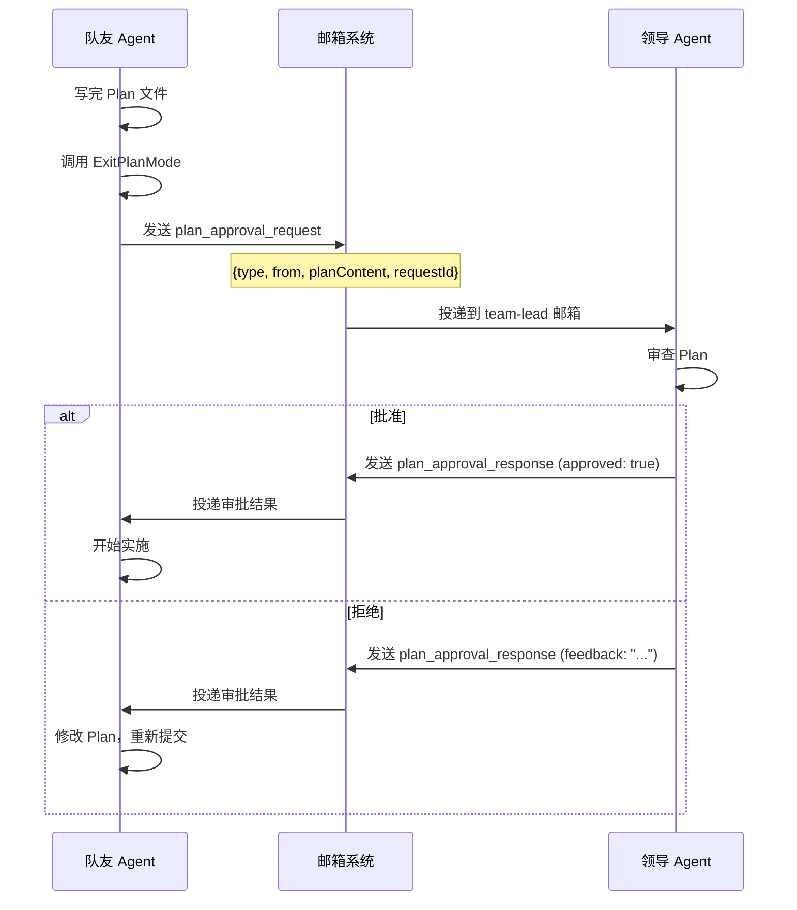

> [!abstract]
> Plan 模式是 Claude Code 最精巧的人机协作机制：**AI 主动提出"我先想清楚再动手"，用户审批后才开始写代码**。这篇笔记从源码层面拆解它的完整实现——两个工具如何切换权限状态、提示词如何约束 AI 行为、Plan 文件如何持久化、以及多智能体场景下的审批流程。

## 一、核心设计理念

Plan 模式解决的核心矛盾是：**AI 能力越强，用户越需要在"开干"之前知道 AI 打算做什么**。

它的设计思路是把一次复杂任务拆成两个阶段：

```
探索 + 规划（只读）  →  用户审批  →  实施（正常权限）
```

这不是简单的"确认对话框"，而是一个**完整的状态机切换**——进入 Plan 模式后，AI 的权限模式、可用工具、系统提示词全部改变。

> [!tip] 设计启示
> 对于高风险或高成本的 AI 操作，**不要只在执行时拦截，要在规划时就介入**。Plan 模式的核心洞见是：让 AI 把"思考过程"外化成一个可审查的文件，比事后审查 diff 更有效。

## 二、状态机：权限模式的切换

Plan 模式是 Claude Code 六种权限模式之一（`default`、`plan`、`acceptEdits`、`auto`、`bypassPermissions`、`dontAsk`）。每种模式有独立的标题、符号和颜色：

```typescript
// src/utils/permissions/PermissionMode.ts
plan: {
  title: 'Plan Mode',
  shortTitle: 'Plan',
  symbol: PAUSE_ICON,   // ⏸ 暂停图标——直觉传达"停下来想想"
  color: 'planMode',    // 专属颜色，整个 UI 都会变色
  external: 'plan',
}
```

### 进入 Plan 模式的三条路径

| 路径 | 触发方式 | 代码位置 |
|------|---------|---------|
| AI 主动 | AI 调用 `EnterPlanMode` 工具 | `src/tools/EnterPlanModeTool/` |
| 用户命令 | 用户输入 `/plan` | `src/commands/plan/plan.tsx` |
| Shift+Tab | 快捷键切换 | UI 层直接切换权限模式 |

三条路径最终都执行同一个状态变更：

```typescript
// 核心切换逻辑（EnterPlanModeTool.ts:88-94 和 plan.tsx:75-82）
context.setAppState(prev => ({
  ...prev,
  toolPermissionContext: applyPermissionUpdate(
    prepareContextForPlanMode(prev.toolPermissionContext),
    { type: 'setMode', mode: 'plan', destination: 'session' },
  ),
}))
```

关键函数 `prepareContextForPlanMode` 会：
1. **保存当前模式**到 `prePlanMode`（退出时恢复）
2. 如果之前是 `auto` 模式，处理分类器激活的副作用
3. 返回准备好的权限上下文

### 退出 Plan 模式

退出时不是简单地切回来，而是要**恢复到进入前的模式**：

```typescript
// ExitPlanModeV2Tool.ts:361
let restoreMode = prev.toolPermissionContext.prePlanMode ?? 'default'
```

这意味着：
- 如果用户之前在 `acceptEdits` 模式，退出 Plan 后回到 `acceptEdits`
- 如果之前在 `auto` 模式，还要检查 auto 模式的门控是否仍然有效（熔断器防御）

> [!important]
> `prePlanMode` 的设计意味着 Plan 模式是一个"插入层"——它不会破坏用户之前的权限设置。这避免了"进一次 Plan 模式后权限全被重置"的糟糕体验。

### 全局状态标记

`src/bootstrap/state.ts` 维护了几个关键标记：

| 标记 | 作用 |
|------|------|
| `hasExitedPlanMode` | 本次会话是否曾退出过 Plan 模式（防止重复触发） |
| `needsPlanModeExitAttachment` | 是否需要注入退出提示词 |
| `handlePlanModeTransition()` | 处理快速切换时的状态竞争（先进再出不会发重复附件） |

## 三、两个工具的设计

### EnterPlanMode：请求进入

```
参数：无
输出：确认消息
权限：需要用户批准（shouldDefer: true）
```

核心约束：
- **不能在子代理中使用**：`if (context.agentId) throw new Error(...)`
- **Channels 模式下禁用**：如果用户通过 Telegram/Discord 连接，Plan 模式会变成"进得去出不来"的陷阱（审批对话框需要终端），所以直接禁用

进入后，工具结果中注入行为指令：

```
In plan mode, you should:
1. Thoroughly explore the codebase using Glob, Grep, and Read tools
2. Understand existing patterns and architecture
3. Design an implementation approach
4. Present your plan to the user for approval
5. Use AskUserQuestion if you need to clarify approaches
6. When ready, use ExitPlanMode to present your plan for approval

Remember: DO NOT write or edit any files yet. This is a read-only exploration and planning phase.
```

### ExitPlanMode：提交计划

```
参数：allowedPrompts（可选，语义化权限请求）
输出：plan 内容、文件路径、是否被编辑等
权限：需要用户批准
```

关键设计：
- **Plan 内容不是参数传入的**，而是从磁盘文件读取：`getPlan(context.agentId)`
- 用户可以在审批界面**编辑** Plan 内容（CCR Web UI 或 Ctrl+G），编辑后的内容会写回磁盘
- 如果不在 Plan 模式时调用，会被 `validateInput` 拦截并返回友好错误

审批通过后的 tool_result 消息会包含完整 Plan 和实施指引：

```
User has approved your plan. You can now start coding.
Start with updating your todo list if applicable

Your plan has been saved to: {filePath}
You can refer back to it if needed during implementation.

## Approved Plan:
{plan content}
```

> [!tip] 设计启示
> "Plan 从文件读取而不是从参数传入"这个设计很巧妙——它让 Plan 成为一个**持久化的、可编辑的中间制品**，而不是一次性的消息。用户可以用外部编辑器打开它（`/plan open`），AI 也可以在规划过程中逐步完善它。

## 四、Plan 文件系统

### 文件路径与命名

Plan 文件存储在 `~/.claude/plans/` 目录（可通过 `settings.plansDirectory` 配置）：

```typescript
// src/utils/plans.ts
// 主对话：{word-slug}.md   例如 "brave-fox.md"
// 子代理：{word-slug}-agent-{agentId}.md
```

`word-slug` 是每个会话生成的随机单词组合（如 `brave-fox`），保证：
- 文件名可读（不是 UUID）
- 会话内唯一（最多重试 10 次）
- 会话缓存（同一会话始终用同一个 slug）

### 恢复与持久化

Plan 文件在以下场景需要恢复：

| 场景 | 恢复策略 |
|------|---------|
| 会话恢复（resume） | 从日志中提取 slug，重新绑定到文件 |
| 会话 Fork | 复制原文件到新 slug（防止互相覆盖） |
| 远程会话（CCR） | 从消息历史中的 `file_snapshot` 恢复 |

消息历史中 Plan 内容可能出现在三个地方：
1. `ExitPlanMode` 的 tool_use input（`normalizeToolInput` 注入）
2. 用户消息的 `planContent` 字段
3. `plan_file_reference` 附件（auto-compact 时保留）

> [!important]
> 这套三重恢复机制说明 Plan 文件在远程/断线场景下很容易丢失。设计 AI Agent 产品时，所有**跨轮次的关键中间制品**都需要这种防御性持久化。

## 五、提示词注入：如何约束 AI 行为

Plan 模式最核心的行为控制不靠代码硬限制，而靠**提示词注入**。根据状态，`messages.ts` 会生成不同的附件消息注入到对话中。

### 两套工作流

Claude Code 有两套 Plan 模式工作流，通过 `isPlanModeInterviewPhaseEnabled()` 切换：

#### 1. 五阶段工作流（默认，外部用户）

```
Phase 1: Initial Understanding  →  启动 Explore 代理并行搜索代码
Phase 2: Design                 →  启动 Plan 代理设计方案
Phase 3: Review                 →  阅读关键文件，向用户确认
Phase 4: Final Plan             →  写入 Plan 文件
Phase 5: Call ExitPlanMode      →  提交审批
```

每个阶段都有严格的提示词指导，比如：

```
Plan mode is active. The user indicated that they do not want you to
execute yet -- you MUST NOT make any edits (with the exception of the
plan file mentioned below), run any non-readonly tools (including
changing configs or making commits), or otherwise make any changes to
the system. This supercedes any other instructions you have received.
```

注意最后一句——**"覆盖你收到的所有其他指令"**。这是对抗提示词注入的关键：即使恶意代码库中有指令让 AI 执行操作，Plan 模式的提示词优先级更高。

Phase 4 还在进行 A/B 测试（`tengu_pewter_ledger` 实验），测试不同的 Plan 文件长度限制：
- **control**：自然长度
- **trim**：建议精简
- **cut**：大多数好 Plan 在 40 行以内
- **cap**：硬限制 40 行

#### 2. 迭代访谈工作流（Anthropic 内部 / 实验性）

```
循环执行：
  1. Explore — 读代码
  2. Update the plan file — 每次发现立即记录
  3. Ask the user — 遇到歧义就问
```

这是一种更自然的"结对编程"风格——不是分阶段走流程，而是持续循环、渐进完善。

关键提示词要求：
- "Never ask what you could find out by reading the code"（能查代码的别问用户）
- "Batch related questions together"（相关问题一起问，减少打断）
- "Scale depth to the task"（简单 bug 不需要多轮，复杂功能需要）

### 附件类型矩阵

| 附件类型 | 时机 | 内容 |
|---------|------|------|
| `plan_mode` | 进入 Plan 模式 | 完整工作流指令 |
| `plan_mode`（sparse） | Plan 模式内的后续轮次 | 精简提醒 |
| `plan_mode_reentry` | 再次进入 Plan 模式 | 要求先审视已有 Plan |
| `plan_mode_exit` | 退出 Plan 模式 | 告知可以开始编辑 |
| `plan_file_reference` | compact 后保留 Plan | 注入 Plan 文件内容 |

Sparse 版本只有一行：

```
Plan mode still active (see full instructions earlier in conversation).
Read-only except plan file ({path}). Follow 5-phase workflow.
End turns with AskUserQuestion (for clarifications) or ExitPlanMode (for plan approval).
```

> [!tip] 设计启示
> **Full + Sparse 模式**是处理长对话的好模式：第一次给完整指令，后续轮次只给精简提醒。这既节省 token，又不让 AI "忘记"自己在 Plan 模式中。

## 六、Plan Agent：只读的架构师

Plan 模式会用到一个内置子代理类型 `Plan`，定义在 `src/tools/AgentTool/built-in/planAgent.ts`：

```typescript
export const PLAN_AGENT: BuiltInAgentDefinition = {
  agentType: 'Plan',
  disallowedTools: [
    AGENT_TOOL_NAME,          // 不能再派生子代理
    EXIT_PLAN_MODE_TOOL_NAME, // 不能自己退出 Plan 模式
    FILE_EDIT_TOOL_NAME,      // 不能编辑文件
    FILE_WRITE_TOOL_NAME,     // 不能写文件
    NOTEBOOK_EDIT_TOOL_NAME,  // 不能编辑 notebook
  ],
  omitClaudeMd: true,         // 不加载 CLAUDE.md（省 token）
  model: 'inherit',           // 继承父对话的模型
}
```

注意它的系统提示词用了**全大写的强调**：

```
=== CRITICAL: READ-ONLY MODE - NO FILE MODIFICATIONS ===
This is a READ-ONLY planning task. You are STRICTLY PROHIBITED from:
- Creating new files
- Modifying existing files
- Deleting files
...
```

并且要求输出以 "Critical Files for Implementation" 结尾，列出 3-5 个关键文件。

> [!tip] 设计启示
> 子代理的工具限制是**双保险**——提示词说"不要编辑"，工具列表中也移除了编辑工具。对于安全关键的行为约束，**同时使用声明式（提示词）和程序式（工具过滤）两种机制**。

## 七、多智能体场景：Plan 审批协议

在团队模式（Agent Swarms）中，队友（Teammate）的 Plan 审批流程不一样：



关键实现：
- 队友调用 `ExitPlanMode` 时，不弹审批对话框，而是通过邮箱发送给领导
- `checkPermissions` 对队友返回 `allow`（绕过本地权限 UI）
- `requiresUserInteraction` 对队友返回 `false`（不需要终端交互）
- 如果 `isPlanModeRequired()` 返回 true，Plan 为必须；否则队友可以自愿退出

## 八、UI 展示

### 终端 UI

进入时显示：
```
⏸ Entered plan mode
  Claude is now exploring and designing an implementation approach.
```

退出时显示：
```
⏸ User approved Claude's plan
  Plan saved to: ~/.claude/plans/brave-fox.md · /plan to edit
  [Plan 内容的 Markdown 渲染]
```

拒绝时显示：
```
● User declined to enter plan mode
```

### Plan 审批对话框

用户看到的审批界面包含：
- Plan 内容（Markdown 渲染）
- Plan 文件路径
- 批准 / 拒绝 / 编辑的选项

### /plan 命令

`/plan` 是一个多功能命令：
- **不在 Plan 模式时**：启用 Plan 模式，如果后面有文字（如 `/plan 重构认证系统`）还会自动触发查询
- **已在 Plan 模式时**：显示当前 Plan 内容和文件路径
- **`/plan open`**：在外部编辑器中打开 Plan 文件

## 九、V2 的演进与实验

### Agent 数量配置

`planModeV2.ts` 根据订阅类型动态调整子代理数量：

| 订阅类型 | Plan Agent 数量 | Explore Agent 数量 |
|---------|----------------|-------------------|
| Max (20x) | 3 | 3 |
| Enterprise / Team | 3 | 3 |
| 其他 | 1 | 3 |

可以通过环境变量覆盖：`CLAUDE_CODE_PLAN_V2_AGENT_COUNT`

### Plan 长度实验

`tengu_pewter_ledger` 实验发现：
- 基线数据（14 天，2600 万次）：Plan 文件中位数 4,906 字符，平均 6,207 字符
- **拒绝率随 Plan 长度单调递增**：<2K 字符拒绝率 20%，>20K 字符拒绝率 50%
- 实验目标：在不增加实现迭代次数的前提下，降低 Plan 文件长度

> [!tip] 设计启示
> **Plan 越长，用户越不想看，拒绝率越高**。这对产品设计的启示是：AI 的中间输出也需要"信息密度"优化。冗长的方案不如精炼的要点——这不只是 UI 问题，是影响用户决策质量的设计问题。

## 十、关键设计模式总结

| 模式 | 怎么做 | 为什么 |
|------|--------|--------|
| 权限插入层 | `prePlanMode` 保存恢复 | Plan 是临时状态，不能破坏原有权限设置 |
| 文件即 Plan | Plan 写入磁盘文件 | 可编辑、可持久化、可跨轮次引用 |
| 双重只读保障 | 提示词 + 工具过滤 | 声明式和程序式双保险 |
| Full + Sparse 提示 | 首轮完整、后续精简 | 节省 token 又不丢失约束 |
| 三重恢复 | tool_use / 用户消息 / snapshot | 防御断线、compact 等异常 |
| 邮箱审批 | 队友通过邮箱而非 UI 审批 | 多智能体场景不能依赖终端交互 |

---

> **所属域**：[[交互与体验]]
> **相关笔记**：[[权限与安全模型]]、[[多智能体协作]]、[[系统提示词的组装流水线]]、[[设计哲学与核心理念]]
