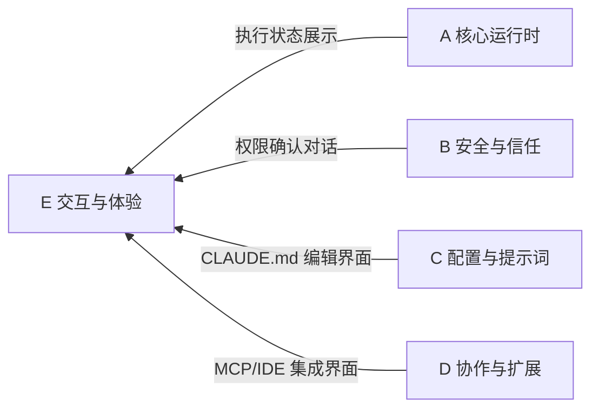

# E 域：交互与体验 — "用户怎么感知"

> [!abstract] 这个域回答什么问题
> 用户怎么和 AI Agent 交互？Plan 模式是什么？语音输入怎么做？LSP 如何让 AI 理解代码？——一切关于"用户感知层"的问题都在这里。

这是当前知识库中最薄弱的域——还没有独立的笔记。但待探索的 7 个主题中有 3 个属于这里，说明这是下一阶段的重点方向。

---

## 域内笔记

![[E-交互与体验.base]]

> [!info] 相关笔记
> 交互体验相关的内容也散落在其他笔记中：
> - [[构建 AI Agent 的设计启示]]（第七节"交互设计"）讨论了"能自动的就不问"等原则
> - [[对话生命周期]] 涉及对话流转的用户可见部分
> - [[扩展性机制]] 的 Hooks 部分涉及用户自定义行为

---

## 为什么这个域重要

AI Agent 产品的一个常见陷阱是：**后端很强，前端很弱**。引擎能力强大，但用户感知不到、交互笨拙、反馈不及时。Claude Code 在交互层有很多精巧的设计：

- **[[Plan 模式的实现细节|Plan 模式]]**：让用户先审批方案再执行，是一种结构化的人机协作模式
- **实时状态反馈**：工具执行过程中展示进度，而不是让用户盯着空白等待
- **权限确认的 UX**：只问真正需要问的，记住用户的选择，减少打断
- **LSP 集成**：让 AI 能跳转定义、查引用，拥有接近 IDE 的代码理解能力

---

## 与其他域的关系

交互与体验是所有其他域的"出口"——后端的能力最终要通过这一层传递给用户。

---

## 待探索方向

| 主题 | 为什么值得探索 | 优先级 |
|------|--------------|--------|
| Plan 模式 | EnterPlanMode/ExitPlanMode 工具如何控制 AI 行为？这是结构化人机协作的典型设计 | ⭐⭐⭐ |
| LSP 集成 | 如何把语言服务器的能力（跳转定义、查引用）提供给 AI？这扩展了 AI 的代码理解力 | ⭐⭐⭐ |
| Voice 特性 | 语音输入输出的架构设计——多模态交互的前沿 | ⭐⭐ |
| 终端 UI 架构 | Ink 框架如何渲染终端 UI？React 模式在 CLI 中的应用 | ⭐⭐ |
| 实时流式反馈 | AI 回复流式到达时，UI 如何实时渲染？工具执行时如何展示进度？ | ⭐⭐ |

> [!important] 这是下一阶段的主力探索域
> 上面 5 个方向中，Plan 模式和 LSP 集成是最有产品设计参考价值的。建议优先探索这两个。

---

**导航**：[[Claude Code 架构总览]] | [[设计哲学与核心理念]]
