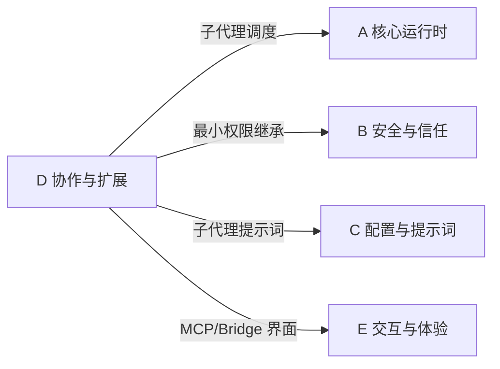

# D 域：协作与扩展 — "怎么长出新能力"

> [!abstract] 这个域回答什么问题
> 一个 AI Agent 不够用时怎么办？怎么让多个 Agent 协作？怎么在不改代码的情况下添加新功能？怎么接入外部服务？——一切关于"能力扩展"的问题都在这里。

这是 AI Agent 产品的"生态层"。一个只能靠自己的 Agent 能力有限，一个能调用子代理、挂载技能、连接外部服务的 Agent 才有真正的扩展性。

---

## 域内笔记

![[D-协作与扩展.base]]

> [!tip] 这两篇笔记的关系
> [[多智能体协作]] 解决的是"纵向扩展"——用更多的 Agent 处理更复杂的任务。[[扩展性机制]] 解决的是"横向扩展"——让 Agent 连接更多的外部能力。

---

## 核心设计模式

**1. 最小权限子代理**
父代理不把所有工具都给子代理，而是只传入完成特定任务必要的工具。这是安全域（[[安全与信任]]）原则在协作层的体现。

**2. 三层扩展体系**

| 层次 | 机制 | 解决什么问题 |
|------|------|-------------|
| 事件层 | Hooks（钩子） | 在 Agent 行为的关键节点插入自定义逻辑 |
| 知识层 | Skills（技能） | 用 Markdown 文件教 Agent 新的任务处理方式 |
| 能力层 | MCP（协议） | 通过标准协议接入外部服务和工具 |

**3. 消息传递 > 共享状态**
代理间通过输出→输入传递结果，而不是共同读写全局变量。无副作用，可追踪。

---

## 与其他域的关系

- **← A 域**：子代理的执行循环复用核心运行时的 Agentic Loop
- **← B 域**：子代理的权限由安全域的最小权限原则约束
- **← C 域**：子代理的系统提示词从主代理裁剪而来
- **→ E 域**：MCP 和 Bridge 系统涉及到用户可感知的集成体验

---

## 待探索方向

| 主题 | 为什么值得探索 | 优先级 |
|------|--------------|--------|
| Bridge 系统 | CLI 与 VS Code/JetBrains 如何通信？这是 Agent 与 IDE 集成的关键架构 | ⭐⭐⭐ |
| 远程代理（CCR） | 企业版的云端代理如何工作？分布式 Agent 的部署模式 | ⭐⭐⭐ |
| MCP 服务发现与生命周期 | MCP Server 如何被发现、启动、监控、重连？ | ⭐⭐ |

---

**导航**：[[Claude Code 架构总览]] | [[设计哲学与核心理念]]
