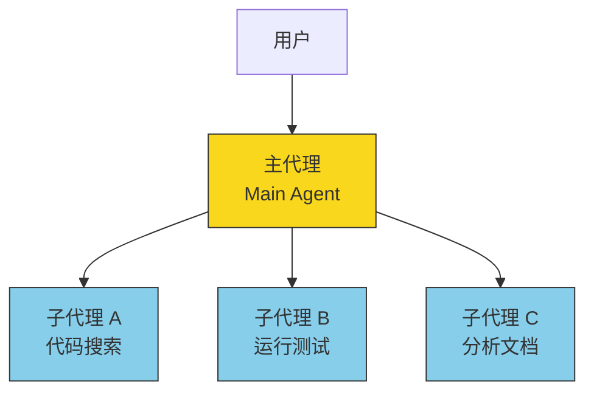

# 多智能体协作

> [!abstract] 核心问题
> 一个 AI 的能力有限——它可能需要同时搜索代码、运行测试、分析文档。Claude Code 的解决方案是：==让多个 AI 代理各自负责不同任务，协同完成复杂工作==。

## 一、代理的层级结构

Claude Code 有明确的代理层次：



### 三种协作模式

| 模式 | 说明 | 适用场景 |
|------|------|---------|
| **子代理模式** | 主代理派生独立子代理，完成后返回结果 | 代码搜索、研究调查、独立子任务 |
| **协调者模式** | 一个协调者指挥多个工作者并行执行 | 大规模并行任务（如多文件重构） |
| **群组模式** | 多个对等代理组成团队，互相通信 | 复杂的多角色协作 |

## 二、子代理的生命周期

### 创建过程

```
1. 主代理决定需要帮助 → 调用 Agent 工具
2. 系统创建新的代理上下文：
   ├── 分配唯一 ID
   ├── 确定工具集（通常是主代理的子集）
   ├── 设置权限模式
   ├── 初始化 MCP 连接
   └── 建立进度追踪器
3. 开始独立的对话循环
4. 完成后返回结果给主代理
```

### 前台 vs 后台

子代理有两种运行方式：

| 方式 | 行为 | 用户体验 |
|------|------|---------|
| 前台（同步） | 主代理等待子代理完成 | 用户看到子代理的实时进度 |
| 后台（异步） | 主代理继续工作，不等待 | 子代理完成后通知主代理 |

> [!info] 用户可以在运行中按 Ctrl+B 把前台任务切到后台
> 就像把一个窗口最小化，它继续在后台运行。

## 三、上下文隔离：AsyncLocalStorage

> [!info] 什么是 AsyncLocalStorage？
> 想象多个人在同一间办公室工作，每人有自己的抽屉。AsyncLocalStorage 就是 Node.js 提供的"每人专属抽屉"——即使大家共用一个进程（房间），每个异步任务链都有自己的私有数据空间。

### 为什么需要隔离？

```
场景：用户同时运行 3 个后台代理

如果不隔离：
  代理 A 设置 "当前目录 = /src"
  代理 B 设置 "当前目录 = /tests"
  代理 A 读文件 → 读到了 /tests 下的文件！❌

有了 AsyncLocalStorage：
  代理 A 的上下文：{ cwd: "/src", agentId: "a1", ... }
  代理 B 的上下文：{ cwd: "/tests", agentId: "b2", ... }
  互不干扰 ✅
```

### 隔离的内容

每个子代理都有独立的：
- 代理 ID 和类型
- 工作目录
- 权限规则
- 分析追踪（哪些 token 花在了哪个代理上）
- 文件状态缓存

## 四、工具分配策略

不是所有代理都能用所有工具——这是==按需最小权限==的体现：

```
主代理：所有工具
  ├── 子代理（搜索型）：Read, Grep, Glob, LSP（只读工具）
  ├── 子代理（通用型）：大部分工具，但不能嵌套创建子代理
  └── 子代理（后台型）：受限工具集（防止后台任务阻塞交互）
  
协调者模式：
  协调者：Agent, SendMessage, 管理工具
  工作者：Bash, Read, Edit, Grep 等执行工具（不能创建新代理）
```

> [!warning] 防止无限嵌套
> 子代理被禁止再创建子代理。Fork（分叉）子代理有特殊的"防递归标记"（fork-boilerplate-tag），防止 AI 产生无限递归。

## 五、Fork 子代理：缓存优化的极致

Fork 是一种特殊的子代理模式，为==缓存命中率==做了极致优化：

```
普通子代理：
  系统提示词 + 子代理自己的上下文 + 任务描述
  → 每个子代理的提示词都不同
  → 缓存命中率低

Fork 子代理：
  系统提示词 + 主代理完整上下文 + 相同的占位符结果 + 具体任务
  → 所有 Fork 子代理的前缀完全相同
  → 缓存命中率极高，省钱！
```

> [!tip] 设计启示
> 在多代理系统中，缓存不只是"加速"——它直接影响 API 调用成本。如果你的代理系统要大量并发，==提示词前缀的一致性==是关键的成本优化点。

## 六、代理间通信

### SendMessage 工具

代理之间通过 `SendMessage` 工具通信：

```
通信方式：
  ├── 直接发送：指定代理名字  → "to: researcher"
  ├── 广播：发给所有人        → "to: *"
  ├── 跨进程：通过 Unix Socket → "to: uds:/path"
  └── 远程：通过 Bridge        → "to: bridge:sessionId"
```

### 结构化消息

除了普通文本，代理还可以发送结构化消息：

| 消息类型 | 用途 |
|---------|------|
| `shutdown_request` | 代理请求终止 |
| `shutdown_response` | 领导者批准/拒绝终止 |
| `plan_approval_response` | 领导者批准计划 |
| 普通文本 | 一般性通信 |

### 消息传递机制

```
同一进程内（In-Process）：
  消息放入目标代理的 pendingMessages 队列
  → 在工具执行轮次的间隙检查并处理

不同进程间：
  消息写入 .claude/mailboxes/{agent-id}
  → 目标代理轮询邮箱文件
```

## 七、工作树隔离：给代理一个独立的代码副本

> [!info] 什么是 Git 工作树（Worktree）？
> 通常一个 Git 仓库只能签出一个分支。工作树允许同时签出多个分支到不同目录，每个目录都是完整的工作副本。

```
子代理的工作树隔离：
  1. 检查工作树名称合法性（防路径遍历攻击）
  2. 在 .claude/worktrees/ 下创建新的 git worktree
  3. 通过符号链接共享 node_modules（节省空间）
  4. 子代理在副本中自由修改，不影响主仓库
  5. 完成后可以合并修改或丢弃
```

> [!tip] 设计启示
> 如果你的 Agent 会修改代码，"隔离执行"是必须考虑的。让代理在==沙箱==里工作，确认无误后再合并到主环境。

## 八、任务状态管理

每个运行中的代理对应一个"任务"，系统追踪其状态：

```
任务状态机：
  pending → running → completed
                   → failed
                   → killed（被用户或超时取消）
```

### 进度追踪

```
每个任务实时追踪：
  ├── toolUseCount：调用了多少次工具
  ├── latestInputTokens：最近一轮的输入 token 数
  ├── cumulativeOutputTokens：累计输出 token 数
  └── recentActivities：最近 5 次工具活动描述
       例如："Reading src/auth.ts"、"Running npm test"
```

### 完成通知

```xml
<task-notification>
  <task-id>agent-123</task-id>
  <status>completed</status>
  <summary>搜索了 15 个文件，找到 3 处相关代码</summary>
  <result>完整的代理输出文本...</result>
  <usage>
    <total_tokens>12500</total_tokens>
    <tool_uses>8</tool_uses>
    <duration_ms>15000</duration_ms>
  </usage>
</task-notification>
```

## 九、群组模式的权限协调

在群组模式中，队员（Teammate）需要执行危险操作时，不能自己做主：

```
权限流程：
  1. 队员想运行 "npm install"
  2. 权限请求路由到领导者（Team Lead）
  3. 领导者的界面弹出确认对话，标注"这是队员 researcher 的请求"
  4. 领导者批准/拒绝
  5. 决策通过邮箱传回给队员
  6. 队员继续或放弃
```

> [!tip] 设计启示
> 多代理系统的权限不能各自为政。要有一个==统一的审批节点==，避免多个代理同时执行冲突操作。

## 设计模式总结

| 模式 | 解决什么问题 |
|------|-------------|
| AsyncLocalStorage 隔离 | 多代理并发时互不干扰 |
| 最小权限工具集 | 代理只拿到它需要的能力 |
| 防递归标记 | 防止子代理无限嵌套 |
| Fork 提示词对齐 | 缓存优化降低成本 |
| 邮箱式消息传递 | 松耦合的代理间通信 |
| 工作树隔离 | 代码修改不影响主环境 |
| 集中式权限审批 | 多代理场景下的安全保障 |
| 任务状态机 | 统一管理代理的生命周期 |

---

**所属域**：[[协作与扩展]]
**相关笔记**：[[扩展性机制]] | [[上下文与状态管理]] | [[权限与安全模型]] | [[工具系统设计]] | [[Claude Code 架构总览]]
