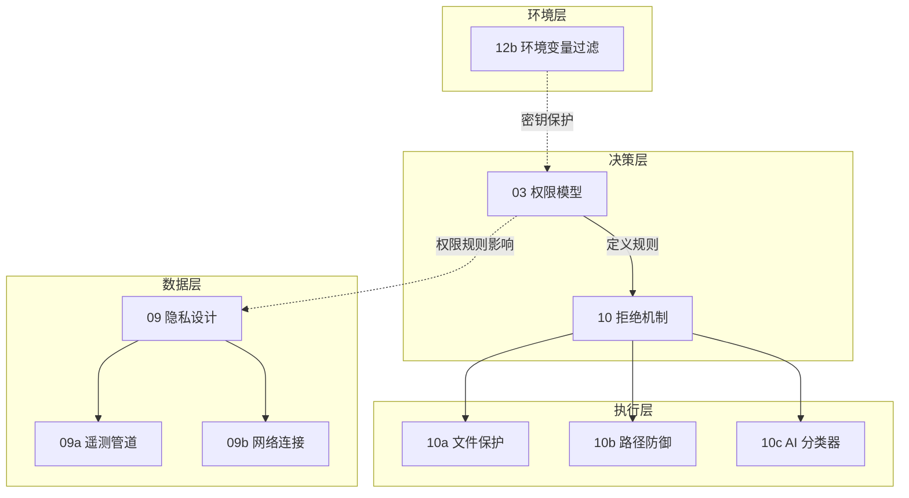

# B 域：安全与信任 — "什么不能做"

> [!abstract] 这个域回答什么问题
> 如何让 AI Agent 不干坏事？权限怎么管？危险操作怎么拦截？用户数据怎么保护？——一切关于"信任基础设施"的问题都在这里。

安全不是功能完成后的补丁，而是从第一天就嵌入架构的设计约束。这个域是 Claude Code 设计中最"重"的一个域，因为它直接决定了产品能否被用户信任。

---

## 域内笔记

![[B-安全与信任.base]]

> [!info] 跨域笔记
> [[环境变量的安全过滤机制]] 同时属于本域和 [[配置与提示词|C 域]]

---

## 安全体系的整体架构

这 8 篇笔记不是孤立的话题，而是构成了一个完整的安全体系：

> [!tip] 设计启示
> 安全体系的三个层次：**谁能做什么**（权限）→ **怎么拦截危险操作**（拒绝机制）→ **数据怎么保护**（隐私）。构建 AI Agent 产品时，这三层缺一不可。

---

## 与其他域的关系

- **← A 域（核心运行时）**：运行时的每一次工具调用都要经过本域的权限检查
- **← C 域（配置与提示词）**：环境变量的安全过滤（[[环境变量的安全过滤机制]]）同时属于两个域
- **← D 域（协作与扩展）**：子代理的权限继承和最小权限原则来自本域
- **→ E 域（交互与体验）**：权限确认对话框、危险操作警告都是安全系统的用户界面

---

## 待探索方向

| 主题 | 为什么值得探索 | 优先级 |
|------|--------------|--------|
| 沙箱隔离的具体实现 | 工具执行在什么环境中运行？Docker？进程隔离？文件系统限制？ | ⭐⭐ |
| 权限规则的持久化与同步 | 用户授予的权限如何跨会话保存？团队间如何共享安全规则？ | ⭐⭐ |

---

**导航**：[[Claude Code 架构总览]] | [[设计哲学与核心理念]]
