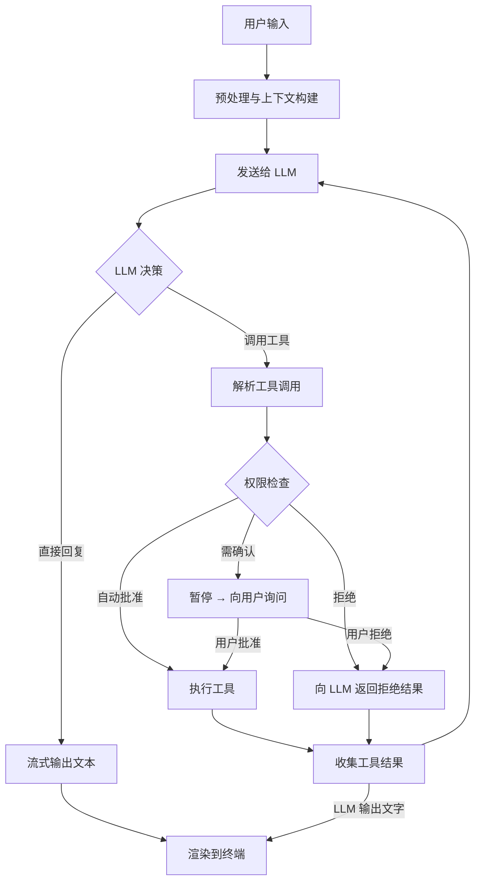
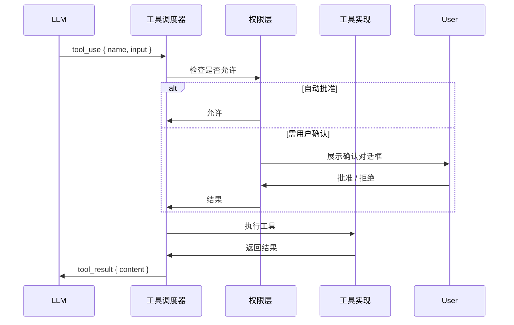
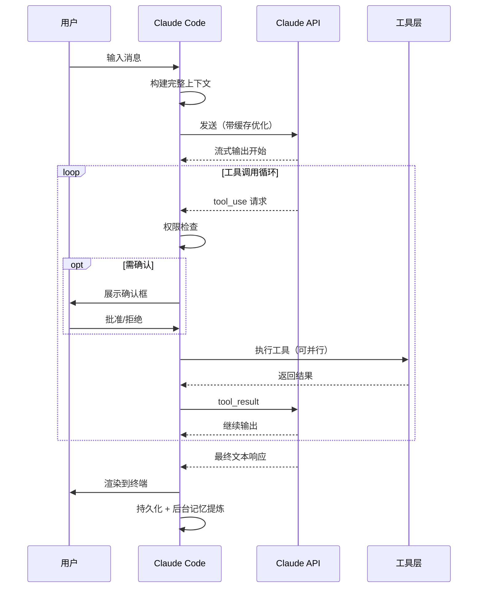

# 对话生命周期

> [!abstract] 核心问题
> 从用户敲下回车到 AI 回复完成，中间经历了哪些阶段？Claude Code 如何协调 LLM 推理、工具调用、权限审批这三件事有序进行？

---

## 一、整体流程鸟瞰

Claude Code 的一轮对话不是简单的"问 → 答"，而是一个**可能多次往返的循环**：



> [!info] 关键设计
> 工具调用**不会中断对话**，而是作为一条新消息（`tool_result`）塞回给 LLM，让它在新的上下文里继续推理。这个循环可以无限嵌套，直到 LLM 决定"我不需要再调用工具了"。

---

## 二、阶段一：用户输入预处理

用户按下回车后，Claude Code 做的第一件事不是直接发 API，而是**组装完整上下文**：

### 2.1 消息构建顺序

```
系统提示词（System Prompt）
    ↓ 包含
    ├── 核心人格与行为规则（硬编码）
    ├── CLAUDE.md 内容（项目级指令）
    ├── Memory 文件内容（用户记忆）
    └── 当前 Skill 内容（如有激活）

历史消息（Previous Messages）
    ↓ 包含
    ├── 本轮会话的所有历史对话
    └── 被压缩过的早期消息摘要

当前用户消息（New User Message）
    ↓ 可能包含
    ├── 纯文本
    ├── 图片附件（base64 编码）
    └── 文件引用内容
```

### 2.2 提示词缓存优化

系统提示词中**不变的部分**（人格规则、Memory 文件）会被标记为 `cache_control: ephemeral`，告知 Anthropic API 可以缓存这些 token，避免每轮对话重复计算，降低延迟和费用。

> [!tip] 设计启示
> 把系统提示词拆成"稳定部分"和"动态部分"，稳定的部分利用缓存，只重新计算动态的部分。这在高频对话场景下能节省大量成本。

---

## 三、阶段二：LLM 推理与流式输出

### 3.1 流式响应的处理

Claude Code 使用流式 API（`stream: true`）：

```
LLM 开始输出
    ├── text_delta（文本片段）→ 实时追加到终端
    ├── tool_use_start（开始工具调用）→ 解析工具名
    ├── input_json_delta（工具参数片段）→ 拼接 JSON
    └── message_stop（结束）→ 触发后续处理
```

这让用户感受到"AI 在实时打字"，而不是等待一个完整响应。

### 3.2 工具调用的识别

LLM 输出工具调用时，格式类似：

```json
{
  "type": "tool_use",
  "id": "toolu_01",
  "name": "Read",
  "input": {
    "file_path": "/src/main.ts"
  }
}
```

Claude Code 识别到这个结构后，进入**工具执行阶段**，暂停等待结果，然后将结果作为 `tool_result` 消息发回 LLM。

---

## 四、阶段三：工具执行循环

这是整个生命周期中最复杂的部分，也是 Claude Code 区别于普通聊天机器人的关键。

### 4.1 单次工具执行流程



### 4.2 多工具并行执行

当 LLM 在一次响应中请求多个工具时，Claude Code 会**尽可能并行执行**：

```
LLM 请求 [Read(a.ts), Read(b.ts), Grep("keyword")]
                ↓
        并发检查三个工具的权限
                ↓
        并发执行三个工具（Promise.all）
                ↓
        收集全部结果 → 一次性发回 LLM
```

> [!info] 为什么并行？
> 串行执行 3 个文件读取需要等待 3 个来回（每次都要 LLM 分析结果再决定下一步）。并行执行一次解决，减少了 2/3 的 LLM 调用次数，速度更快成本更低。

### 4.3 工具执行的中断恢复

如果用户在工具执行中途按了 `Ctrl+C`：

1. 发送中断信号到当前工具
2. 工具收到信号后尽力清理（如关闭文件句柄）
3. 向 LLM 返回"操作被用户中断"的结果
4. LLM 收到中断信息，可以决定如何继续（通常是停止）

---

## 五、阶段四：响应渲染

### 5.1 终端渲染架构

Claude Code 基于 **Ink**（React 的终端版本）渲染 UI，这意味着：

- 每次状态变化触发虚拟 DOM 对比（就像网页 React）
- 只更新真正变化的终端行，避免闪烁
- 工具调用、权限确认、文本输出可以同时存在于界面上

### 5.2 Markdown 实时渲染

LLM 输出的文本（包含 Markdown 语法）在终端中被**实时解析并渲染**：

```
# 标题      → 加粗高亮
**粗体**    → 终端粗体
`代码`      → 高亮背景色
```diff     → 带颜色的差异高亮
```

---

## 六、阶段五：轮次结束处理

每轮对话结束后，Claude Code 会做几件"收尾"的事：

### 6.1 Token 计量

统计本轮消耗的 token 数（输入 + 输出），更新会话的总消耗，用于：
- 展示给用户（费用透明）
- 触发上下文压缩的判断（接近窗口上限时）

### 6.2 会话持久化

对话内容被序列化到本地文件（通常在 `~/.claude/projects/` 下），格式类似：

```json
{
  "sessionId": "uuid",
  "messages": [...],
  "metadata": {
    "totalTokens": 12345,
    "lastUpdated": "2026-03-31T..."
  }
}
```

这让用户关闭终端后重新打开，可以恢复历史对话。

### 6.3 后台记忆提炼

在对话结束后，如果开启了"会话记忆"功能，Claude Code 会在**后台静默**地让 LLM 提炼本次对话的关键信息，存入 Memory 文件，供未来对话使用。

---

## 七、特殊场景：非交互模式

当通过 `--print` 或 `-p` 标志以"管道模式"运行时，生命周期有所不同：

```
stdin 输入 → 处理 → stdout 输出 → 进程退出
```

- 没有交互式权限确认（所有工具都要预先批准，或使用 `--dangerously-skip-permissions`）
- 没有流式终端渲染（等全部完成后输出）
- 适合在 CI/CD 流水线中调用

---

## 八、完整生命周期时序图



---

## 设计模式总结

| 模式 | 解决什么问题 |
|------|-------------|
| 工具结果回注 LLM | 让 LLM 保持完整上下文，自主决定何时停止调用 |
| 流式输出 + 实时渲染 | 消除等待感，用户体验更流畅 |
| 多工具并行执行 | 减少 LLM 来回次数，降低延迟和成本 |
| 提示词缓存分段 | 静态内容不重复计费，降低 API 成本 |
| 中断信号传递 | 用户随时可以停止，工具层要能优雅退出 |
| 非交互模式分支 | 同一套逻辑支持交互式和管道式两种场景 |
| 轮次结束后台作业 | 记忆提炼不占用用户等待时间 |

---

**所属域**：[[核心运行时]]
**相关笔记**：[[工具系统设计]] | [[上下文与状态管理]] | [[权限与安全模型]] | [[Claude Code 架构总览]]
