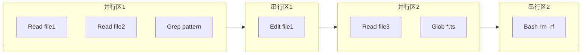
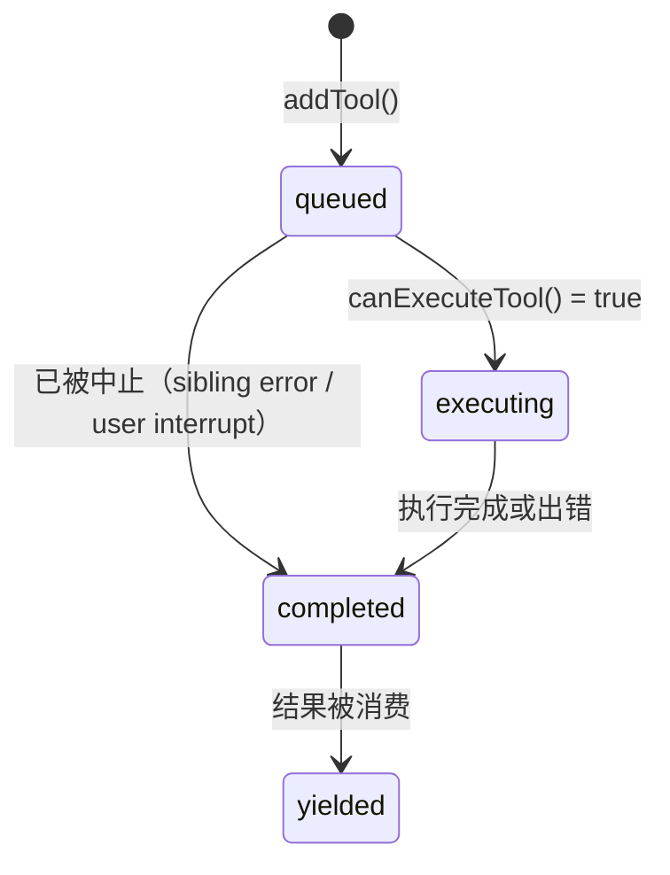
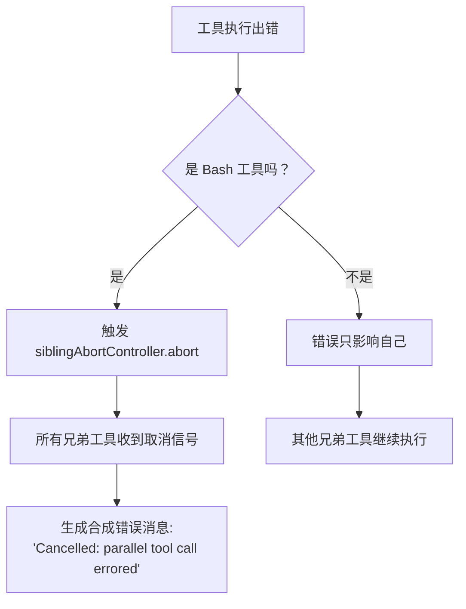

# 工具并发调度与流式执行

> [!abstract] 核心问题
> AI 一次回复经常同时调用 3-10 个工具（比如"读这 5 个文件"）。==天真的串行执行浪费时间，天真的并行执行引发竞态条件==。这篇笔记分析 Claude Code 如何精确控制哪些工具可以并行、哪些必须串行，以及并行出错时怎么级联处理。

## 一、为什么需要两套调度引擎

Claude Code 同时服务两种使用模式：

| 模式 | 特点 | 需求 |
|------|------|------|
| **交互式 REPL** | 用户在终端实时操作 | 工具一到就开始执行，用户能实时看到进度 |
| **SDK / API 调用** | 程序化批量调用 | 等所有工具调用收齐后再统一执行，逻辑更简单 |

因此，系统设计了两套引擎：

```
┌──────────────────────────────────────────────┐
│              工具调用到达                       │
├────────────────────┬─────────────────────────┤
│  批处理调度器        │    流式调度器              │
│  toolOrchestration  │    StreamingToolExecutor  │
│                    │                           │
│  等所有调用收齐      │    调用一到就开始执行        │
│  → 分区             │    → 状态机管理             │
│  → 并行区并行跑      │    → 实时队列处理           │
│  → 串行区串行跑      │    → 进度即时转发           │
│                    │                           │
│  适用：SDK/API       │    适用：交互式终端          │
└────────────────────┴─────────────────────────┘
```

> [!tip] 设计启示
> 如果你的 Agent 产品同时有交互和 API 两种入口，考虑设计两套调度策略而不是试图用一套兼顾。交互场景需要"边流边跑"的即时反馈；API 场景需要"收齐再跑"的简单可靠。两者的复杂度差异很大。

## 二、批处理调度器：分区执行

### 工作原理

`partitionToolCalls()` 将一批工具调用按**顺序**切分成交替的"并行区"和"串行区"：



**规则**：
- 连续的并发安全工具 → 合并为一个并行区，用 `all()` 并发执行
- 非并发安全工具 → 单独成为一个串行区，一个一个跑
- 严格保持原始顺序——分区只在连续的安全/不安全边界处切割

### 核心代码逻辑

```
对每个工具调用：
  1. 解析输入，调用 isConcurrencySafe(parsedInput) 判定
  2. 如果安全 且 上一个区也安全 → 加入上一个区
  3. 否则 → 新开一个区
```

> [!important] 异常兜底
> 如果 `isConcurrencySafe()` 本身抛出异常（比如 BashTool 解析 shell 命令语法失败），系统默认返回 `false`——==宁可串行也不冒并发风险==。

## 三、流式调度器：即到即跑

### 状态机

`StreamingToolExecutor` 为每个工具维护一个状态机：



### 并发控制逻辑

`canExecuteTool()` 的判定非常精练：

```
当前没有正在执行的工具 → 可以执行
或者
当前工具是并发安全的 且 所有正在执行的工具也是并发安全的 → 可以执行
否则 → 排队等待
```

这意味着：
- 多个只读工具可以同时跑（如 3 个 Read 并行）
- 一个写工具必须等所有读工具跑完才能开始
- 一个写工具跑着时，其他所有工具都得等

### 进度即时转发

进度消息（progress）走独立通道，不等工具完成就立即转发给用户：

```
工具执行中 → onProgress 回调
  → 存入 tool.pendingProgress[]
  → 触发 progressAvailableResolve()
  → getRemainingResults() 被唤醒
  → 立即 yield 进度消息给用户
```

> [!tip] 设计启示
> 在 AI Agent 产品中，==进度反馈和结果返回应该是两个独立通道==。用户需要知道"工具在做什么"（进度），但不需要等到结果出来。这种分离让用户体验显著提升——不用干等。

## 四、输入级并发安全判定

这是整个系统最巧妙的设计之一。

### 传统方案 vs Claude Code 方案

| 维度 | 传统方案 | Claude Code 方案 |
|------|---------|-----------------|
| 判定粒度 | 工具级（Bash 工具=不安全） | 输入级（Bash + `ls` = 安全，Bash + `rm` = 不安全） |
| 灵活性 | 低（整个 Bash 被标记为串行） | 高（`git status` 可以和 Read 并行） |
| 实现复杂度 | 低 | 高（需要分析输入内容） |

### BashTool 的判定方式

BashTool 的 `isConcurrencySafe(input)` 委托给 `isReadOnly(input)`，后者会==解析 shell 命令的 AST==（抽象语法树）来判断：

```
git status     → 只读 → 并发安全 ✓
git log        → 只读 → 并发安全 ✓
cat file.txt   → 只读 → 并发安全 ✓
git commit     → 写入 → 不安全 ✗
rm -rf /tmp    → 破坏性 → 不安全 ✗
echo "hi" > f  → 重定向写入 → 不安全 ✗
```

### 其他工具的判定

| 工具 | `isConcurrencySafe` | 原因 |
|------|---------------------|------|
| FileReadTool | 始终 `true` | 读文件不修改任何东西 |
| GrepTool | 始终 `true` | 搜索是只读的 |
| GlobTool | 始终 `true` | 文件匹配是只读的 |
| WebFetchTool | 始终 `true` | HTTP GET 请求 |
| ToolSearchTool | 始终 `true` | 查询工具列表 |
| FileEditTool | 始终 `false` | 修改文件 |
| FileWriteTool | 始终 `false` | 创建/覆盖文件 |
| AgentTool | 始终 `false` | 子代理可能执行任何操作 |

> [!tip] 设计启示
> **输入级并发安全判定**是一个可复用的高价值模式。大多数 Agent 框架只在工具级做并发控制，导致像 Bash 这样的"万能工具"被一刀切地标记为不安全。通过分析输入内容（比如解析 shell 命令），可以把 `git status` 和 `rm -rf` 区分开来，大幅提升并行度。

### 安全默认值

`buildTool()` 工厂函数给 `isConcurrencySafe` 设的默认值是 `false`——即==新工具默认串行==。这是"安全默认"原则在并发控制中的应用：开发者必须主动证明工具是并发安全的，而不是假设它是安全的。

## 五、选择性错误级联

当并行执行的工具之一出错时，需要决定：==要不要取消其他正在跑的兄弟工具？==

### Claude Code 的答案：视工具而定



### 为什么只有 Bash 错误才级联？

源码注释直接解释了：

> Bash commands often have implicit dependency chains (e.g. mkdir fails → subsequent commands pointless). Read/WebFetch/etc are independent — one failure shouldn't nuke the rest.

翻译：
- **Bash 命令有隐式依赖链**——`mkdir` 失败了，后面的 `cd` 和 `touch` 就没意义了
- **Read/WebFetch 等工具相互独立**——读文件 A 失败不影响读文件 B

### 实现机制：siblingAbortController

```
toolUseContext.abortController（顶层，abort = 结束整个对话轮次）
  └── siblingAbortController（子级，abort = 只取消兄弟工具）
        ├── tool1.abortController
        ├── tool2.abortController
        └── tool3.abortController
```

关键设计：`siblingAbortController` 是顶层的==子级==控制器。取消它不会取消整个对话——只取消这一批并行工具。对话轮次继续，模型会收到错误消息并决定下一步。

> [!tip] 设计启示
> 错误级联策略应该==因工具而异==，不是一刀切。有隐式依赖链的操作（如 shell 命令）应该级联取消；独立操作（如并行读取）不应该。这需要分层的中止控制器树来实现精确的取消范围。

## 六、Context Modifier：工具如何修改执行环境

某些工具执行后需要修改共享的执行上下文（`ToolUseContext`），比如更新文件状态、修改可用工具集等。

### 并发 vs 串行的处理差异

| 执行模式 | Context Modifier 处理 |
|---------|---------------------|
| 串行执行 | 立即应用——当前工具改完，下一个工具就能看到 |
| 并发执行 | 排队——等所有并发工具都跑完，再按工具到达顺序依次应用 |

```
并发执行：
  Read file1 → modifier1 ─┐
  Read file2 → modifier2 ─┤ 全部完成后
  Grep pattern → (无)    ─┘ → 按顺序应用 modifier1, modifier2
  
串行执行：
  Edit file1 → modifier1 → 立即应用 → Edit file2 看到更新后的上下文
```

> [!important] 当前限制
> 源码注释明确指出：流式调度器（`StreamingToolExecutor`）目前==不支持并发工具的 Context Modifier==。非并发安全工具的 modifier 正常工作；并发安全工具如果需要修改上下文，需要额外开发。

## 七、并发上限与有界并发

### 上限配置

```
默认并发数：10（同时最多跑 10 个工具）
配置方式：环境变量 CLAUDE_CODE_MAX_TOOL_USE_CONCURRENCY
```

### `all()` 生成器：通用有界并发工具

底层使用 `all()` 函数（来自 `generators.ts`），这是一个通用的==有界并发异步生成器组合器==：

- 输入：一组异步生成器 + 并发上限
- 输出：一个合并的异步生成器，按完成顺序 yield 结果
- 用 `Promise.race()` 实现——当任何一个生成器产出值时立即 yield

> [!tip] 设计启示
> 有界并发是 Agent 系统的必备能力。无界并发会压垮系统资源（比如同时打开 100 个文件），零并发（串行）又太慢。10 是一个经验值——足够利用 I/O 并发性，又不会打开太多文件句柄。

## 设计模式总结

| 模式 | 解决什么问题 | 关键洞察 |
|------|-------------|---------|
| 双引擎架构 | 交互/API 两种模式需求不同 | 不要试图一套逻辑兼顾 |
| 输入级并发判定 | 同一工具不同输入有不同安全性 | 比工具级判定大幅提升并行度 |
| 安全默认值 | 新工具忘记声明并发安全 | 默认串行，明确声明才并行 |
| 选择性错误级联 | 不同工具错误的影响范围不同 | Bash 级联，Read 不级联 |
| 分层中止控制器 | 精确控制取消范围 | sibling 取消不影响整个对话 |
| Context Modifier 队列 | 并发工具不能立即修改共享状态 | 排队后按序应用 |
| 有界并发 | 资源保护 | 10 个并发就够了 |

---

**所属域**：[[核心运行时]]
**相关笔记**：[[工具系统设计]] | [[对话生命周期]] | [[工具结果的上下文预算管理]] | [[工具搜索与延迟加载]]
