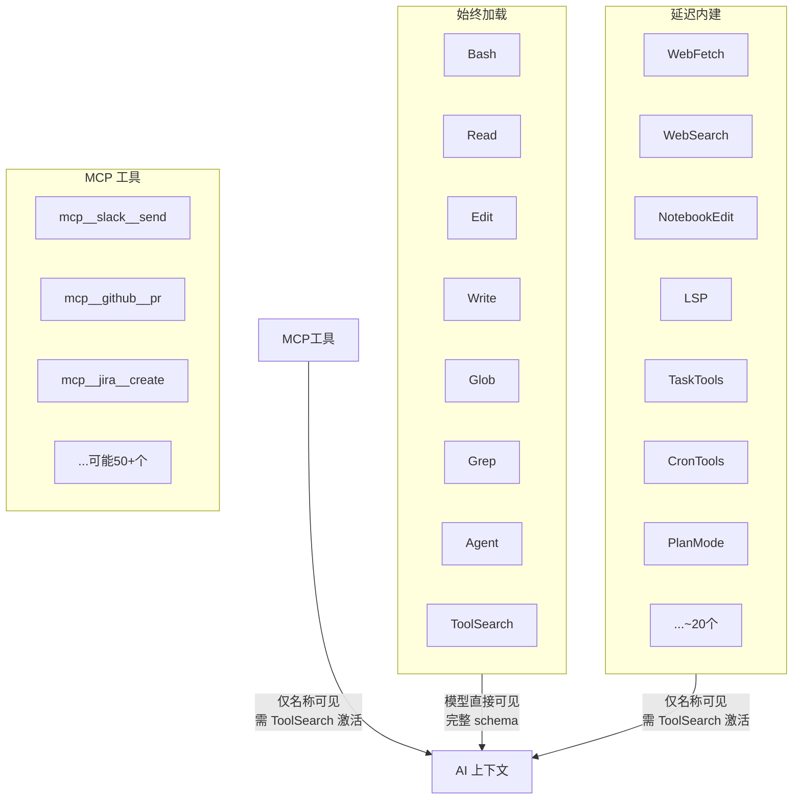
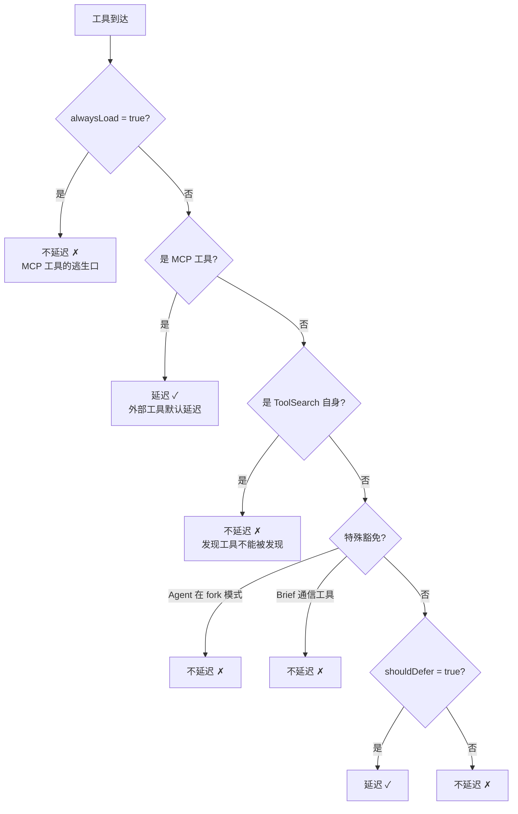

# 工具搜索与延迟加载

> [!abstract] 核心问题
> 每个工具的定义（名称、描述、参数 schema）都会消耗 tokens。当 Agent 拥有 60+ 工具（内建 + MCP 外部工具），工具定义可能占据上下文的 10% 以上。==怎样在不淹没上下文的前提下，让模型随时能发现并调用任何工具？==

## 一、"工具爆炸"问题

假设每个工具定义平均消耗 200-500 tokens：

```
15 个核心工具 × 300 tokens = 4,500 tokens
27 个内建工具 × 300 tokens = 8,100 tokens
30 个 MCP 工具 × 400 tokens = 12,000 tokens
──────────────────────────────────────────
总计                         ≈ 24,600 tokens → 上下文的 ~12%
```

这还不算工具的 prompt 描述（使用说明），加上后可能达到 20%+。这意味着每次 API 调用都要为"工具目录"付费，即使大部分工具这次用不上。

## 二、解决方案：三级工具可见性

Claude Code 把工具分成三个层级：



| 层级 | 数量 | API 中的状态 | 模型能力 |
|------|------|-------------|---------|
| 始终加载 | ~15 个 | 完整 schema | 直接调用 |
| 延迟内建 | ~27 个 | `defer_loading: true` | 只看名称，不能调用 |
| MCP 工具 | 不限 | `defer_loading: true` | 只看名称，不能调用 |

> [!tip] 设计启示
> 这就像手机的"常用应用" vs "应用抽屉"。==核心工具（你每天用的）放桌面，长尾工具放抽屉==。用户（AI）需要的时候搜一下就找到了。这个分层让系统可以支持无限数量的工具而不影响性能。

## 三、`defer_loading` 与 `tool_reference`：API 级机制

这不是 Claude Code 独创的 workaround，而是 Anthropic API 的一级能力：

### 延迟发送

```
正常工具：API 请求中发送完整的 name + description + parameters schema
延迟工具：API 请求中发送 name + defer_loading: true，模型只看到名称
```

### 动态加载

当 ToolSearch 找到目标工具后，返回特殊的 `tool_reference` 块：

```json
{
  "type": "tool_result",
  "tool_use_id": "search_123",
  "content": [
    { "type": "tool_reference", "tool_name": "WebFetchTool" }
  ]
}
```

API 收到 `tool_reference` 后，==自动将该工具的完整 schema 注入模型上下文==。之后模型就能正常调用这个工具了。

> [!important] 平台兼容性
> `tool_reference` 是 Anthropic 第一方 API 能力。Bedrock/Vertex 等第三方平台可能不支持。Haiku 模型也不支持。系统通过 `modelSupportsToolReference()` 检查兼容性，不兼容时回退到所有工具内联。

## 四、哪些工具延迟、哪些不延迟

`isDeferredTool()` 的判定逻辑有严格的优先级：



### 关键豁免规则

| 规则 | 原因 |
|------|------|
| ToolSearch 永不延迟 | 如果发现工具本身被延迟了，谁来发现它？鸡生蛋问题 |
| Agent 在 fork-subagent 模式下不延迟 | fork 模式下 Agent 必须在第一轮就可用 |
| Brief 通信工具不延迟 | Kairos 系统中 Brief 是主要通信渠道，模型必须立即看到使用规则 |
| MCP `alwaysLoad` 工具不延迟 | MCP 工具可以通过 `_meta['anthropic/alwaysLoad']` 选择不延迟 |

> [!tip] 设计启示
> 设计延迟加载系统时，必须仔细列出==不能延迟的例外==。最容易忽略的是"发现机制本身"——如果搜索工具被延迟了，系统就死锁了。

## 五、自动阈值模式：按需启用延迟

不是所有情况都需要延迟加载。`ToolSearchMode` 提供三种模式：

| 模式 | 行为 | 适用场景 |
|------|------|---------|
| `tst` | 始终延迟 | 工具很多时 |
| `tst-auto` | 延迟工具定义占上下文 >10% 时才延迟 | **默认模式** |
| `standard` | 全部内联 | 工具少时 |

### `tst-auto` 的判定逻辑

```
1. 计算所有延迟工具的定义 token 数（优先用 API 精确计数）
2. 计算上下文窗口大小
3. 如果占比 > DEFAULT_AUTO_TOOL_SEARCH_PERCENTAGE (10%) → 启用延迟
4. 否则 → 全部内联

回退：如果 API 精确计数不可用，用字符估算
  CHARS_PER_TOKEN ≈ 2.5
  token 数 ≈ 字符数 / 2.5
```

> [!tip] 设计启示
> 自动阈值是==渐进增强==的好例子。只有 5 个 MCP 工具？全部内联，体验最好。有 50 个？自动切换到延迟加载。用户不需要知道这个决策，系统自适应。

## 六、搜索算法：怎么找到对的工具

### 三种查询方式

#### 1. 直接选择（`select:` 前缀）

```
查询: "select:Read,Edit,Grep"
→ 精确匹配工具名
→ 支持逗号分隔多选
→ 即使工具已加载也返回（无害的 no-op）
```

#### 2. MCP 前缀匹配

```
查询: "mcp__slack"
→ 前缀匹配所有 mcp__slack__ 开头的工具
→ mcp__slack__send_message ✓
→ mcp__slack__list_channels ✓
→ mcp__github__pr ✗
```

#### 3. 关键词评分搜索

这是最复杂也最常用的方式：

### 工具名解析

```
CamelCase 工具：
  "NotebookEditTool" → ["notebook", "edit", "tool"]
  "FileReadTool" → ["file", "read", "tool"]

MCP 工具：
  "mcp__slack__send_message" → ["slack", "send", "message"]
  "mcp__github__create_pr" → ["github", "create", "pr"]
```

### 加权评分系统

对每个查询词，在每个工具上算分：

| 匹配位置 | MCP 工具得分 | 普通工具得分 |
|---------|-----------|-----------|
| 名称部分精确匹配 | 12 | 10 |
| 名称部分包含匹配 | 6 | 5 |
| 全名回退匹配 | 3 | 3 |
| `searchHint` 匹配 | 4 | 4 |
| 描述词边界匹配 | 2 | 2 |

> [!example] 搜索示例
> 查询 `"notebook jupyter"`
>
> `NotebookEditTool`：
> - "notebook" 精确匹配名称部分 → +10
> - "jupyter" 匹配 searchHint "edit jupyter notebooks" → +4
> - 总分：14 ✓
>
> `FileEditTool`：
> - "notebook" 不在名称中 → 0
> - "jupyter" 不在名称中 → 0
> - 总分：0 ✗

### `searchHint`：工具的 SEO

每个工具可以声明一个 3-10 词的 `searchHint`——==不在工具名中的关键能力描述==：

```
WebFetchTool → searchHint: "fetch and extract content from a URL"
NotebookEditTool → searchHint: "edit jupyter notebooks"
LSPTool → searchHint: "go to definition, find references, hover"
```

hint 的设计原则：
- 包含工具名==没有的==关键词（名称已经会被搜索到，不用重复）
- 使用用户最可能搜索的术语
- 3-10 个词，言简意赅

> [!tip] 设计启示
> `searchHint` 本质上是"工具级 SEO"。当你的 Agent 有工具发现机制时，每个工具需要为自己写一个"搜索摘要"——不是给人看的描述，而是==给搜索算法看的关键词==。把最有区分度的词放进去。

### 必选词语法

`+slack send` 表示 "slack" 必须出现在工具名或描述中：

```
+slack send → 先过滤出包含 "slack" 的工具，再按 "slack" + "send" 评分
```

这让模型可以在知道服务器名时精确缩小范围。

## 七、自我修复：模型幻觉调用未加载工具

有时模型会"幻觉"——直接调用一个延迟工具，猜测参数。系统的应对方式不是报错拒绝，而是==教模型自我修复==：

```
场景：模型直接调用 WebFetchTool，但 schema 还没加载
↓
系统检测到 schema 未发送
↓
在错误消息中附加提示：
"This tool's schema was not sent... 
 call ToolSearch with 'select:WebFetchTool' first."
↓
模型学会：先搜索，再调用
```

> [!tip] 设计启示
> 面对 AI 的"幻觉调用"，==教比堵更有效==。直接报错让模型困惑（它以为工具存在）；附带修复指令让模型知道怎么正确操作。一次教会后，后续就不会再犯。

## 八、延迟工具的动态感知

MCP 服务器可能在对话中途连接或断开，工具列表随之变化。`getDeferredToolsDelta()` 追踪变化：

```
第 1 轮：延迟工具 = [WebFetch, WebSearch, LSP]
第 3 轮：MCP 服务器连接，新增 [mcp__slack__send, mcp__slack__list]
↓
delta = {
  added: [mcp__slack__send, mcp__slack__list],
  removed: []
}
↓
通过 system-reminder 附件消息通知模型：
"新的延迟工具可用：mcp__slack__send, mcp__slack__list"
```

### MCP 服务器正在连接时

如果搜索没有结果，但有 MCP 服务器仍在连接中，返回结果会包含提示：

```json
{
  "matches": [],
  "query": "slack",
  "total_deferred_tools": 27,
  "pending_mcp_servers": ["slack-server"]
}
```

模型看到 `pending_mcp_servers` 后知道可以稍后重试。

## 九、精确匹配的快速路径

搜索算法有多个快速路径避免不必要的评分计算：

```
1. 查询 = 工具名（不区分大小写）→ 直接返回
2. 查询以 "mcp__" 开头 → 前缀匹配
3. 查询以 "select:" 开头 → 精确选择
4. 其他 → 完整关键词评分
```

第一个快速路径特别重要——子代理或上下文压缩后，模型有时会用裸工具名搜索（不加 `select:` 前缀），快速路径让这种情况无缝工作。

## 十、缓存与失效

工具描述的获取（`getToolDescriptionMemoized`）是记忆化的——同一个工具名只获取一次描述。但当延迟工具集变化时（MCP 服务器连接/断开），缓存需要失效：

```
每次搜索前：
  当前延迟工具名集合 → 排序 → join(",") → 生成 key
  如果 key != 上次的 key → 清空描述缓存
```

## 设计模式总结

| 模式 | 解决什么问题 | 关键洞察 |
|------|-------------|---------|
| 三级可见性 | 工具多但大部分用不上 | 核心常驻，长尾按需 |
| `defer_loading` API 能力 | 减少工具定义的 token 开销 | 是 API 一级特性，不是 workaround |
| `tool_reference` 动态加载 | 延迟工具需要"激活" | API 自动注入 schema |
| 自动阈值模式 | 不知道该不该延迟 | 占比 >10% 自动延迟 |
| `searchHint` 工具 SEO | 工具名不包含所有关键词 | 为搜索算法写关键词摘要 |
| 幻觉自修复 | 模型猜测调用未加载工具 | 教比堵更有效 |
| 动态 delta 通知 | MCP 中途连接/断开 | 增量告知模型工具变化 |
| 记忆化描述 + 集合失效 | 搜索性能 | 工具集变了才清缓存 |

---

**所属域**：[[核心运行时]]
**相关笔记**：[[工具系统设计]] | [[扩展性机制]] | [[工具并发调度与流式执行]] | [[工具结果的上下文预算管理]]
