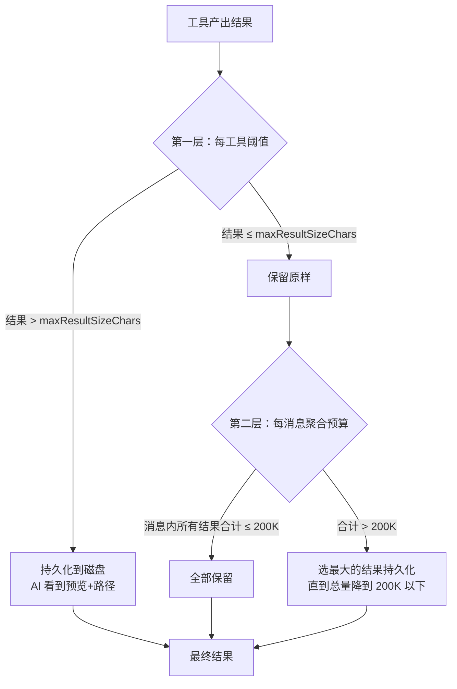
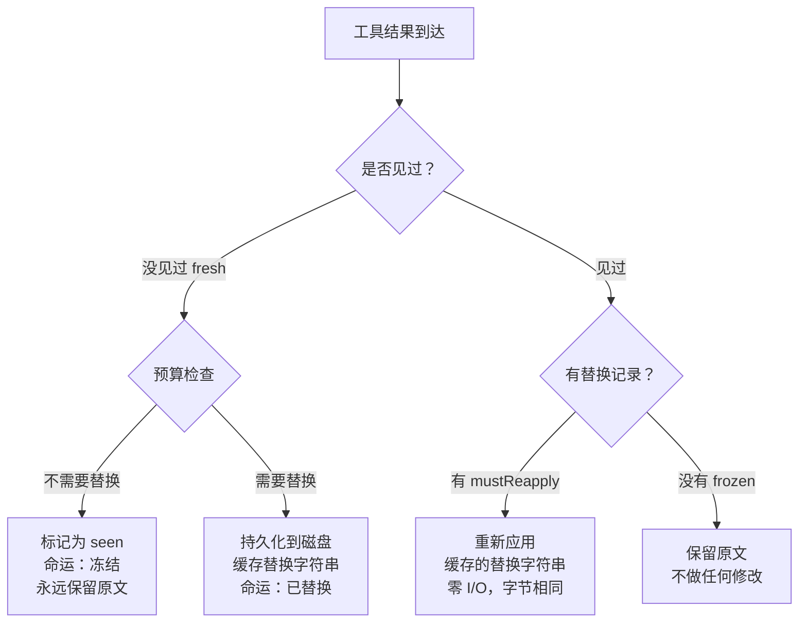

# 工具结果的上下文预算管理

> [!abstract] 核心问题
> AI 的上下文窗口是有限的（像一张固定大小的工作台）。一次 `grep` 可能返回几百 KB，10 个并行 Read 可能产出 400KB。==怎么决定 AI 看什么、存什么、怎么保证 Prompt Cache 不被破坏？==

## 一、问题有多严重？

一个具体场景：

```
AI 说："让我读这 5 个文件来理解架构"
→ Read file1.ts  →  35 KB
→ Read file2.ts  →  42 KB
→ Read file3.ts  →  28 KB
→ Read file4.ts  →  50 KB
→ Read file5.ts  →  39 KB
──────────────────────────
  合计            194 KB  → 约 50,000 tokens
```

这 5 个文件的结果就占了上下文窗口的约 5%。而这只是一轮对话——后续 AI 还要继续看新文件、跑命令、写代码。如果不管控，几轮对话后上下文就满了。

## 二、双层预算系统

Claude Code 用两层独立的预算来控制：



### 第一层：每工具阈值

每个工具自己声明"我的结果最大多少字符"：

| 工具 | `maxResultSizeChars` | 原因 |
|------|---------------------|------|
| BashTool | 30,000 | 命令输出通常不太大 |
| GrepTool | 20,000 | 搜索结果需要紧凑 |
| GlobTool | 20,000 | 文件列表需要紧凑 |
| FileReadTool | **Infinity** | 特殊处理（见下文） |
| ToolSearchTool | 100,000 | 搜索结果可能较多 |

超过阈值的结果会被完整存到磁盘，AI 只看到摘要。

> [!warning] FileReadTool 为什么是 Infinity？
> 如果 Read 的结果被持久化到磁盘，AI 就会用 Read 去读那个持久化文件——然后那个结果又被持久化——形成==无限循环==。所以 Read 故意设为 `Infinity`，永远不会被第一层持久化。Read 工具自己通过 `maxTokens` 参数控制读取量。

### 第二层：每消息聚合预算

即使每个工具的结果都在各自阈值内，N 个并行工具的结果合在一起可能仍然很大：

```
场景：AI 同时调用 10 个 Grep（每个结果 19K，都在 20K 阈值内）
→ 单条消息总量 = 190K → 逼近 200K 预算
→ 如果再加一两个 → 超出预算
→ 系统选最大的几个结果持久化到磁盘
```

预算值 `MAX_TOOL_RESULTS_PER_MESSAGE_CHARS = 200,000`（约 50,000 tokens）。

### 选择谁持久化？

当聚合预算超标时，`selectFreshToReplace()` 的策略很简单：==从最大的开始持久化==，直到总量降到预算以下。

```
排序：[50K, 35K, 28K, 20K, 15K]  总计 148K（假设预算 100K）
持久化 50K → 剩余 98K → 还是超  
持久化 35K → 剩余 63K → 在预算内 ✓
```

## 三、持久化的结果长什么样？

AI 不会看到完整内容，而是看到一个标准格式的摘要：

```xml
<persisted-output>
Output too large (120.5 KB). Full output saved to: /path/to/tool-results/uuid.txt

Preview (first 2.0 KB):
[前 2KB 内容，在换行符处截断]
...
</persisted-output>
```

关键设计点：
- **完整存盘**：磁盘上保存的是完整内容，一个字不少
- **2KB 预览**：给 AI 看开头部分，足以判断是否需要全文
- **换行截断**：预览在最近的换行符处截断，避免截在一行中间
- **文件路径**：AI 可以用 Read 工具读取完整内容

> [!tip] 设计启示
> "Preview + 延迟读取"比"截断"高明得多。截断意味着信息永远丢失；Preview 意味着 AI ==知道信息在哪==，需要时随时取回。这把"丢失"变成了"推迟"——就像人类说"这份报告在某个抽屉里"，需要时再翻开。

## 四、不可变预算决策：Prompt Cache 的守护者

这是整个系统最精妙的部分。

### 问题：为什么预算决策必须不可变？

每次 AI 发起新请求时，之前所有的消息都会重新发送给 API。如果第 3 轮的一个工具结果在第 5 轮被持久化了（因为上下文变紧张了），那第 3 轮之后的所有内容都变了——==Prompt Cache 全部失效==。

Prompt Cache 是 API 的重要成本优化：相同前缀的请求不需要重新计算。前缀一变，缓存就废了。

### 解决方案：ContentReplacementState

系统维护一个全局状态，追踪每个工具结果的"命运"：

```
ContentReplacementState:
  seenIds: Set<string>           — 见过的工具结果 ID
  replacements: Map<string, string>  — 被替换的结果 → 精确替换字符串
```

### 三种命运，一旦决定永不改变



| 命运 | 含义 | 后续处理 |
|------|------|---------|
| **fresh**（新鲜） | 第一次见到 | 执行预算检查，决定是否替换 |
| **frozen**（冻结） | 见过但没替换 | ==永远不会被后续替换==，即使上下文紧张 |
| **mustReapply**（必须重应用） | 见过且已替换 | 每次请求都用缓存的精确字符串替换 |

> [!important] 核心取舍
> 这牺牲了最优性——后来上下文紧张时，一个早期 frozen 的 40KB 结果本可以被持久化腾出空间，但系统不会这么做。==缓存稳定性比最优压缩更重要==，因为 Prompt Cache 节省的 API 成本远超多占的上下文空间。

### 重应用是零成本操作

已替换的结果在后续每轮请求中不需要重新做文件 I/O——替换字符串已经缓存在内存中：

```
第 3 轮：结果 A 被替换 → 缓存 "<persisted-output>..." 字符串
第 4 轮：对结果 A → Map.get(id) → 直接使用缓存字符串
第 5 轮：对结果 A → Map.get(id) → 直接使用缓存字符串
...（永远是同一个字符串，字节完全一致）
```

> [!tip] 设计启示
> 在 AI Agent 系统中，任何影响 Prompt 前缀的操作都必须是==幂等的==。一旦做了决定就不能反悔，否则缓存就废了。这个约束看似限制了灵活性，但省下的 API 成本是巨大的。

## 五、API 消息分组：预算的计算单位

预算不是按"内部消息"计算的，而是按==API 级消息==计算。

### 为什么？

Claude Code 内部一个并行工具批次会产生 N 个单独的 `tool_result` 消息，但发送给 API 时，`normalizeMessagesForAPI` 会把连续的用户消息合并成一条：

```
内部状态：                           API 发送时：
  user: tool_result(A)  ─┐            user: [tool_result(A),
  user: tool_result(B)  ─┤ 合并 →           tool_result(B),
  user: tool_result(C)  ─┘                   tool_result(C)]
```

如果预算按内部消息算，3 个 70K 的结果各自在 200K 以下，通过了预算检查。但合并后是 210K——超标了。

`collectCandidatesByMessage()` 专门处理这个：它按助理消息边界（不是用户消息边界）来分组，确保预算检查和 API 合并逻辑一致。

> [!important] 特殊消息类型
> 进度消息（progress）、附件消息（attachment）不会创建 API 级边界——它们会被过滤或合并到相邻的用户消息中。所以预算系统也不把它们作为分组边界。这些细节如果处理不当，会导致预算失效。

## 六、空结果的特殊处理

工具可以合法地返回空结果（比如静默成功的 shell 命令、返回 `content:[]` 的 MCP 服务器）。但空的 `tool_result` 会导致某些模型出问题：

> 源码注释：Empty tool_result content at the prompt tail causes some models to emit the `\n\nHuman:` stop sequence and end their turn with zero output.

解决方案：空结果被替换为一个占位符：

```
(BashTool completed with no output)
```

看似简单，但这个细节直接影响模型行为。

## 七、GrowthBook 动态调优

所有关键阈值都可以通过 GrowthBook（A/B 测试平台）远程调整：

| Feature Flag | 控制内容 |
|-------------|---------|
| `tengu_satin_quoll` | 每工具阈值覆盖（`{toolName: charLimit}`） |
| `tengu_hawthorn_window` | 每消息聚合预算值 |
| `tengu_hawthorn_steeple` | 聚合预算开关 |

### 防御性编码

GrowthBook 可能返回意外类型（null、string、NaN），所以每个取值处都有严格的类型检查：

```
typeof override === 'number' 
  && Number.isFinite(override) 
  && override > 0
```

> [!tip] 设计启示
> AI Agent 的预算参数应该可以==远程调整==，不需要发新版本。因为：
> 1. 最佳参数取决于用户使用模式，上线前无法确定
> 2. 模型升级后最佳参数可能改变
> 3. 出问题时需要快速调整

## 八、会话恢复与子代理

### 会话恢复

用户关闭终端后重新打开，之前的预算决策需要恢复。`reconstructContentReplacementState()` 从保存的 transcript 记录中重建状态：

- 所有候选的 `tool_use_id` 标记为 `seen`（冻结）
- 有替换记录的填入 `replacements` Map
- 确保恢复后的决策和原始决策完全一致

### 子代理的状态继承

当主线程 fork 出子代理时，子代理需要继承父线程的替换状态（因为它们共享 Prompt Cache 前缀）：

```
主线程的 replacements → clone → 子代理初始状态
子代理的新决策不影响主线程
```

`reconstructForSubagentResume()` 处理子代理恢复的特殊情况：sidechain 记录可能不完整（主线程 mustReapply 的替换不会被子代理重新记录），需要从父线程的活跃状态补全。

## 设计模式总结

| 模式 | 解决什么问题 | 核心取舍 |
|------|-------------|---------|
| 双层预算 | 单工具爆炸 + 多工具叠加 | 两层独立检查，都不可或缺 |
| Infinity 豁免 | 循环持久化问题 | 某些工具必须永不持久化 |
| 不可变决策 | Prompt Cache 稳定性 | 牺牲最优压缩换取缓存命中 |
| Preview + 延迟读取 | 信息不丢失 | "推迟"而非"截断" |
| API 级消息分组 | 内部消息和 API 消息不一致 | 预算计算必须对齐 API 合并逻辑 |
| 远程阈值调优 | 最佳参数事先不知道 | 增加系统复杂度换取运营灵活性 |
| 幂等替换 | 多轮请求一致性 | 缓存精确字符串，零 I/O 重应用 |

---

**所属域**：[[核心运行时]]
**相关笔记**：[[工具系统设计]] | [[工具并发调度与流式执行]] | [[上下文与状态管理]] | [[对话生命周期]]
