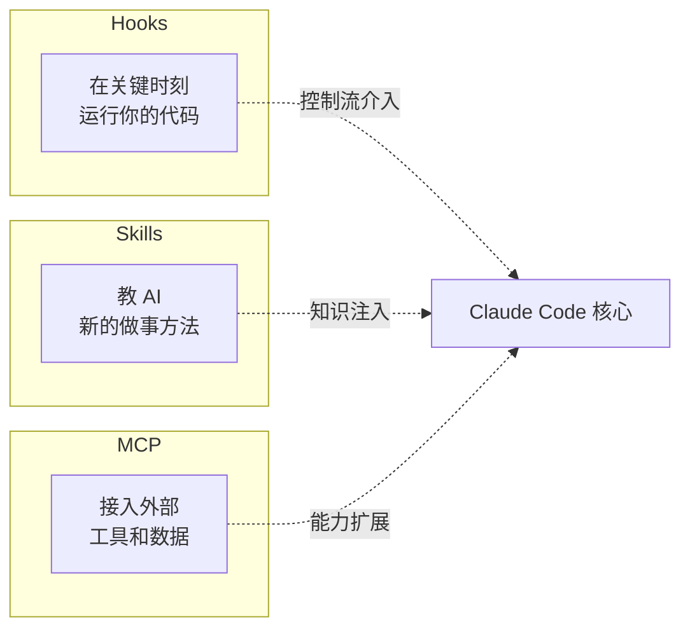
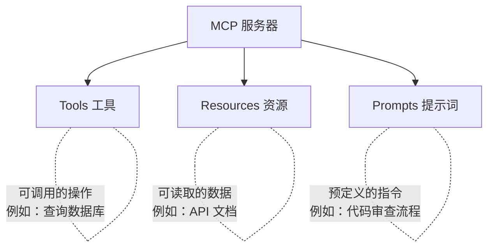

# 扩展性机制

> [!abstract] 核心问题
> 一个 Agent 产品不可能内置所有功能。Claude Code 提供了三种扩展机制：**Hooks（钩子）** 让你在关键时刻介入、**Skills（技能）** 让你教 AI 新本领、**MCP（协议）** 让你接入外部服务。它们分别解决不同层面的扩展需求。

## 三种扩展机制对比



| 维度 | Hooks | Skills | MCP |
|------|-------|--------|-----|
| 本质 | 事件回调 | 提示词模板 | 工具协议 |
| 执行者 | 你的 Shell 脚本 | AI 模型 | 外部 MCP 服务器 |
| 能做什么 | 拦截/修改/阻止操作 | 引导 AI 的行为方式 | 提供新工具和数据源 |
| 类比 | 门卫 / 审计员 | 培训手册 | 外包团队 |

## 一、Hooks 钩子系统

### 核心概念

Hooks 是==在特定事件发生时自动执行的 Shell 命令==。就像在门口装一个感应器——有人进来时自动响铃。

### 事件类型（共 20+ 种）

| 事件 | 触发时机 | 典型用途 |
|------|---------|---------|
| `PreToolUse` | 工具执行==之前== | 审查操作、修改输入、阻止危险操作 |
| `PostToolUse` | 工具执行==之后== | 记录日志、修改输出、触发后续流程 |
| `UserPromptSubmit` | 用户提交消息时 | 输入预处理、注入额外上下文 |
| `Notification` | AI 有通知时 | 推送到 Slack、邮件等 |
| `SessionStart` / `SessionEnd` | 会话开始/结束 | 初始化/清理资源 |
| `SubagentStart` / `SubagentStop` | 子代理启动/停止 | 监控代理活动 |
| `Stop` | AI 停止输出时 | 验证 AI 的最终输出 |
| `PreCompact` / `PostCompact` | 上下文压缩前/后 | 保护关键信息不被压缩 |
| `PermissionRequest` | 权限请求时 | 自定义审批逻辑 |
| `TaskCreated` / `TaskCompleted` | 任务创建/完成 | 任务追踪、通知 |
| `FileChanged` | 文件被修改时 | 自动格式化、触发构建 |
| `CwdChanged` | 工作目录变化时 | 重新加载项目配置 |

### Hook 的输入与输出

```
系统给 Hook 的输入（通过 stdin 传入 JSON）：
{
  "session_id": "abc123",
  "cwd": "/project",
  "tool_name": "Bash",
  "tool_input": { "command": "rm -rf /tmp/cache" }
}

Hook 可以返回的 JSON 输出：
{
  "decision": "block",          // 或 "allow" 或不返回
  "reason": "不允许删除操作",
  "updatedInput": { ... }       // 可选：修改工具输入
}
```

### 异步钩子

有些钩子不需要同步等待结果：

```
同步钩子：系统等待 Hook 完成后再继续
  → 适合权限审批、输入修改

异步钩子：Hook 在后台运行，系统继续执行
  → 适合日志记录、通知推送
  → 如果退出码为 2（阻塞错误），会通过通知队列唤醒 AI
```

### 安全保护

```
所有 Hook 执行前会检查：
  ├── 工作区是否已被用户信任？（未信任则跳过所有 Hook）
  ├── 超时保护：工具钩子最长 10 分钟，会话结束钩子最长 1.5 秒
  └── 来源限制：可配置为只允许"托管 Hook"（管理员部署的）
```

> [!tip] 设计启示
> Hook 系统的价值在于==把控制权交给用户和运维==。Agent 产品的核心团队不可能预见所有使用场景，但一个好的 Hook 机制让任何人都能"插一脚"。

## 二、Skills 技能系统

### 核心概念

Skills 是==以 Markdown 文件定义的可复用指令集==。它不是代码，而是一份"操作手册"——告诉 AI 在特定场景下应该怎么做。

### Skill 的结构

```markdown
---
name: commit
description: 帮助用户创建规范的 Git 提交
allowed-tools: Bash, Read, Glob
when-to-use: 当用户请求提交代码时
user-invocable: true
argument-hint: 可选的提交消息
model: inherit
hooks:
  PostToolUse:
    - matcher: Bash
      command: echo "工具已执行"
---

# 提交操作指南

## 步骤
1. 运行 git status 查看变更
2. 运行 git diff 查看具体改动
3. 根据变更内容起草提交消息
...
```

### Skill 的加载来源

```
Skills 从以下位置加载（优先级从高到低）：
  ├── 内建 Skills（bundled）→ 系统自带的核心技能
  ├── 托管 Skills（managed）→ 管理员部署的企业技能
  ├── 用户 Skills（~/.claude/skills/）→ 个人全局技能
  ├── 项目 Skills（.claude/skills/）→ 项目特定技能
  ├── 插件 Skills（plugin）→ 通过插件安装的技能
  └── MCP Skills（mcp）→ 从 MCP 服务器获取的技能
```

### 关键设计：延迟加载

```
Skill 的加载分两阶段：

阶段 1：列表发现（启动时）
  只读取 frontmatter（名字、描述、触发条件）
  → 用来估算 token 消耗和生成列表

阶段 2：内容加载（调用时）
  才读取完整的 Markdown 内容
  → 注入到 AI 的上下文中
```

> [!tip] 为什么延迟加载？
> 如果有 50 个 Skills，每个 2000 tokens，全部加载就要 100K tokens。延迟加载让系统只在需要时才"打开手册"。

### Skill 与 Hook 的联动

Skill 的 frontmatter 可以定义专属 Hook：

```yaml
hooks:
  PostToolUse:
    - matcher: Bash
      command: "node validate-output.js"
```

这意味着某个 Skill 被激活时，它的 Hook 也会自动注册——Skill 结束后 Hook 自动注销。

### 路径敏感的 Skills

```yaml
paths: src/api/**, tests/api/**
```

只有当用户操作的文件匹配这些路径时，这个 Skill 才会被激活。这避免了无关 Skill 的干扰。

## 三、MCP 协议集成

### 核心概念

MCP（Model Context Protocol）是一个==开放的标准协议==，让 AI 能连接任何外部服务——数据库、API、文件系统、搜索引擎等等。

> [!info] 类比
> 如果 Claude Code 的内建工具是"自带的办公用品"，MCP 就是"能从外面订购任何工具的目录"。

### MCP 的三大能力



### 传输方式

Claude Code 支持多种与 MCP 服务器通信的方式：

| 传输 | 说明 | 适用场景 |
|------|------|---------|
| Stdio | 通过标准输入/输出通信 | 本地命令行工具 |
| SSE | 服务器推送事件（HTTP 长连接） | 远程 HTTP 服务 |
| StreamableHTTP | 可流式传输的 HTTP | 现代 Web 服务 |
| WebSocket | 双向实时通信 | 需要实时交互的服务 |
| InProcess | 进程内直接调用 | IDE 集成、SDK 模式 |

### MCP 工具的命名与去重

```
内建工具：Read
MCP 工具：mcp__github__read_file

如果 MCP 工具和内建工具同名：
  → 内建工具优先
  → MCP 工具的名字会加上服务器前缀
```

### MCP 的安全控制

| 控制 | 说明 |
|------|------|
| 通道白名单 | 只有白名单内的 MCP 服务器可以连接 |
| 通道权限 | 每个 MCP 服务器有独立的权限规则 |
| 结果截断 | MCP 工具的输出过大时自动截断 |
| 二进制处理 | 二进制结果（图片等）自动存到磁盘 |
| OAuth 认证 | 支持标准 OAuth 流程连接受保护的服务 |
| 引出处理 | MCP 服务器可以向用户提问（Elicitation） |

### MCP Skills 桥接

MCP 服务器不仅能提供工具，还能提供 Skills：

```
MCP 服务器 → 提供 Prompts（提示词模板）
                ↓
Claude Code → 转化为 Skills
                ↓
用户 → 通过 /skill-name 调用
```

## 三种机制的协作

它们不是互相替代的，而是==互补的层次==：

```
用户请求 → 检查是否有匹配的 Skill
              ↓ 有 → 加载 Skill 指令
AI 思考 → 选择使用 MCP 工具
              ↓
触发 PreToolUse Hook → 检查是否允许
              ↓ 允许
执行 MCP 工具调用
              ↓
触发 PostToolUse Hook → 记录日志
              ↓
返回结果给 AI
```

> [!example] 实际例子
> 用户说"帮我审查这个 PR"：
> 1. **Skill** `review-pr` 被激活，告诉 AI 审查的步骤和标准
> 2. AI 调用 **MCP** 的 GitHub 工具获取 PR 内容
> 3. **Hook** 在每次工具调用后记录审计日志
> 4. AI 按照 Skill 的指导逐步完成审查

## 设计模式总结

| 模式 | 解决什么问题 |
|------|-------------|
| Hook 事件系统 | 在不修改核心代码的情况下介入任何环节 |
| Hook 同步/异步分离 | 权限审批要同步等，日志记录不用等 |
| Skill Markdown 格式 | 非开发人员也能编写 AI 技能 |
| Skill 延迟加载 | 技能多也不影响性能 |
| Skill 路径敏感 | 只在相关场景激活 |
| MCP 标准协议 | 一个协议接入无限多的外部服务 |
| MCP 多传输方式 | 本地和远程服务都能接入 |
| 三层协作 | 控制流 + 知识 + 能力的完整扩展 |

---

**所属域**：[[协作与扩展]]
**相关笔记**：[[多智能体协作]] | [[工具系统设计]] | [[CLAUDE.md 配置层级]] | [[权限与安全模型]] | [[Claude Code 架构总览]]
