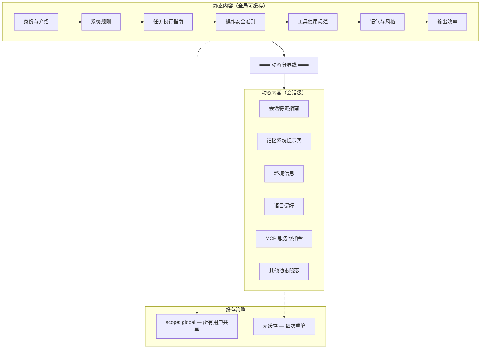

> [!abstract]
> Claude Code 的提示词系统是如何把一堆零散的指令、配置、环境信息拼成一个完整的系统提示词，并且在多轮对话中尽可能复用缓存、降低成本的？这篇是提示词系列的导航入口。

## 核心问题

系统提示词（System Prompt）是 AI 产品的"操作系统"——它定义了 AI 的身份、能力边界、行为规范。Claude Code 面临的挑战是：

1. **内容来源多样**：基础指令、工具描述、用户配置（CLAUDE.md）、环境信息、记忆系统、MCP 服务器指令……全部要拼进一个提示词
2. **动态性与缓存矛盾**：每次对话的环境不同（目录、工具集、MCP 连接），但 API 调用需要尽可能复用缓存来省钱
3. **优先级冲突**：用户指令、项目配置、系统默认行为之间谁说了算？
4. **规模控制**：CLAUDE.md 可以嵌套引用、rules 目录可以有几十个文件，怎么防止提示词爆炸？

## 架构总览

## 子笔记导航

| 笔记 | 核心问题 |
|------|---------|
| [[系统提示词的组装流水线]] | 提示词由哪些段落组成？怎么排列？优先级如何决定？ |
| [[静态段落的内容与设计意图]] | 7 个静态段落到底写了什么？为什么这样设计？对构建产品有什么启示？ |
| [[提示词缓存策略]] | 静态/动态怎么划分？全局缓存怎么工作？缓存失效怎么检测？ |
| [[CLAUDE.md 配置层级]] | 多层配置文件怎么发现、加载、注入提示词？条件规则怎么匹配？ |

## 关键源码入口

| 文件 | 职责 |
|------|------|
| `src/constants/prompts.ts` | 主组装函数 `getSystemPrompt()`，所有段落定义 |
| `src/constants/systemPromptSections.ts` | 段落缓存注册表，memoize 机制 |
| `src/utils/systemPrompt.ts` | 优先级系统 `buildEffectiveSystemPrompt()` |
| `src/utils/api.ts` | 缓存分割 `splitSysPromptPrefix()` |
| `src/services/api/promptCacheBreakDetection.ts` | 缓存失效检测的两阶段机制 |
| `src/utils/claudemd.ts` | CLAUDE.md 发现与加载 |
| `src/memdir/memdir.ts` | 记忆系统提示词构建 |

## 设计全景

> [!tip] 设计启示：提示词是分层的基础设施
> 不要把系统提示词当成一个字符串来管理。Claude Code 的做法是：
> - **分段管理**：每个关注点（安全、工具、风格）独立成段，可以单独更新
> - **静态/动态分离**：不变的内容全局缓存，变化的内容每次重算
> - **优先级链**：override > coordinator > agent > custom > default > append
> - **注册表模式**：动态段落通过注册表管理，支持 memoize 和强制刷新
>
> 如果你在构建 AI Agent 产品，提示词系统的复杂度会随功能增长而爆炸。从一开始就按"分段 + 缓存 + 优先级"来设计，后面会省很多痛苦。

---

**所属域**：[[配置与提示词]]
**相关笔记**：[[系统提示词的组装流水线]] | [[提示词缓存策略]] | [[CLAUDE.md 配置层级]] | [[上下文与状态管理]] | [[Claude Code 架构总览]]
