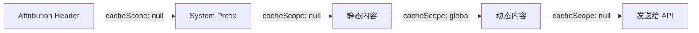
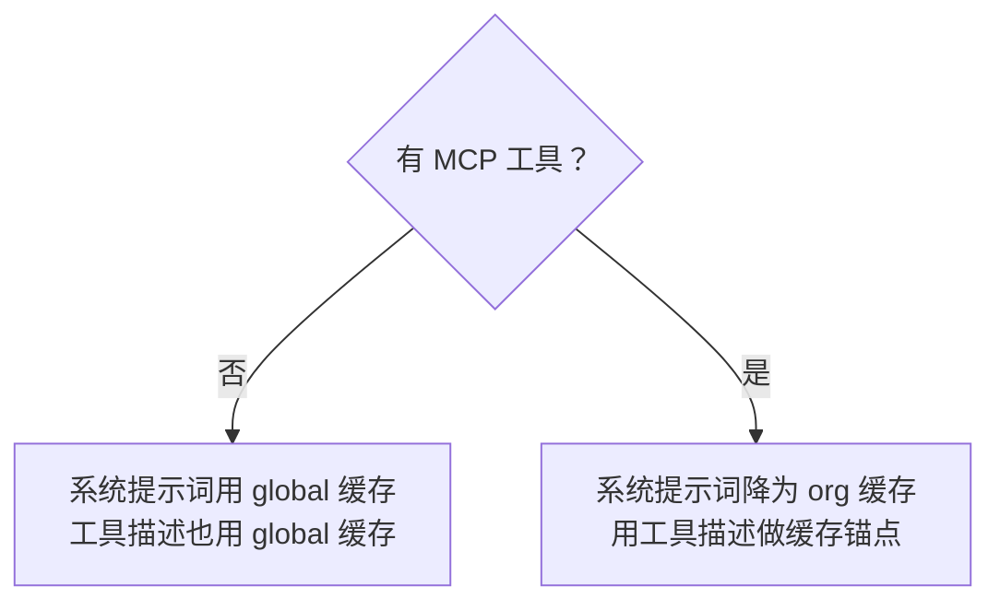
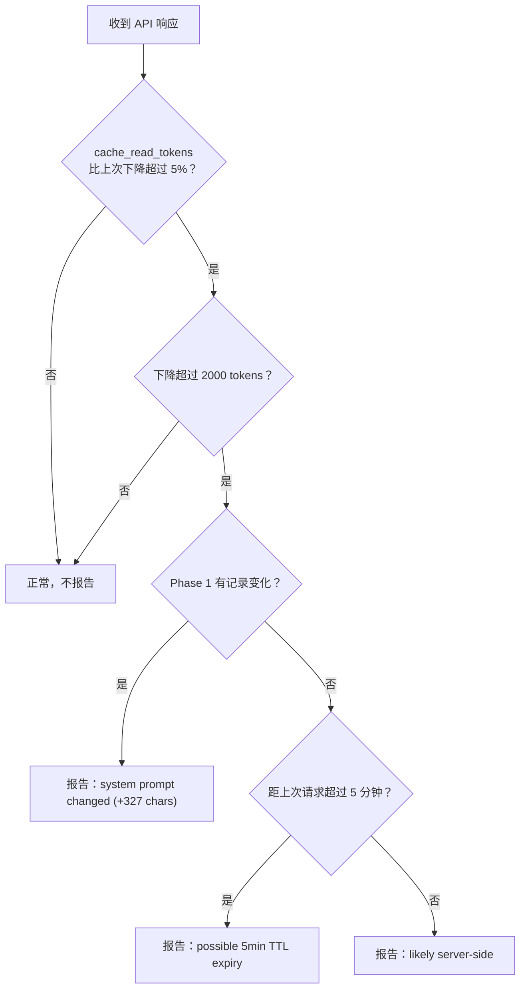
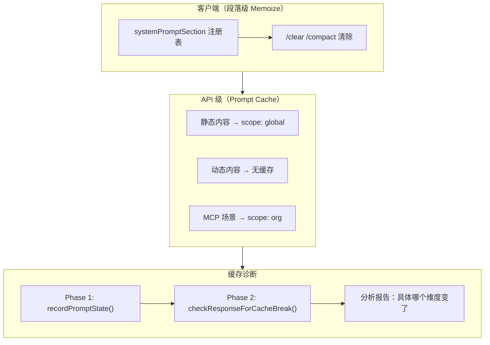

> [!abstract]
> Claude API 的 Prompt Caching 功能可以大幅降低重复发送相同系统提示词的成本。Claude Code 围绕这一特性设计了一套精细的缓存分割策略和失效检测机制，确保静态内容被全局缓存，同时避免动态内容意外破坏缓存。

## 一、为什么需要提示词缓存？

每次 API 调用都会发送完整的系统提示词。Claude Code 的系统提示词通常有数千 token——如果每次都完整处理，成本和延迟都很高。

Anthropic 的 Prompt Caching 提供两种缓存级别：

| 缓存级别 | scope | 含义 | 适用场景 |
|---------|-------|------|---------|
| 全局缓存 | `global` | 所有用户、所有组织共享 | 完全不变的通用指令 |
| 组织缓存 | `org` | 同一组织内共享 | 含组织特定配置的内容 |
| 无缓存 | `null` | 每次重新处理 | 用户/会话特定内容 |

Claude Code 的核心思路：**把系统提示词切成两半——前半部分全局缓存，后半部分不缓存**。

## 二、分界标记：`SYSTEM_PROMPT_DYNAMIC_BOUNDARY`

这是整个缓存策略的核心机制。源码中定义了一个特殊字符串：

```typescript
export const SYSTEM_PROMPT_DYNAMIC_BOUNDARY =
  '__SYSTEM_PROMPT_DYNAMIC_BOUNDARY__'
```

在 `getSystemPrompt()` 返回的字符串数组中，这个标记被插入在静态段落和动态段落之间：

```
[intro, system, tasks, actions, tools, tone, output_efficiency,
 "__SYSTEM_PROMPT_DYNAMIC_BOUNDARY__",    ← 这里
 session_guidance, memory, env_info, language, mcp, ...]
```

### 分割逻辑

`splitSysPromptPrefix()` 函数读取这个标记，把数组拆成最多 4 个块：



| 块 | cacheScope | 内容 |
|----|-----------|------|
| Attribution Header | `null` | 计费标识头 |
| System Prompt Prefix | `null` | CLI 前缀标识 |
| 静态内容 | `global` | 分界线之前的所有段落合并 |
| 动态内容 | `null` | 分界线之后的所有段落合并 |

> [!important] 静态内容被合并成一个大文本块
> 分界线之前的所有段落（intro、system、tasks……）会被 `join('\n\n')` 合并成**一个**文本块，标记为 `global` 缓存。这意味着只要这些段落的内容不变，全世界所有用户都能命中同一份缓存。

## 三、MCP 工具的特殊处理

当用户连接了 MCP 服务器时，缓存策略会降级：



原因是：MCP 工具的描述（schema）是用户自定义的，不同用户的工具集不同。如果系统提示词用 `global`，工具描述用 `org`，API 的缓存前缀匹配会在工具描述处断裂。

解决方案是"**tool-based cache**"模式：
- 系统提示词不用 `global`（降为 `org`）
- 让**工具描述列表**成为 `org` 级缓存的锚点
- 这样同一组织的用户如果工具集相同，仍然能命中缓存

## 四、段落级 Memoize：避免重复计算

动态段落虽然在分界线之后（不享受 API 级全局缓存），但在客户端仍然做了 **memoize**——同一个会话中，只计算一次，直到 `/clear` 或 `/compact` 清除缓存。

```typescript
// systemPromptSections.ts
export function systemPromptSection(name, compute) {
  return { name, compute, cacheBreak: false }
  // cacheBreak: false → 用客户端 memoize
}

export function DANGEROUS_uncachedSystemPromptSection(name, compute, reason) {
  return { name, compute, cacheBreak: true }
  // cacheBreak: true → 每轮重算
}
```

### 缓存清除时机

| 事件 | 操作 | 原因 |
|------|------|------|
| `/clear` | 清除全部段落缓存 + beta header latches | 用户显式重置 |
| `/compact` | 同上 | 上下文压缩后需要刷新 |
| 切换 worktree | 清除 memory 文件缓存 | 工作目录变了 |
| `/memory` 对话 | 清除 memory 文件缓存 | 用户可能修改了记忆 |

## 五、缓存失效检测：两阶段机制

`promptCacheBreakDetection.ts` 实现了一个精密的缓存失效检测系统，用于定位和诊断"为什么缓存没有命中"。

### 阶段一：Pre-call（发请求前）

`recordPromptState()` 在每次 API 调用前拍摄快照：

```typescript
type PreviousState = {
  systemHash: number,       // 系统提示词哈希（去掉 cache_control 后）
  toolsHash: number,        // 工具描述哈希
  cacheControlHash: number, // cache_control 本身的哈希
  perToolHashes: Record<string, number>,  // 每个工具的独立哈希
  toolNames: string[],      // 工具名列表
  model: string,
  fastMode: boolean,
  betas: string[],          // beta header 列表
  // ...十几个字段
}
```

然后和上一次的快照做 diff，记录下哪些字段发生了变化（`pendingChanges`）。

### 阶段二：Post-call（收到响应后）

`checkResponseForCacheBreak()` 检查 API 响应中的 `cache_read_tokens`：



### 检测的变化维度

| 维度 | 检查方式 | 常见原因 |
|------|---------|---------|
| 系统提示词变化 | 去掉 cache_control 后哈希比较 | MCP 指令变化、memory 变化 |
| 工具描述变化 | 每个工具独立哈希 | AgentTool/SkillTool 嵌入动态列表 |
| cache_control 变化 | 单独哈希 | scope 或 TTL 切换 |
| 模型变化 | 字符串比较 | 用户切换模型 |
| Fast mode 变化 | 布尔比较 | `/fast` 切换 |
| Beta headers 变化 | 排序后比较 | AFK mode、cache editing 等 |
| Effort 变化 | 字符串比较 | 用户指定 token 预算 |

> [!tip] 设计启示：缓存失效不只是"没命中"，要知道"为什么没命中"
> Claude Code 的缓存检测不是简单的"命中/未命中"，而是追踪了十几个维度的变化，能精确报告"是因为 MCP 指令变了"还是"因为 TTL 过期了"还是"服务器端的路由变化"。这种可观测性对于优化 API 成本至关重要。在你的 AI 产品中，如果使用了 Prompt Caching，也应该建立类似的诊断机制。

### 工具描述变化的精确定位

当检测到工具哈希整体变化时，系统会**逐个工具比较**哈希，找出具体是哪个工具的描述变了：

```
tools changed (tool prompt/schema changed, same tool set)
changedToolSchemas: Agent, Skill
```

源码注释说，77% 的工具缓存破坏是"工具数量不变但描述变了"——通常是 AgentTool 和 SkillTool 因为动态嵌入了代理/技能列表。

## 六、TTL 管理与锁存机制

Claude 的 Prompt Cache 有两种 TTL：

| TTL | 条件 | 含义 |
|-----|------|------|
| 5 分钟 | 默认 | 标准缓存生存期 |
| 1 小时 | 符合条件的会话 | 长时间使用时自动升级 |

系统通过**锁存（latch）**机制确保一些状态不会在会话中间翻转：

- **AFK mode beta header**：一旦激活就保持（sticky-on），不会因为状态变化而反复触发缓存破坏
- **Cache editing beta header**：同上
- **Overage 状态**：缓存资格一旦确定就不再变化

> [!tip] 设计启示：对影响缓存的状态做"锁存"
> 如果某个状态翻转会导致缓存破坏，但翻转本身不影响功能，那就把它锁住。一次缓存破坏的成本（重新处理几千 token）远高于某个标记多保留一会儿。

## 七、缓存删除的预期处理

当 cached microcompact（缓存的微压缩）发送 `cache_edits` 删除操作时，`cache_read_tokens` 会合理下降。系统通过 `notifyCacheDeletion()` 标记这种"预期内的下降"，避免误报为缓存破坏：

```typescript
if (state.cacheDeletionsPending) {
  state.cacheDeletionsPending = false
  // 预期内的下降，不报告为 cache break
  return
}
```

类似地，`notifyCompaction()` 在上下文压缩后重置基线——压缩后消息减少，缓存读取量自然下降。

## 八、设计全景



> [!tip] 设计启示：缓存是分层的
> Claude Code 的缓存策略至少有三层：
> 1. **客户端 memoize**：同一会话中不重复计算段落
> 2. **API 全局缓存**：跨用户复用静态提示词
> 3. **API 组织缓存**：同组织复用含 MCP 的提示词
>
> 每一层解决不同的问题。如果你的 AI 产品也使用了 Prompt Caching，考虑类似的分层设计——不要只依赖一层缓存。

---

**所属域**：[[配置与提示词]]
**相关笔记**：[[提示词系统架构]] | [[系统提示词的组装流水线]] | [[CLAUDE.md 配置层级]] | [[上下文与状态管理]]
