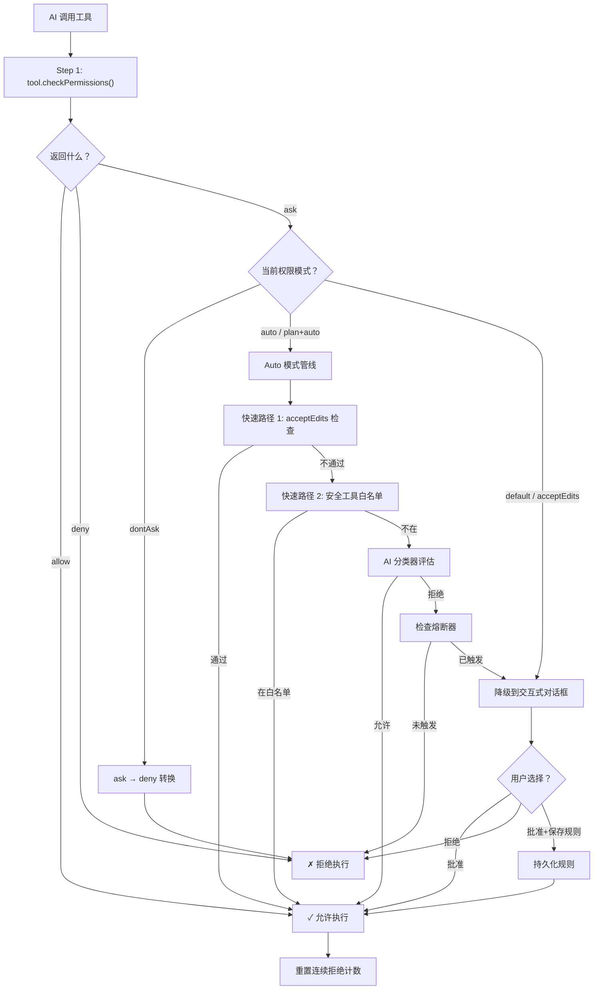

> [!abstract]
> 当 AI 想执行一个操作时，Claude Code 怎么决定"让不让做"？这篇笔记拆解从工具调用到最终 allow/deny/ask 的完整判定流水线——7 种权限模式如何分流、规则系统如何匹配、以及多层级配置如何叠加。

## 一、七种权限模式全景

Claude Code 定义了 7 种权限模式，分为**外部可见**和**内部专用**两类：

```typescript
// src/types/permissions.ts
// 用户可通过 settings.json、CLI、/mode 命令设置的 5 种模式
export const EXTERNAL_PERMISSION_MODES = [
  'acceptEdits', 'bypassPermissions', 'default', 'dontAsk', 'plan'
] as const

// 内部运行时还有 auto 和 bubble
export type InternalPermissionMode = ExternalPermissionMode | 'auto' | 'bubble'
```

其中 `auto` 模式需要 `TRANSCRIPT_CLASSIFIER` 特性开关才会激活。

### 模式配置一览

| 模式 | 标题 | 符号 | 颜色 | 行为摘要 |
|------|------|------|------|---------|
| `default` | Default | （无） | text | 每次都问用户 |
| `plan` | Plan Mode | ⏸ | planMode | 只读探索，方案需审批 → [[Plan 模式的实现细节]] |
| `acceptEdits` | Accept edits | ⏵⏵ | autoAccept | 工作目录内的文件编辑自动放行 → [[Default 与 AcceptEdits 模式]] |
| `auto` | Auto mode | ⏵⏵ | warning | AI 分类器评估安全性 → [[Auto 模式与 AI 分类器]] |
| `bypassPermissions` | Bypass | ⏵⏵ | error | 几乎全部放行（可被企业禁用） → [[BypassPermissions 与 DontAsk 模式]] |
| `dontAsk` | Don't Ask | ⏵⏵ | error | 全部拒绝（headless/SDK 场景） → [[BypassPermissions 与 DontAsk 模式]] |
| `bubble` | （内部） | — | — | 内部使用，协调者模式下的权限冒泡 |

### bubble 模式

`bubble` 是一个纯内部模式，不在 `ExternalPermissionMode` 和 `INTERNAL_PERMISSION_MODES` 中暴露。它用于多智能体的协调者（Coordinator）场景：当子代理需要权限时，决策"冒泡"到上层协调者处理，而不是在本地弹出对话框。

> [!tip] 设计启示
> 区分"外部模式"和"内部模式"是一个好的分层设计——用户只看到 5 种简洁的选择，系统内部可以有更多控制状态。关键是**不要把内部实现状态暴露给用户**。

## 二、判定流水线

每次 AI 调用工具时，都经过 `hasPermissionsToUseTool()` 函数（`permissions.ts:473`）。这是权限系统的中枢：



### 关键细节

**Step 1：工具自身判断**。每个工具都实现了 `checkPermissions()` 方法，根据输入参数和当前模式返回初始决策。比如 `BashTool` 会检查命令是否匹配已有的 allow 规则，`FileEditTool` 会检查目标路径是否在工作目录内。

**模式分流发生在 `ask` 路径上**。如果工具直接返回 `allow` 或 `deny`，模式不参与（除了 `bypassPermissions` 的提前短路）。模式的核心作用是处理"拿不准"的 `ask` 决策。

**dontAsk 转换在最后**。代码注释说得很清楚：

```typescript
// Apply dontAsk mode transformation: convert 'ask' to 'deny'
// This is done at the end so it can't be bypassed by early returns
```

**allow 后重置拒绝计数**。即使在 auto 模式中，只要有一次成功的工具调用，连续拒绝计数就会清零。这防止了"偶尔一次误拒导致永久降级"。

> [!tip] 设计启示
> 流水线的核心模式是**工具先自判 + 模式后处理**。这种分层让工具和模式各司其职——工具知道"这个操作危不危险"，模式知道"用户想怎么处理危险操作"。两者解耦意味着新增工具或新增模式都不需要改对方。

## 三、规则系统

规则系统是权限判定的"长期记忆"——用户说过"允许 npm install"，下次就不再问。

### 规则结构

```typescript
// src/types/permissions.ts
type PermissionRule = {
  source: PermissionRuleSource,  // 来自哪里
  ruleBehavior: 'allow' | 'deny' | 'ask',  // 做什么
  ruleValue: {
    toolName: string,       // 哪个工具（如 "Bash"）
    ruleContent?: string    // 可选的模式（如 "npm install"）
  }
}
```

### 八级规则来源

规则来源有明确的优先级，高优先级覆盖低优先级：

| 优先级 | 来源 | 说明 | 持久化？ |
|--------|------|------|---------|
| 1 | `flagSettings` | Statsig/GrowthBook 远程策略 | 远程 |
| 2 | `policySettings` | 企业组织策略（不可被用户覆盖） | 管理员控制 |
| 3 | `userSettings` | 用户的 `~/.claude/settings.json` | 是 |
| 4 | `projectSettings` | 项目的 `.claude/settings.json` | 是（进 git） |
| 5 | `localSettings` | 工作区的 `.claude/settings.local.json` | 是（不进 git） |
| 6 | `cliArg` | CLI 参数 `--allowed-tools` / `--disallowed-tools` | 否 |
| 7 | `command` | `/permissions` 命令 | 否 |
| 8 | `session` | 会话内临时规则 | 否（内存） |

### 规则匹配

每个工具在自己的 `checkPermissions()` 中实现匹配逻辑：

| 工具 | 规则示例 | 匹配方式 |
|------|---------|---------|
| Bash | `Bash(npm install)` | 精确匹配命令 |
| Bash | `Bash(npm *)` | 通配符匹配 |
| Bash | `Bash(npm:*)` | 前缀匹配（旧语法） |
| FileEdit | `FileEdit(src/**)` | 目录递归匹配 |
| FileWrite | `FileWrite(*.log)` | 扩展名匹配 |
| MCP 工具 | `mcp__server` | 匹配该服务器的所有工具 |
| MCP 工具 | `mcp__server__tool` | 匹配特定工具 |

> [!important]
> 没有 `ruleContent` 的规则匹配**整个工具**。比如规则 `Bash`（无内容）等于允许所有 Bash 命令——这在 auto 模式中被视为"危险权限"并会被剥离。

## 四、权限持久化与配置层级

### 5 个存储目的地

当用户在权限对话框中选择"Accept Session"或"Always Allow"时，规则会被写入不同的位置：

| Destination | 存储位置 | 生命周期 |
|-------------|---------|---------|
| `session` | 内存 | 会话结束清除 |
| `userSettings` | `~/.claude/settings.json` | 永久，所有项目生效 |
| `projectSettings` | `.claude/settings.json` | 永久，该项目内生效 |
| `localSettings` | `.claude/settings.local.json` | 永久，不进 git |
| `cliArg` | CLI 参数 | 本次启动 |

### 企业级管控

企业管理员可以通过 `policySettings` 源施加控制：

- **`allowManagedPermissionRulesOnly: true`**：隐藏"Always Allow"选项，只显示会话级审批。用户不能自己创建持久化规则，只能用管理员预设的规则
- **规则不可覆盖**：`policySettings` 来源的规则优先级最高（仅次于 `flagSettings`），用户的 `settings.json` 无法覆盖
- **禁用危险模式**：`tengu_disable_bypass_permissions_mode` 门控可以全局禁用 `bypassPermissions` 模式

### 决策原因追踪

每个权限决策都附带结构化的原因，用于分析和调试：

```typescript
type PermissionDecisionReason =
  | { type: 'rule'; rule: PermissionRule }       // 规则匹配
  | { type: 'mode'; mode: PermissionMode }       // 模式决定
  | { type: 'classifier'; reason: string }       // AI 分类器
  | { type: 'hook'; hookName: string }           // Hook 介入
  | { type: 'safetyCheck'; reason: string }      // 安全检查
  | { type: 'workingDir'; reason: string }       // 工作目录限制
  | { type: 'sandboxOverride'; reason: string }  // 沙箱覆盖
  | { type: 'asyncAgent'; reason: string }       // 异步代理
  // ...
```

> [!tip] 设计启示
> **权限决策的可追溯性**是安全系统的基本要求。每个决策都记录"是谁、因为什么原因、做了什么决定"，这不仅用于调试，也是合规审计的基础。对 AI Agent 产品来说，"为什么 AI 被允许/拒绝做了这件事"必须有明确答案。

## 五、权限上下文

整个权限状态被封装在 `ToolPermissionContext` 结构中，随 AppState 流转：

```typescript
{
  mode: PermissionMode,                  // 当前模式
  alwaysAllowRules: RulesBySource,       // 按来源分组的 allow 规则
  alwaysDenyRules: RulesBySource,        // 按来源分组的 deny 规则
  alwaysAskRules: RulesBySource,         // 按来源分组的 ask 规则
  additionalWorkingDirectories: Map,     // 额外工作目录
  isBypassPermissionsModeAvailable: bool,// bypass 模式是否可用
  isAutoModeAvailable: bool,             // auto 模式是否可用
  strippedDangerousRules?: RulesBySource,// auto 模式剥离的危险规则
  prePlanMode?: PermissionMode,          // Plan 模式前的模式
  shouldAvoidPermissionPrompts?: bool,   // headless 模式标记
  awaitAutomatedChecksBeforeDialog?: bool,// 协调者模式标记
}
```

这个结构是权限系统的"脊柱"——所有判定逻辑都从它读取状态，所有模式切换都修改它。

## 六、设计模式总结

| 模式 | 怎么做 | 为什么 |
|------|--------|--------|
| 工具自判 + 模式后处理 | `checkPermissions()` → 模式分流 | 工具和模式解耦，各司其职 |
| 八级规则优先级 | flagSettings > ... > session | 企业策略能覆盖个人偏好 |
| 决策原因追踪 | 每个决策附带 `DecisionReason` | 可审计、可调试 |
| dontAsk 尾部兜底 | ask→deny 在最后执行 | 不能被早期返回绕过 |
| allow 重置拒绝计数 | 任何成功调用清零连续拒绝 | 防止偶尔误拒导致永久降级 |
| 内外模式分层 | External vs Internal | 用户看到简洁选择，系统有更多控制 |

---

> **所属域**：[[安全与信任]]
> **相关笔记**：[[权限与安全模型]]、[[Auto 模式与 AI 分类器]]、[[Default 与 AcceptEdits 模式]]、[[BypassPermissions 与 DontAsk 模式]]、[[Plan 模式的实现细节]]
