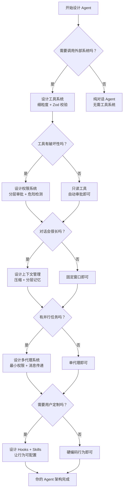

# 构建 AI Agent 的设计启示

> [!abstract] 这篇笔记的定位
> 这是整个知识库的"萃取笔记"。前面 7 篇分析了 Claude Code 的架构细节，这篇提炼出**对构建 AI Agent 类产品真正有价值的决策经验**，帮助你在自己的产品中少走弯路。

---

## 一、最重要的一个认知转变

> 构建 AI Agent 产品，**不是"做一个聊天机器人"，而是"做一个 AI 操作系统"**。

| 聊天机器人思维 | Agent 产品思维 |
|--------------|--------------|
| AI 是对话的主角 | AI 是执行引擎，工具是它的四肢 |
| 对话是线性的 | 对话是带分支的循环 |
| 出错了让用户重试 | 出错了 AI 自己纠错再试 |
| 安全靠 prompt 约束 | 安全靠架构层隔离 |
| 功能靠训练模型 | 功能靠组合工具和扩展 |

Claude Code 最核心的设计选择就是这个转变：它把 LLM 当成"会推理的 CPU"，把工具系统、权限系统、上下文管理都当成围绕这颗 CPU 的"操作系统组件"。

---

## 二、工具系统：能力的边界

### 2.1 把工具设计得像 API，而不是像命令

差的工具设计：
```
tool: execute_anything
input: { command: "rm -rf /..." }   ← 太宽泛，AI 可以做任何事
```

好的工具设计：
```
tool: Read
input: { file_path: string }    ← 明确的能力边界

tool: Write
input: { file_path: string, content: string }  ← 只做一件事

tool: Bash
input: { command: string }      ← 危险工具，但明确标记需要更严格的权限审批
```

> [!tip] 原则：**工具粒度要细，职责要单一**
> 细粒度工具的好处：AI 能准确描述自己在做什么，权限系统能精准管控，出错后容易定位。

### 2.2 工具要有输入验证，且验证要在执行前

Claude Code 使用 **Zod schema** 对工具输入做强类型校验：

```typescript
// 工具定义时声明 schema
const ReadTool = {
  name: "Read",
  inputSchema: z.object({
    file_path: z.string().describe("绝对路径"),
    limit: z.number().optional(),
  }),
  // 执行前自动校验，校验失败直接返回错误，不会执行
}
```

**为什么重要**：LLM 有时会传错误的参数格式，在执行前校验能阻止大量低级错误。

### 2.3 工具结果要"AI 友好"

工具返回的结果是给 LLM 读的，不是给人读的。好的工具结果：
- 包含足够的上下文（如文件路径、行号）
- 失败时说明**失败原因**，而不只是抛异常
- 长结果要有摘要（LLM 不需要完整的 10 万字文件）

---

## 三、权限系统：安全的底线

### 3.1 分层权限是必须的，不是可选的

```
第 1 层（工具定义层）：声明工具是否危险、是否只读
第 2 层（规则引擎层）：基于路径、命令模式做自动审批
第 3 层（用户确认层）：危险操作弹框确认
第 4 层（沙箱层）：工具执行在隔离环境中
```

很多早期 Agent 产品只有第 3 层（每次都问用户），导致用户体验极差，频繁被打断。Claude Code 的设计是：**绝大多数安全的操作自动执行，只有真正危险的才打断用户**。

> [!warning] 常见错误
> 把权限系统做成"全审批"或"全放行"，两者都是错的。全审批让用户崩溃，全放行让安全崩溃。要学 Claude Code 的"白名单 + 危险模式识别"模式。

### 3.2 "只读"与"写入"要严格分开

Claude Code 的权限系统核心区分就两类：
- **只读操作**（Read, Grep, Glob, Bash 的读命令）：宽松审批，几乎不打断
- **写入/破坏性操作**（Write, Edit, Bash 的删除命令）：严格审批，默认需确认

这个简单的二分法已经覆盖了 80% 的安全需求。

### 3.3 危险操作要有可逆机制

Claude Code 在执行破坏性操作前会提示，并通过 git 工作树（worktree）隔离来提供"撤销"能力。构建 Agent 时要问：**如果 AI 做错了，用户能撤销吗？**

---

## 四、上下文管理：记忆的艺术

### 4.1 三层记忆结构

```
工作记忆（本轮对话）
    → 对话轮次多了 → 触发压缩
    
情节记忆（会话历史）
    → 会话结束 → 提炼 → 写入
    
语义记忆（持久知识）
    → 存在 Memory 文件/CLAUDE.md
    → 每次对话开始时加载
```

> [!tip] 关键洞察
> 不要把所有信息都堆在 prompt 里，要**分层存储，按需加载**。会话级信息用短期记忆，跨会话信息用长期记忆，只读的背景知识用系统 prompt 缓存。

### 4.2 上下文压缩不能简单截断

常见错误：token 超限就删掉最早的消息。这会导致 AI 忘记对话开头的重要指令。

Claude Code 的做法：**先摘要，再压缩**——让 LLM 自己总结被压缩的内容，保留要点，再把摘要放回上下文。

### 4.3 缓存系统 prompt 节省成本

把系统 prompt 中不变的部分（人格设定、规则、参考文档）标记为可缓存，Anthropic API 会复用这些 token 的 KV cache，减少计算成本。对高频对话场景来说这是**最容易实现、收益最大的优化**。

---

## 五、多代理设计：何时、如何拆分

### 5.1 什么时候应该用子代理？

不是所有任务都需要多代理。用这个判断框架：

| 特征 | 是否适合子代理 |
|------|--------------|
| 任务可以独立并行 | ✅ 适合（节省时间） |
| 任务需要隔离环境 | ✅ 适合（防止互相干扰） |
| 任务有严格的上下文长度要求 | ✅ 适合（子代理有独立上下文窗口） |
| 任务是顺序依赖的 | ❌ 不必要（主代理自己做就行） |
| 任务需要实时共享状态 | ❌ 谨慎（代理间通信成本高） |

### 5.2 子代理必须有最小权限

父代理不应该把自己所有的工具都给子代理。Claude Code 的模式：

```
主代理：拥有完整工具集
  ↓ 创建子代理时
子代理：只传入完成任务必要的工具
```

这防止了"一个子代理出问题把整个系统搞坏"的情况。

### 5.3 代理间通信用"消息传递"而非"共享状态"

```
差的设计：多个代理共同读写一个全局变量（竞争条件、难以调试）
好的设计：代理通过消息（输出→输入）传递结果（无副作用、可追踪）
```

---

## 六、扩展性设计：产品的长期生命力

### 6.1 为你的 Agent 设计"钩子系统"

Claude Code 的 Hooks 允许用户在不修改源码的情况下介入任何环节。这对企业用户尤其重要：

```
事件点（触及代理行为边界的地方）：
├── 工具调用前（可以审计、拦截）
├── 工具调用后（可以记录、触发下游）
├── 会话开始（初始化配置）
└── 会话结束（清理、上报）
```

> [!tip] 设计原则
> 在你的 Agent 核心路径上定义清晰的钩子点，让高级用户能定制，让集成方能接入，而不需要修改你的核心代码。

### 6.2 技能（Skills）= 业务逻辑外置

Claude Code 的 Skill 本质上是把"如何完成某类任务的知识"从代码中剥离出来，放到可编辑的 Markdown 文件里。

这意味着：**不用改代码就能让 AI 学会新技能**。

对于 Agent 产品来说，这个思路可以扩展为：
- 用户可以上传"操作手册"
- 系统管理员可以定义"业务流程规范"
- AI 会按照这些文档行事，而不是硬编码在 prompt 里

### 6.3 MCP = 能力的生态化

把外部服务接入 Agent 不应该靠在代码里硬写 API 调用，而应该用标准协议（如 MCP）。这带来：

- **一次集成，到处可用**：第三方服务写一个 MCP Server，所有支持 MCP 的 Agent 都能用
- **安全隔离**：外部服务在独立进程，崩溃不影响主代理
- **热插拔**：运行时添加/移除工具，不需要重启

---

## 七、交互设计：别让 AI 打断用户

这是很多 Agent 产品忽视的问题。Claude Code 的几个交互原则：

### 7.1 能自动的就不问

- 建立规则引擎，让常见操作自动通过
- 用户说"是"一次，就记住"这类操作都允许"
- 只有真正新的、高风险的操作才打断

### 7.2 输出要实时可见

不要让用户盯着转圈圈等。即使是工具执行，也要展示"正在做什么"：

```
✓ 读取 src/main.ts（完成）
⟳ 搜索关键词 "getUserById"（进行中...）
  等待确认: 修改 database.ts？[y/n]
```

### 7.3 错误信息给 AI 看，不只是给人看

当工具执行失败时，错误信息会被 AI 读到，AI 要根据错误决定下一步。所以错误信息要包含：

```
✗ 错误类型（权限错误？文件不存在？超时？）
✗ 错误上下文（哪个文件？哪一行？）
✗ 建议的修复方向（可选，但有用）
```

---

## 八、架构选型建议

如果你要从头构建一个 Agent 产品，以下是 Claude Code 验证过的选择：

| 决策点 | Claude Code 的选择 | 为什么 |
|--------|------------------|--------|
| 工具定义格式 | TypeScript + Zod schema | 类型安全，运行时校验 |
| UI 框架（命令行） | Ink（React for CLI） | 声明式 UI，好维护 |
| 并发模型 | AsyncLocalStorage 上下文隔离 | 多代理不互相污染 |
| 状态管理 | 类 Redux 不可变状态 | 可预测，便于调试 |
| 配置格式 | Markdown（CLAUDE.md） | 非开发人员也能编写 |
| 扩展协议 | MCP | 标准化，有生态 |

---

## 九、一张决策树：你的 Agent 需要什么？



---

## 十、最后：避开三个常见陷阱

> [!warning] 陷阱 1：过早优化多代理
> 很多团队一开始就设计复杂的多代理系统，结果调试困难、成本爆炸。**先做好单代理，当单代理确实遇到瓶颈（上下文太长、需要并行）再引入多代理**。

> [!warning] 陷阱 2：权限系统做成事后补丁
> 权限和安全要从第一天就设计进架构里，不是功能完成后再"加一个审批流"。事后加入的权限系统往往有漏洞，且影响整个代码结构。

> [!warning] 陷阱 3：把 AI 当黑盒
> 很多团队对 AI 的行为缺乏可观测性——不知道它调用了什么工具、花了多少 token、为什么做了某个决定。Claude Code 的设计里充满了日志、状态展示、审计钩子。**可观测性不是可选项，是 Agent 可靠运行的前提**。

---

## 设计模式总结

| 模式 | 解决什么问题 | 适用场景 |
|------|-------------|---------|
| 工具单一职责 | 能力边界清晰，易于权限管控 | 所有 Agent |
| 输入 Schema 验证 | 防止 LLM 传入错误参数导致崩溃 | 所有 Agent |
| 分层权限审批 | 安全与体验的平衡 | 有破坏性工具的 Agent |
| 三层记忆模型 | 在有限上下文里保持"记忆" | 长对话 Agent |
| 最小权限子代理 | 防止子代理越权 | 多代理系统 |
| 事件钩子系统 | 不改核心代码实现定制化 | 面向企业/开发者的 Agent |
| MCP 标准协议 | 工具生态化，一次写多处用 | 需要接入外部服务的 Agent |

---

**定位**：从所有域萃取的产品设计经验
**相关笔记**：[[Claude Code 架构总览]] | [[设计哲学与核心理念]] | [[核心运行时]] | [[安全与信任]] | [[配置与提示词]] | [[协作与扩展]] | [[交互与体验]]
