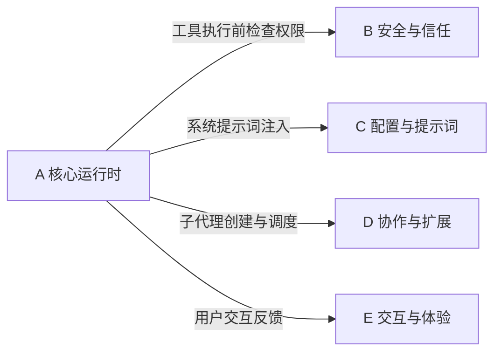

# A 域：核心运行时 — "引擎怎么转"

> [!abstract] 这个域回答什么问题
> AI Agent 的核心执行循环是怎么运转的？从用户输入到 AI 回复，中间经历了什么？工具怎么被调用？对话太长了怎么办？——一切关于"引擎如何工作"的问题都在这里。

这是整个知识库最底层的域。如果你要从零开始理解 Claude Code，从这里开始。

---

## 域内笔记

![[A-核心运行时.base]]

> [!tip] 阅读顺序建议
> 先读 [[对话生命周期]] 建立全局时序感，再读 [[工具系统设计]] 理解核心能力机制，最后读 [[上下文与状态管理]] 理解记忆与状态。

---

## 核心设计模式

这个域揭示了 AI Agent 运行时的几个关键设计选择：

**1. Agentic Loop（代理循环）**
对话不是"一问一答"，而是一个循环：AI 回复 → 调用工具 → 读取结果 → 决定下一步 → 再调用工具... 直到 AI 认为任务完成。这个循环是 Agent 区别于聊天机器人的核心。

**2. 工具即能力边界**
AI 能做什么，完全取决于它被赋予了哪些工具。工具设计的粒度、接口、校验直接决定了 Agent 的能力上限和安全下限。

**3. 分层记忆**
不把所有信息都堆在 prompt 里，而是分工作记忆（当前对话）、情节记忆（会话历史）、语义记忆（持久知识）三层，按需加载。

---

## 与其他域的关系

- **→ B 域**：每次工具调用前，运行时会查询权限系统（[[权限与安全模型]]）决定是否允许执行
- **→ C 域**：对话开始时，运行时从提示词系统（[[提示词系统架构]]）获取系统提示词
- **→ D 域**：运行时负责创建和调度子代理（[[多智能体协作]]）
- **→ E 域**：运行时的执行状态需要实时反馈给用户界面

---

## 待探索方向

| 主题 | 为什么值得探索 | 优先级 |
|------|--------------|--------|
| 推测执行（Speculation） | 源码中有 `speculation` 状态，AI 可能在预测用户下一步——这是运行时优化的前沿 | ⭐⭐⭐ |
| Token 估算机制 | 在发出 API 请求前估算 token 数，是成本控制和上下文管理的基础 | ⭐⭐ |
| 流式响应处理 | AI 的回复是流式到达的，运行时如何处理部分响应、中断、重试？ | ⭐⭐ |

---

**导航**：[[Claude Code 架构总览]] | [[设计哲学与核心理念]]
