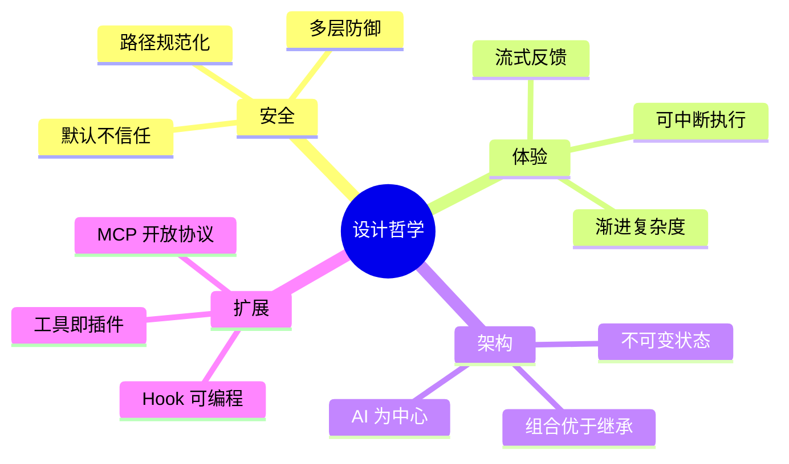

# 设计哲学与核心理念

> [!tip] 核心观点
> Claude Code 不只是一个"聊天机器人 + 工具"的拼接，它的设计体现了一套完整的 ==Agent 运行时（Runtime）== 思想——**让 AI 安全、高效、可扩展地在真实环境中行动**。

## 一、AI 是"调度中心"，不是"命令执行器"

传统的 CLI 工具是==人发指令、机器执行==。Claude Code 反转了这个模式：

```
传统 CLI：  用户 → 具体命令 → 结果
Claude Code：用户 → 意图描述 → AI 规划 → 选择工具 → 执行 → 反馈 → 再规划...
```

AI 不只是"翻译"用户指令，它在**主动思考该做什么**。这就要求系统给 AI 提供：
- **工具目录**（知道能做什么）→ 见 [[工具系统设计]]
- **权限边界**（知道什么不能做）→ 见 [[权限与安全模型]]
- **上下文记忆**（知道之前做了什么）→ 见 [[上下文与状态管理]]

> [!quote] 类比
> 如果 AI 是一个新来的员工，Claude Code 就是给他的==入职培训 + 工作手册 + 权限管理系统==。

## 二、"安全默认"原则

Claude Code 在安全设计上遵循一个核心原则：

> ==默认不信任，逐步授权。==

具体体现在：
1. **所有操作默认需要用户批准**——除非用户主动开放权限
2. **危险操作即使在"全权模式"下也会拦截**——比如修改 `.git/hooks` 或 `.bashrc`
3. **路径检查不可绕过**——防止通过符号链接（symlink，一种文件快捷方式）、NTFS 替代数据流等方式绕过安全检查

这不是简单的"加个确认弹窗"，而是==多层防御体系==。详见 [[权限与安全模型]]。

## 三、"流式异步"架构风格

Claude Code 大量使用了==异步生成器（AsyncGenerator）==模式：

```
工具执行过程：
  → 产出"进度事件"（用户看到加载动画）
  → 产出"中间结果"（用户看到实时输出）
  → 产出"最终结果"（工具执行完成）
```

> [!info] 什么是异步生成器？
> 想象一个水龙头——普通函数是"一次倒满一杯水"，异步生成器是"水一直流，你随时可以接"。这让用户在 AI 思考和执行的过程中就能看到反馈，而不用等全部完成。

这种设计带来几个好处：
- **用户体验好**：不是等半天才看到结果，而是实时看到 AI 在做什么
- **可中断**：用户随时可以按 Esc 打断正在进行的操作
- **内存友好**：不需要把所有数据存在内存里，流式处理即可

## 四、"不可变状态"管理

整个应用的状态管理采用==不可变更新（Immutable Update）==模式：

> [!info] 什么是不可变更新？
> 就像你不会在一张重要文件上直接涂改，而是==复印一份再修改==。每次状态变化都创建一个新的状态副本，旧的不动。

好处：
- **可追溯**：每个状态变化都有记录，出了问题容易排查
- **并发安全**：多个 AI 代理同时运行时，不会互相干扰对方的状态
- **UI 高效**：React 可以精准判断哪些部分变了，只更新必要的界面

> [!example] 源码中的体现
> 权限上下文被定义为 `DeepImmutable` 类型（深度只读），从类型系统层面杜绝了意外修改。

## 五、"组合优于继承"的扩展策略

Claude Code 几乎不用"继承"（一个东西是另一个东西的子类），而是大量使用==组合==：

| 模式 | 说明 | 例子 |
|------|------|------|
| 工具组合 | 每个工具独立定义，按需组合给不同的代理 | 子代理只拿到它需要的工具子集 |
| Hook 组合 | 任意数量的钩子可以挂载到同一个事件上 | 工具执行前可以有多个检查 |
| 规则组合 | 权限规则从多个来源合并，有优先级 | 项目级、用户级、策略级规则叠加 |
| 上下文组合 | 系统提示词由多个独立的"段落"拼接而成 | 静态段落可缓存，动态段落每次更新 |

> [!quote] 设计启示
> 如果你在构建 Agent 产品，优先考虑"怎么把功能拆成可组合的小块"，而不是"怎么设计一个大的基类"。

## 六、"渐进式复杂度"

Claude Code 的功能极其丰富，但它的设计让简单用法保持简单：

```
最简模式：  用户输入问题 → AI 回答（纯文本对话）
进阶模式：  AI 读写文件、运行命令（需要授权）
专家模式：  多代理并行、自定义 Hook、MCP 扩展
```

这是通过==特性门控（Feature Gate）==实现的——许多高级功能默认关闭，只在满足条件时才出现。

## 关键设计原则总结



---

**定位**：贯穿所有域的设计原则基底
**相关笔记**：[[Claude Code 架构总览]] | [[构建 AI Agent 的设计启示]] | [[核心运行时]] | [[安全与信任]] | [[配置与提示词]] | [[协作与扩展]] | [[交互与体验]]
