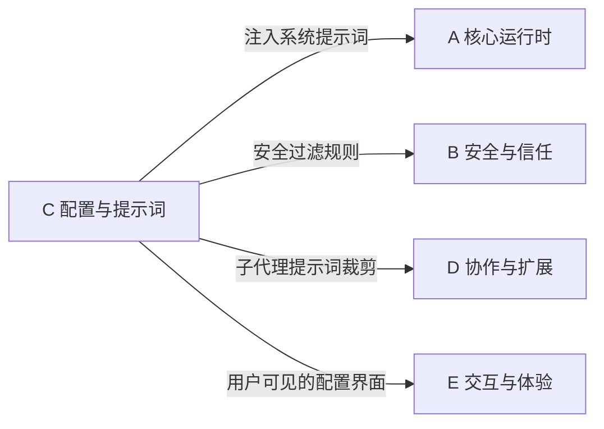

# C 域：配置与提示词 — "怎么调控行为"

> [!abstract] 这个域回答什么问题
> 不改代码，怎么改变 AI Agent 的行为？系统提示词怎么组装？分层配置怎么工作？环境变量怎么管理？——一切关于"行为调控面"的问题都在这里。

这是 AI Agent 产品最容易被低估的域。很多团队把所有行为逻辑硬编码在代码里，而 Claude Code 选择了一个高度可配置的架构——通过提示词组装和环境变量，让行为可以在不改代码的情况下调整。

---

## 域内笔记

![[C-配置与提示词.base]]

> [!info] 跨域笔记
> [[环境变量的安全过滤机制]] 同时属于本域和 [[安全与信任|B 域]]

---

## 核心设计模式

**1. 提示词 = 可编辑的行为规范**
Claude Code 的系统提示词不是一个写死的字符串，而是由十几个"段落"动态拼装的。每个段落可以独立开关、替换、扩展。这意味着行为可以像调配置一样调整。

**2. 六层 CLAUDE.md**
从全局 `~/.claude/CLAUDE.md` 到项目目录、子目录，形成一个层级覆盖体系。这个设计让"组织级规范 → 项目级约定 → 目录级指令"自然地分层落地。

**3. 环境变量 = 运行时开关**
100+ 环境变量控制着功能开关、安全级别、遥测行为。通过环境变量而非配置文件来控制运行时行为，是 CLI 工具的经典模式。

---

## 与其他域的关系

- **→ A 域**：运行时启动时，从本域获取完整的系统提示词
- **↔ B 域**：环境变量安全过滤（[[环境变量的安全过滤机制]]）是两个域的交叉点
- **→ D 域**：子代理的提示词是从主代理提示词裁剪而来（[[系统提示词的组装流水线]]）
- **→ E 域**：CLAUDE.md 是用户直接编辑的配置界面

---

## 待探索方向

| 主题 | 为什么值得探索 | 优先级 |
|------|--------------|--------|
| 提示词版本管理与 A/B 测试 | 企业场景下，如何管理不同版本的系统提示词？如何做实验？ | ⭐⭐ |
| 配置冲突解决 | 六层 CLAUDE.md 如果有冲突，优先级如何判定？边界情况？ | ⭐ |

---

**导航**：[[Claude Code 架构总览]] | [[设计哲学与核心理念]]
